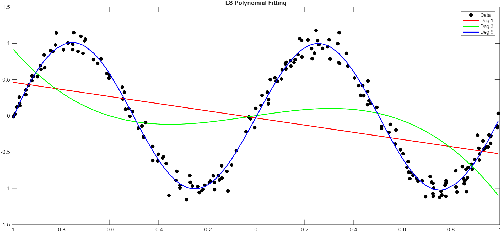
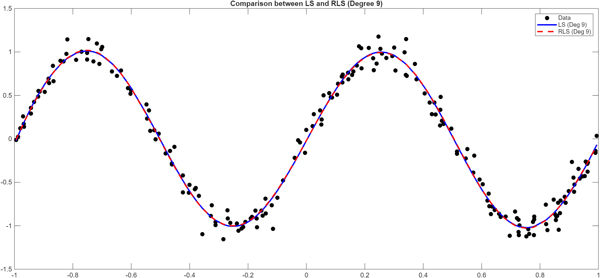
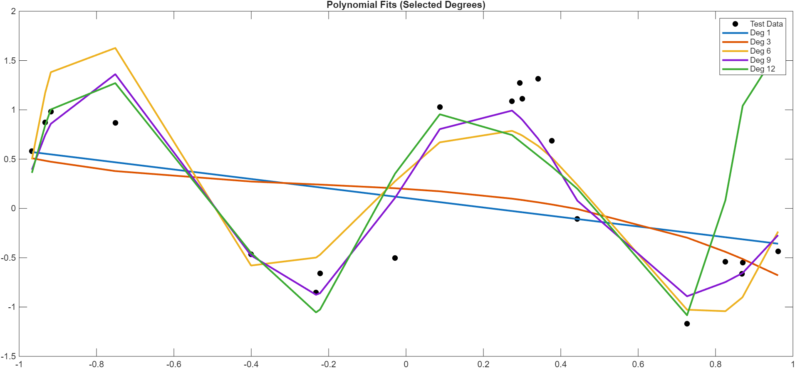
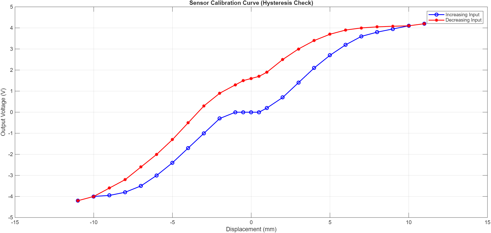
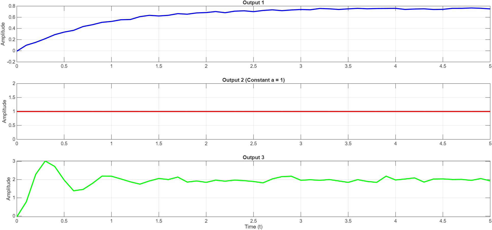
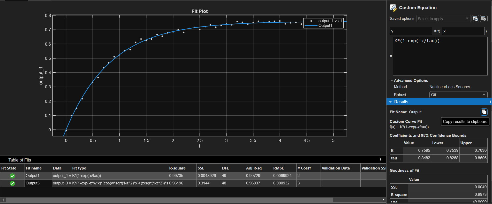
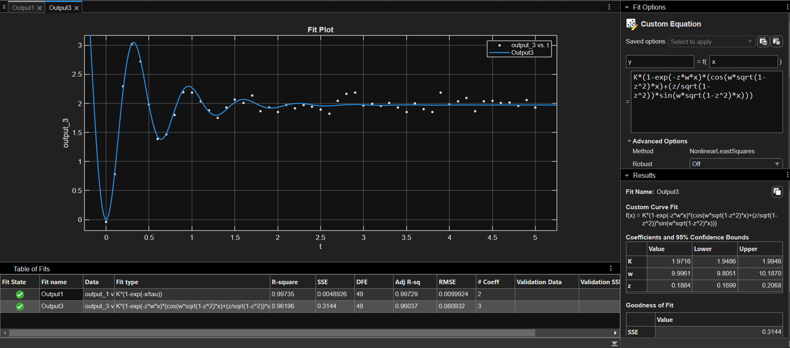

# 📊 HW1: Sensor Data Analysis, Calibration & Dynamic System Identification

> **Course:** Instrumentation Engineering (Spring 2026 / 1405)  
> **Instructor:** Dr. Nayeri  
> **Student:** Amirali Dehghani (ID: 810102443)  
> **Environment:** MATLAB R2026a  
> **Files Included:** MATLAB Scripts (`.m`), Datasets (`.csv`), Result Tables (`.csv`), Figures (`.png`), and Handwritten Lab Report (`.pdf`).

---

## 📖 Overview

Homework 1 addresses fundamental principles of sensor instrumentation, data calibration, statistical error evaluation, and dynamic response modeling:
1. **Industrial Instrumentation & Signal Conditioning Loop:** Closed-loop level transmitter analysis, 4–20 mA standard current loops, live-zero fault detection, and setpoint bias error propagation.
2. **Parameter Estimation & System Identification:** Theoretical proof of standard **Least Squares (LS)**, implementation of **Recursive Least Squares (RLS)** polynomial fitting, parameter vector convergence, and model order selection using Train/Test split to avoid overfitting.
3. **Sensor Performance Metrics & Selection:** Quantitative evaluation of **Accuracy (%FS)**, **Precision (%FS)**, **Repeatability**, **Reproducibility**, and **Sensitivity** for industrial pressure sensors across multiple test trials.
4. **Static Sensor Characteristics & Calibration:** Analysis of **Hysteresis loops**, **Dead Band (Zone)**, **Zero Drift**, and **Sensitivity Drift** under temperature variations ($25^\circ\text{C}$ to $45^\circ\text{C}$).
5. **Dynamic Sensor Response & Curve Fitting:** Time-domain identification of **0th-order** (Photodiode), **1st-order** (Temperature RTD), and **2nd-order** (Elastic Diaphragm Pressure Sensor) systems from step response data using MATLAB `cftool`.

---

## 📂 Directory Structure

```text
HW1/
├── Codes/
│   ├── q2.m                             # MATLAB script for LS, RLS, and model order selection
│   ├── q4.m                             # MATLAB script for Hysteresis and calibration analysis
│   ├── q5.m                             # MATLAB script for dynamic response plotting & identification
│   ├── data_A.csv                       # Dataset for Question 2 (LS & RLS polynomial fitting)
│   ├── data_B_train.csv                 # Training set for Question 2 (Model selection)
│   ├── data_B_test.csv                  # Testing set for Question 2 (Model selection)
│   ├── SensorDataQ4.csv                 # Calibration data for Question 4 (Input, V_inc, V_dec)
│   ├── Data.csv                         # Step response time-series data for Question 5
│   └── Q4-Hysteresis_Error_Results.csv  # Computed hysteresis error per displacement input
├── Results/
│   ├── q2-1.png                         # LS polynomial fits (Degrees 1, 3, 9)
│   ├── q2-2.png                         # Comparison between LS and RLS (Degree 9)
│   ├── q2-3.png                         # Model selection on Test dataset (Overfitting demo)
│   ├── q4-1.png                         # Displacement sensor calibration curve & hysteresis loop
│   ├── q5-1.png                         # Step response plots for Output 1, 2, and 3
│   ├── q5-2.png                         # Dynamic curve fitting results (cftool)
│   ├── q5-3.png                         # Step response analysis overlay
│   └── Q4-Table.csv                     # Exported numerical table for hysteresis error
├── Inst_HW1.pdf                         # Original Assignment Question Paper
└── Inst-HW1-810102443.pdf               # Complete Solved Handwritten Lab Report (PDF)
```

---

## ✍️ Detailed Solutions & Handwritten Report Synthesis

---

### 🔹 Question 1: Industrial Level Sensor & Transmitter Loop

#### **Problem Context:**
An industrial liquid tank maintains a target liquid level of $2\text{ m}$. The system uses a Level Sensor measuring $[0 - 5]\text{ m}$ coupled with a Transmitter outputting a standard $4 - 20\text{ mA}$ current loop.

#### **Detailed Solutions & Handwritten Report Equations:**

1. **Role of Sensor & Transmitter:**
   - **Sensor:** Measures the physical quantity (liquid level in meters $h$). Acts as the feedback element in the closed-loop control system.
   - **Transmitter:** Conditions, amplifies, and standardizes the primary sensor signal into a $4-20\text{ mA}$ current loop to prevent noise corruption and attenuation over long wires.

2. **Fault Detection (0 mA Output):**
   - The transmitter uses a **"Live Zero"** mechanism ($4\text{ mA}$ corresponds to $0\text{ m}$).
   - If the current drops to $0\text{ mA}$, the operator/PLC immediately distinguishes a **system failure, power loss, or cable cut** from a valid zero-level reading ($4\text{ mA}$).

3. **Current Output for 3 m Liquid Level:**
   $$\frac{I - I_{\min}}{I_{\max} - I_{\min}} = \frac{h - h_{\min}}{h_{\max} - h_{\min}} \implies \frac{I - 4}{20 - 4} = \frac{3 - 0}{5 - 0}$$
   $$I = \left( \frac{3}{5} \times 16 \right) + 4 = 9.6 + 4 = \mathbf{13.6\text{ mA}}$$

4. **Measured Level for 10 mA Current:**
   $$\frac{10 - 4}{20 - 4} = \frac{h - 0}{5 - 0} \implies h = 5 \times \frac{6}{16} = \frac{15}{8} = \mathbf{1.875\text{ m}}$$

5. **Sensor Reading with +0.2 m Constant Bias Error:**
   - Actual level = $2.0\text{ m} \implies$ Sensor reports $2.0 + 0.2 = \mathbf{2.2\text{ m}}$.

6. **Effect of Bias Error on Closed-Loop Controller:**
   - Setpoint is $2.0\text{ m}$. The controller receives $2.2\text{ m}$ and throttles the fluid inlet to bring the reported value down to $2.0\text{ m}$.
   - Consequently, the system settles into a steady-state offset where the actual liquid level stays at **$1.8\text{ m}$** ($0.2\text{ m}$ below the desired setpoint).

---

### 🔹 Question 2: Polynomial Curve Fitting via LS & RLS Algorithm

#### **Theoretical Formulation & Mathematical Proof:**

Minimizing the Sum of Squared Errors (SSE):
$$J(\theta) = \sum_{i=1}^{m} (\varphi_i^T \theta - y_i)^2 = (\Phi \theta - y)^T (\Phi \theta - y)$$

Expanding the vector matrix form:
$$J(\theta) = \theta^T \Phi^T \Phi \theta - 2 y^T \Phi \theta + y^T y$$

Setting the gradient $\frac{\partial J}{\partial \theta} = 0$:
$$\frac{\partial J}{\partial \theta} = 2 \Phi^T \Phi \theta - 2 \Phi^T y = 0 \implies \Phi^T \Phi \theta = \Phi^T y \implies \mathbf{\hat{\theta}_{LS} = (\Phi^T \Phi)^{-1} \Phi^T y}$$

#### **RLS Parameter Vector Convergence (Degree 9):**
Using initial conditions $P(0) = 10^5 \cdot I_{10\times 10}$ and $\hat{\theta}(0) = \mathbf{0}$:
$$\theta_{RLS} = \begin{bmatrix} -0.0187 \\ 6.1429 \\ 0.2907 \\ -38.4770 \\ -1.1349 \\ 67.7010 \\ 1.6453 \\ -48.0882 \\ -0.8304 \\ 12.7267 \end{bmatrix}$$

| Figure 1: LS Polynomial Fits (Deg 1, 3, 9) | Figure 2: LS vs RLS Equivalence (Deg 9) |
| :---: | :---: |
|  |  |

#### **Model Order Selection (`data_B_train.csv` / `data_B_test.csv`):**
- Evaluated degrees $d = 1$ to $d = 12$.
- Degrees 1 & 3 exhibit **Underfitting**. Degree 12 exhibits severe **Overfitting**.
- **Degree 9** achieves the global minimum test error and is chosen as the optimal model degree.

| Figure 3: Polynomial Fitting & Overfitting Analysis on Test Data |
| :---: |
|  |

---

### 🔹 Question 3: Pressure Sensor Performance Metrics & Selection

#### **Evaluated Sensor Specifications ($10\text{ bar}$ reference pressure):**
- **Sensor 1:** $[0 - 10]\text{ bar}$ ($FS = 10\text{ bar}$)
- **Sensor 2:** $[0 - 16]\text{ bar}$ ($FS = 16\text{ bar}$)
- **Sensor 3:** $[0 - 25]\text{ bar}$ ($FS = 25\text{ bar}$)

#### **Handwritten Quantitative Results:**

1. **Accuracy (%FS):**
   - **Sensor 1:** $e = 0.23 \implies \text{Acc}_1 = \frac{0.23}{10} \times 100\% = \mathbf{2.3\%}$
   - **Sensor 2:** $e = 0.117 \implies \text{Acc}_2 = \frac{0.117}{16} \times 100\% = \mathbf{0.73\%}$
   - **Sensor 3:** $e = 0.05 \implies \text{Acc}_3 = \frac{0.05}{25} \times 100\% = \mathbf{0.2\%}$ *(Best Accuracy)*

2. **Precision (%FS - Standard Deviation):**
   - **Sensor 1:** $\sigma_1 = 0.01 \implies P_1 = \frac{0.01}{10} \times 100\% = \mathbf{0.1\%}$
   - **Sensor 2:** $\sigma_2 = 0.026 \implies P_2 = \frac{0.026}{16} \times 100\% = \mathbf{0.16\%}$
   - **Sensor 3:** $\sigma_3 = 0.004 \implies P_3 = \frac{0.004}{25} \times 100\% = \mathbf{0.016\%}$ *(Best Precision)*

3. **Accuracy vs. Precision Trade-off:**
   - A sensor can be accurate on average but imprecise (scattered readings). Precision is more critical because bias/accuracy errors can be software-calibrated, whereas noise/precision errors impair feedback loops.

4. **Repeatability & Reproducibility:**
   - **Repeatability:** Short-term consistency under identical conditions ($3 > 1 > 2$).
   - **Reproducibility:** Long-term consistency under changed conditions/days ($3 > 2 > 1$).

5. **Sensitivity ($S = \frac{\Delta I}{\Delta P}$ for $4-20\text{ mA}$ range):**
   - **Sensor 1:** $K_1 = \frac{16}{10} = \mathbf{1.60\text{ mA/bar}}$
   - **Sensor 2:** $K_2 = \frac{16}{16} = \mathbf{1.00\text{ mA/bar}}$
   - **Sensor 3:** $K_3 = \frac{16}{25} = \mathbf{0.64\text{ mA/bar}}$

6. **Engineering Selection:**
   - **General Boiler:** **Sensor 3** (or Sensor 2) for maximum overall accuracy, precision, and safety margin.
   - **Sensitive Chemical Reactor:** **Sensor 1** for maximum sensitivity ($1.6\text{ mA/bar}$) to detect minute pressure variations.

---

### 🔹 Question 4: Linear Displacement Sensor Hysteresis & Thermal Drift

#### **Analysis & Calculations:**

1. **Hysteresis Loop:**
   - Plotted $V_{inc}$ vs $V_{dec}$ showing non-overlapping forward/backward paths.

| Figure 4: Displacement Sensor Calibration Curve & Hysteresis Loop |
| :---: |
|  |

2. **Dead Band (Zone):**
   - Range where output remains $0\text{ V}$: $[-1.0\text{ mm}, +0.5\text{ mm}] \implies \text{Dead Band} = \mathbf{1.5\text{ mm}}$.

3. **Maximum Hysteresis Error (%FS):**
   - Max difference $e_{h,\max} = |V_{inc} - V_{dec}| = 1.8\text{ V}$ at $x = +2\text{ mm}$.
   - $FS = 4.2 - (-4.2) = 8.4\text{ V}$.
   - **Hysteresis Error (%FS):**
     $$\text{Hysteresis } \%FS = \frac{1.8}{8.4} \times 100\% = \mathbf{21.4286\%}$$

4. **Thermal Drift Rates ($T_1 = 25^\circ\text{C}, T_2 = 45^\circ\text{C}, \Delta T = 20^\circ\text{C}$):**
   - $V_{25} = 0.40 x + 0$
   - $V_{45} = 0.36 x + 0.16$
   - **Zero Drift (ZD):**
     $$\text{ZD} = \frac{0.16 - 0}{45 - 25} = \mathbf{0.008 \text{ V/}^\circ\text{C}} \quad (8 \text{ mV/}^\circ\text{C})$$
   - **Sensitivity Drift (SD):**
     $$\text{SD} = \frac{0.36 - 0.40}{45 - 25} = \mathbf{-0.002 \text{ V/(mm} \cdot {^\circ}\text{C)}} \quad (-2 \text{ mV/(mm} \cdot {^\circ}\text{C)})$$

---

### 🔹 Question 5: Dynamic System Response & Fitting (`cftool`)

#### **Dynamic Classification & Curve Fitting Results:**

| Output Channel | Dynamic Order | Matched Sensor | Identified Parameters |
| :--- | :--- | :--- | :--- |
| **Output 1** | **1st Order System** | **Temperature Sensor** (RTD/Thermocouple) | Gain $K_1 = 0.7585$, Time Constant $\tau_1 = 0.8482\text{ s}$ |
| **Output 2** | **0th Order System** | **Photodiode / Photocell** | Instant Gain $K_2 = 1.000$, Time lag $\tau = 0$ |
| **Output 3** | **2nd Order Underdamped** | **Elastic Diaphragm Pressure Sensor** | Gain $K_3 = 1.9716$, $\omega_n = 9.9961\text{ rad/s}$, $\zeta = 0.1844$ |

| Figure 5: Dynamic Step Responses | Figure 6: Fitting Results (`cftool`) |
| :---: | :---: |
|  |  |

| Figure 7: System Identification Overlay |
| :---: |
|  |

#### **Extracted Transfer Functions:**
1. **Output 1 (1st Order Temperature Sensor):**
   $$y_1(t) = 0.7585 \left( 1 - e^{-\frac{t}{0.8482}} \right) \implies G_1(s) = \frac{0.7585}{0.8482 s + 1}$$

2. **Output 2 (0th Order Photodiode):**
   $$y_2(t) = 1.0 \implies G_2(s) = 1.0$$

3. **Output 3 (2nd Order Pressure Sensor):**
   $$y_3(t) = 1.9716 \left[ 1 - e^{-1.8433 t} \left( \cos(9.8247 t) + 0.1876 \sin(9.8247 t) \right) \right]$$
   $$G_3(s) = \frac{1.9716 \times 9.9961^2}{s^2 + 2(0.1844)(9.9961) s + 9.9961^2} = \frac{196.99}{s^2 + 3.6866 s + 99.92}$$

---

## 💻 How to Run MATLAB Scripts

1. Change directory to `HW1/Codes`:
   ```matlab
   cd('HW1/Codes');
   ```

2. Execute target script:
   - **Polynomial Fitting (LS/RLS):** `run q2.m`
   - **Hysteresis Analysis:** `run q4.m`
   - **Dynamic Response Plotting:** `run q5.m`

---

## 📊 Summary of Generated Results

- **`Results/Q4-Table.csv`**: Contains numerical hysteresis error calculations for input range $[-11\text{ mm}, +11\text{ mm}]$.
- **`Results/*.png`**: High-resolution plots covering calibration curves, polynomial fitting comparisons, model order selection, and dynamic system step responses.

---

<div align="center">

**[Go back to Main Repository README](../README.md)**

</div>
