# 🎛️ HW2: Dynamic System Simulation, Signal Conditioning Circuits & Instrumentation Amplifiers

> **Course:** Instrumentation Engineering (Spring 2026 / 1405)  
> **Instructor:** Dr. Nayeri  
> **Student:** Amirali Dehghani (ID: 810102443)  
> **Tools:** MATLAB & Simulink R2026a, Proteus 8 Professional, LaTeX  
> **Files Included:** Simulink Model (`.slx`), Proteus Projects (`.pdsprj`), Circuit Diagrams & Simulation Plots (`img/`), and Solved Report (`.pdf`).

---

## 📖 Overview

Homework 2 focuses on essential analog signal conditioning circuits, dynamic system filtering, digital-to-analog conversion, and precision instrumentation amplifiers:
1. **Industrial Signal Filtering (Simulink):** Design and frequency response analysis of **Passive RC High-Pass**, **Low-Pass**, cascaded **Band-Pass**, and **LC Notch (Band-Stop)** filters for 50 Hz power-line noise elimination.
2. **Temperature Sensing & Threshold ADC (Proteus):** Hardware implementation of an NTC Thermistor signal conditioning circuit connected to an Op-Amp multi-threshold comparator network (LM324) driving LED indicators.
3. **4-Bit R-2R Digital-to-Analog Converter (Proteus):** Inverting R-2R DAC design, theoretical voltage calculations, binary counter integration for **Sawtooth** and **Full Triangular** wave synthesis, and Low-Pass RC filter smoothing.
4. **Bio-Potential & Industrial Instrumentation Amplifiers:**
   - Design of a 4-stage ECG Signal Conditioning Circuit ($\pm 500\,\mu\text{V}$ input to $0-5\text{ V}$ ADC range with active bandpass filtering).
   - Mathematical derivation and simulation of a 3 Op-Amp Instrumentation Amplifier proving **Common-Mode Rejection Ratio (CMRR)** under 50 Hz noise.
   - Strain Gauge **Wheatstone Bridge** integration with **AD620** instrumentation amplifier and 8-bit ADC digital output calculation.

---

## 📂 Directory Structure

```text
HW2/
├── Codes/
│   ├── q1.slx                           # Simulink model for Band-Pass & Notch filter simulation
│   └── Q1.mat                           # Workspace data & filter coefficients
├── Proteus/
│   ├── q2.pdsprj                        # NTC Thermistor & multi-threshold ADC comparator circuit
│   ├── q3.pdsprj                        # 4-Bit R-2R DAC theoretical validation circuit
│   ├── q3-1.pdsprj                      # DAC step voltage test circuit
│   ├── q3-2.pdsprj                      # Sawtooth wave generator (74HC161 Counter + R-2R DAC)
│   ├── q3-3.pdsprj                      # Smooth continuous sawtooth wave (RC Low-Pass Filtered)
│   ├── q4-1.pdsprj                      # 4-Stage ECG Bio-Probe conditioning circuit
│   ├── q4-2.pdsprj                      # 3 Op-Amp Instrumentation Amplifier simulation
│   └── q4-3.pdsprj                      # Common-mode noise rejection (CMRR) test circuit
├── img/
│   ├── q1-1.png                         # Simulink BPF Bode plot & frequency response
│   ├── q1-2.png                         # Simulink -3dB cut-off points verification
│   ├── q2-1.png - q2-4.png              # Proteus NTC temperature threshold LED outputs (15°C to 80°C)
│   ├── q3-1.png - q3-5.png              # Proteus 4-bit R-2R DAC, Sawtooth & Triangular wave plots
│   └── q4-1.png - q4-5.png              # Proteus Instrumentation Amp, CMRR test & AD620 pressure system
├── Inst_HW2.pdf                         # Original Assignment Question Paper
└── Instr-HW2-810102443.pdf              # Complete Solved Lab Report (PDF)
```

---

## ✍️ Detailed Solutions & Problem Breakdown

---

### 🔹 Question 1: Industrial Vibration Sensor Signal Filtering (Simulink)

#### **Problem Context:**
A vibration sensor on industrial machinery produces useful information between $20\text{ Hz}$ and $200\text{ Hz}$. Low-frequency components ($<20\text{ Hz}$) caused by mechanical drift, high-frequency noise ($>200\text{ Hz}$), and a $50\text{ Hz}$ power-line hum must be filtered.

#### **Design & Calculations:**

1. **High-Pass RC Filter ($f_{cL} = 20\text{ Hz}$, $C_1 = 10\,\mu\text{F}$):**
   $$f_c = \frac{1}{2\pi R_1 C_1} \implies R_1 = \frac{1}{2\pi (20)(10 \times 10^{-6})} = \frac{10^6}{400\pi} \approx \mathbf{795.77\,\Omega}$$

2. **Low-Pass RC Filter ($f_{cH} = 200\text{ Hz}$, $C_2 = 470\text{ nF}$):**
   $$f_c = \frac{1}{2\pi R_2 C_2} \implies R_2 = \frac{1}{2\pi (200)(470 \times 10^{-9})} = \frac{10^6}{188\pi} \approx \mathbf{1693.14\,\Omega}$$

3. **Cascaded Band-Pass Filter (BPF) Parameters:**
   - **Filter Type:** Passive Band-Pass Filter
   - **Approximate Center Frequency:**
     $$f_{\text{center}} = \sqrt{f_L \cdot f_H} = \sqrt{20 \times 200} = \sqrt{4000} \approx \mathbf{63.25\text{ Hz}}$$
   - **Bandwidth:**
     $$\text{BW} = f_H - f_L = 200 - 20 = \mathbf{180\text{ Hz}}$$
   - **Quality Factor ($Q$):**
     $$Q = \frac{f_{\text{center}}}{\text{BW}} = \frac{63.25}{180} \approx \mathbf{0.351}$$

4. **Simulink Frequency Response (Bode Plot):**
   - The $-3\text{ dB}$ cut-off frequencies occur precisely at $f_L = 20\text{ Hz}$ and $f_H = 200\text{ Hz}$, confirming the design specifications.

| Figure 1.1: Simulink BPF Bode Plot & Phase Response | Figure 1.2: -3dB Cut-off Points Verification |
| :---: | :---: |
| 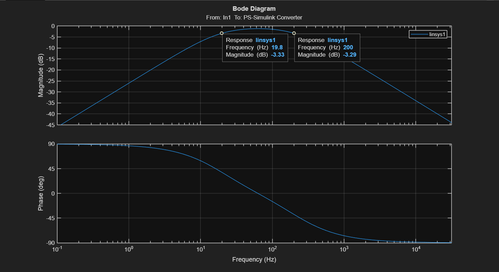 | 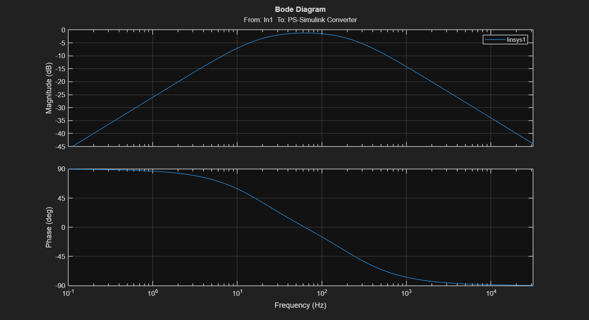 |

5. **LC Notch Filter Design for 50 Hz Noise Elimination ($L = 100\text{ mH}$):**
   $$f_0 = \frac{1}{2\pi \sqrt{L C}} \implies C = \frac{1}{4\pi^2 f_0^2 L} = \frac{1}{4\pi^2 (50)^2 (0.1)} = \frac{1}{1000\pi^2} \approx \mathbf{101.32\,\mu\text{F}}$$
   - **Performance Improvements:**
     - **Active Twin-T Notch Filters:** Replaces passive LC elements with Op-Amps to eliminate inductor internal resistance losses and drastically increase the $Q$-factor (sharper attenuation at $50\text{ Hz}$ without distorting adjacent frequencies like $48\text{ Hz}$ or $52\text{ Hz}$).
     - **Low-Tolerance Components:** Using $1\%$ precision resistors/capacitors to prevent notch frequency shift due to thermal drift.

---

### 🔹 Question 2: NTC Temperature Sensing & Threshold ADC (Proteus)

#### **Circuit Architecture & Working Principle:**
An NTC thermistor is connected in a voltage divider powered by a $5\text{ V}$ reference. The output voltage is fed to three Op-Amp comparators (LM324) configured with reference voltage thresholds at $1.25\text{ V}$, $2.50\text{ V}$, and $3.75\text{ V}$ (created via a series $1\text{ k}\Omega$ resistor ladder). Logic gates (AND / XNOR) decode the comparator outputs to drive Red and Blue LEDs.

#### **Operating Temperature States:**

| Temperature | ADC Voltage ($V_{in}$) | Active Comparators | Red LED | Blue LED | Proteus Simulation |
| :---: | :---: | :---: | :---: | :---: | :---: |
| **$15^\circ\text{C}$** | $V_{in} < 1.25\text{ V}$ | None | **OFF** | **OFF** | 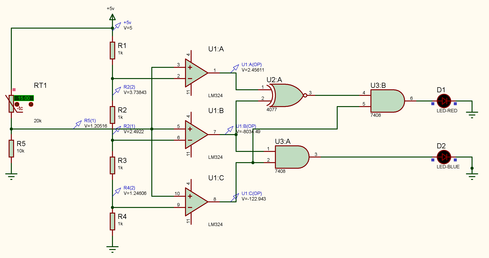 |
| **$25^\circ\text{C}$** | $1.25\text{ V} < V_{in} < 2.50\text{ V}$ | Comp 1 | **ON** | **OFF** | 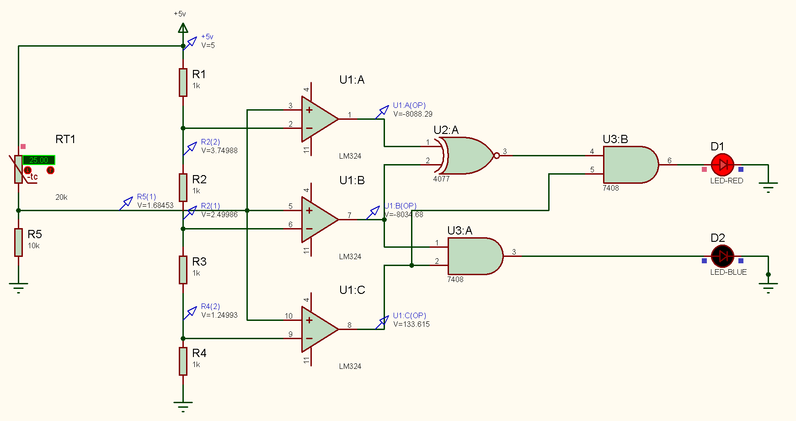 |
| **$50^\circ\text{C}$** | $2.50\text{ V} < V_{in} < 3.75\text{ V}$ | Comp 1 & 2 | **OFF** | **ON** | 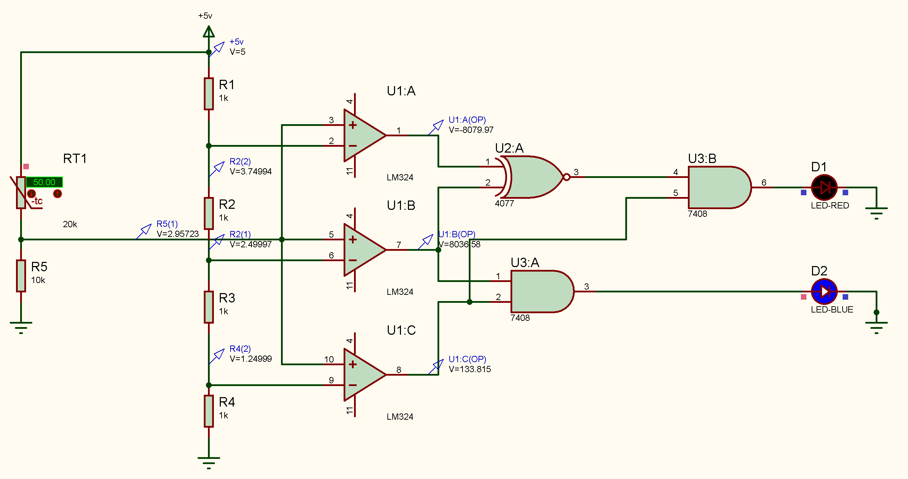 |
| **$80^\circ\text{C}$** | $V_{in} > 3.75\text{ V}$ | Comp 1, 2 & 3 | **ON** | **ON** | 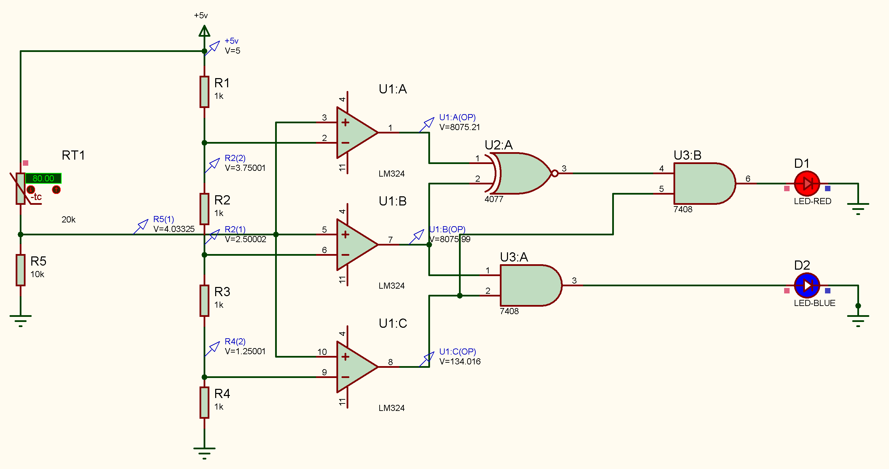 |

---

### 🔹 Question 3: 4-Bit R-2R Digital-to-Analog Converter (DAC) & Waveform Generators

#### **1. Inverting R-2R DAC Transfer Function & Mathematical Derivation:**
Given $V_{\text{ref}} = 4.8\text{ V}$, $R = 5\text{ k}\Omega$, $R_f = 10\text{ k}\Omega$, $n = 4\text{ bits}$:
$$V_{\text{out}} = -V_{\text{ref}} \times \left( \frac{R_f}{R} \right) \times \left( \frac{D}{2^n} \right) = -4.8 \times \left( \frac{10}{5} \right) \times \frac{D}{16} = \mathbf{-0.6 \times D \quad [\text{V}]}$$

#### **Part (a): Theoretical Calculations vs Proteus DC Verification:**
- **Digital Input `1011` ($D = 11$):**
  $$V_{\text{out}} = -0.6 \times 11 = \mathbf{-6.60\text{ V}}$$
- **Digital Input `1110` ($D = 14$):**
  $$V_{\text{out}} = -0.6 \times 14 = \mathbf{-8.40\text{ V}}$$
- Both theoretical calculations match Proteus DC voltmeter measurements with 100% accuracy.

| Figure 3.1: Digital Input `1011` ($V_{\text{out}} = -6.60\text{ V}$) | Figure 3.2: Digital Input `1110` ($V_{\text{out}} = -8.40\text{ V}$) |
| :---: | :---: |
| 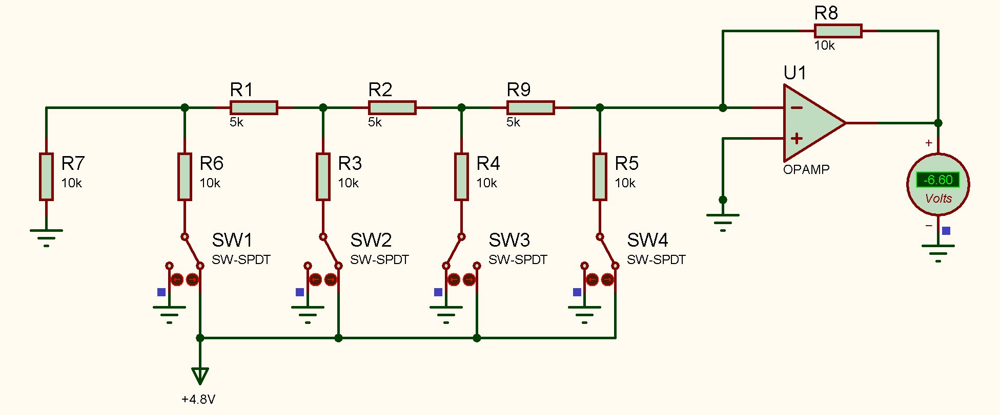 | 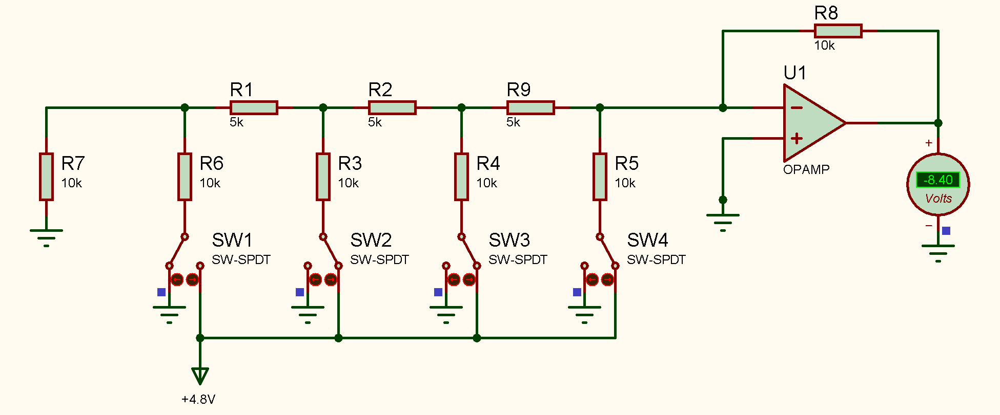 |

#### **Part (b): Discrete Stepped Sawtooth Wave Generation (74HC161 + R-2R DAC):**
- A 4-bit synchronous binary counter (74HC161) increments sequentially from `0000` ($0$) to `1111` ($15$).
- Connected to the inverting R-2R DAC, it outputs a discrete **negative-sloped staircase waveform** dropping from $0\text{ V}$ to $-9.0\text{ V}$ before resetting on counter overflow.

| Figure 3.3: Discrete Stepped Sawtooth Waveform (74HC161 Counter + R-2R DAC) |
| :---: |
| 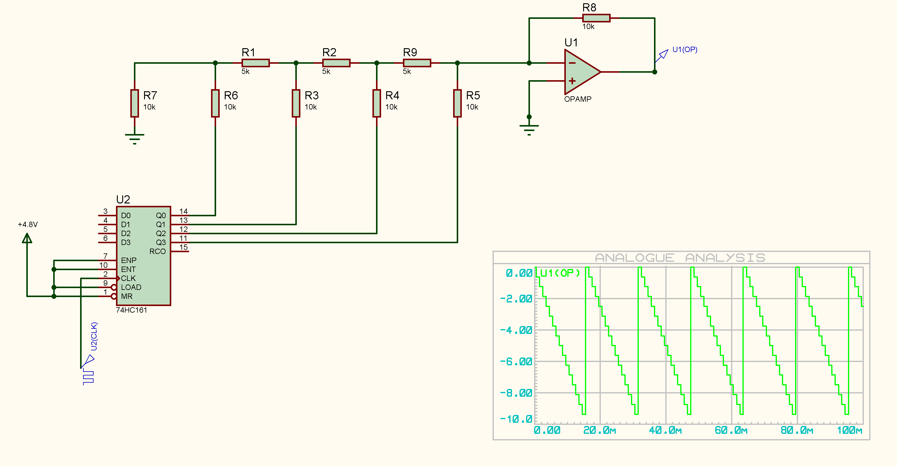 |

#### **Part (c): Continuous Sawtooth Wave Smoothing (Low-Pass RC Filtering):**
- Discrete DAC steps contain high-frequency harmonics due to sharp voltage jumps between states.
- Passing the Op-Amp output through a passive Low-Pass RC filter ($R = 1\text{ k}\Omega$, $C = 1\,\mu\text{F}$) removes high-frequency step harmonics, producing a **smooth, continuous linear sawtooth wave**.

| Figure 3.4: Smooth Continuous Analog Sawtooth Waveform (Filtered via Low-Pass RC) |
| :---: |
| 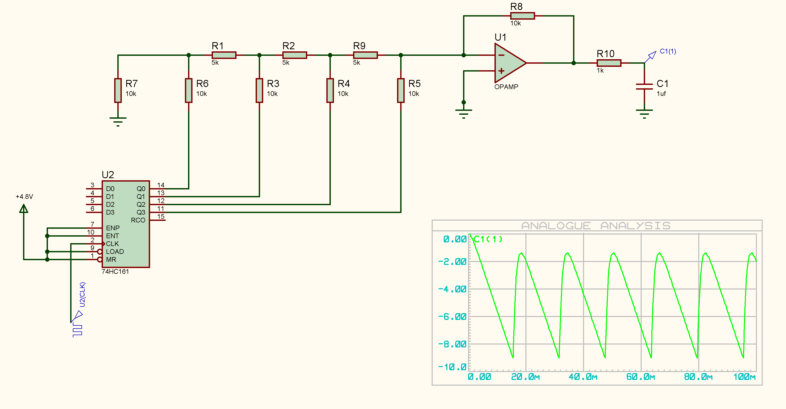 |

#### **Part (d & e): Full Continuous Symmetric Triangular Waveform (74HC191 Up/Down Counter):**
- **Architecture:** Replaces the single-direction counter with a **74HC191 4-bit Up/Down Counter** coupled to a **JK Flip-Flop**.
- **Working Principle:**
  1. Counter counts UP from `0000` to `1111` (generating negative slope to $-9.0\text{ V}$).
  2. Upon reaching Terminal Count (`TC`), `TC` triggers the JK Flip-Flop to toggle the Count Direction pin (`D/U`).
  3. Counter counts DOWN from `1111` to `0000` (generating positive slope back to $0\text{ V}$).
- **Result:** After RC low-pass filtering, the circuit produces a **full, symmetric, smooth continuous triangular wave**.

| Figure 3.5: Full Continuous Triangular Wave Generator (74HC191 U/D Counter + JKFF + Filter) |
| :---: |
| 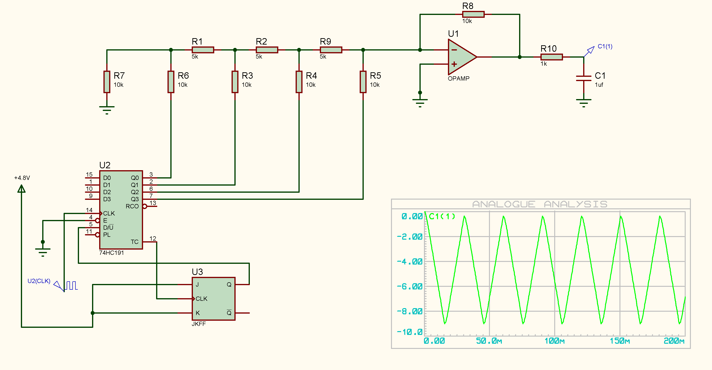 |

---

### 🔹 Question 4: Bio-Potential Conditioning & Precision Instrumentation Amplifiers

#### **1. ECG Bio-Probe Signal Conditioning Circuit Design:**
- **Input:** $V_{\text{in}} = \pm 500\,\mu\text{V} \implies \Delta V_{\text{in}} = 1\text{ mV}_{p-p}$.
- **Target ADC:** $0 - 5\text{ V} \implies \Delta V_{\text{out}} = 5\text{ V}_{p-p}$.
- **Total Required Gain:**
  $$A_v = \frac{\Delta V_{\text{out}}}{\Delta V_{\text{in}}} = \frac{5\text{ V}}{1\text{ mV}} = \mathbf{5000}$$
- **DC Offset Shift:** $V_r = 2.5\text{ V}$ to center symmetrical inputs within $0-5\text{ V}$ range ($V_{\text{out}} = 5000 \cdot V_{\text{in}} + 2.5\text{ V}$).

```text
[Input Probe] ---> [Stage 1: Direct Gain (A1=100)] ---> [Stage 2: Diff Gain (A2=50)] 
              ---> [Stage 3: Active Bandpass (10-100Hz)] ---> [Stage 4: Summing Amp (Vr=2.5V)] ---> [ADC (0-5V)]
```

- **Resistor Sizing:**
  - **Stage 1 (Direct Stage):** $A_1 = 1 + \frac{2 R_1}{R_g} = 100 \implies R_g = 1\text{ k}\Omega, R_1 = 49.5\text{ k}\Omega$.
  - **Stage 2 (Differential Stage):** $A_2 = \frac{R_3}{R_2} = 50 \implies R_2 = 1\text{ k}\Omega, R_3 = 50\text{ k}\Omega$.
  - **Stage 3 (Active BPF $10-100\text{ Hz}$):**
    - High-pass ($10\text{ Hz}$): $C_L = 1\,\mu\text{F} \implies R_L \approx 15.9\text{ k}\Omega$.
    - Low-pass ($100\text{ Hz}$): $C_H = 100\text{ nF} \implies R_H \approx 15.9\text{ k}\Omega$.
  - **Stage 4 (Summer):** Equal resistors $R = 1\text{ k}\Omega$.

| Figure 4.1: Complete 4-Stage ECG Signal Conditioning Schematic |
| :---: |
| 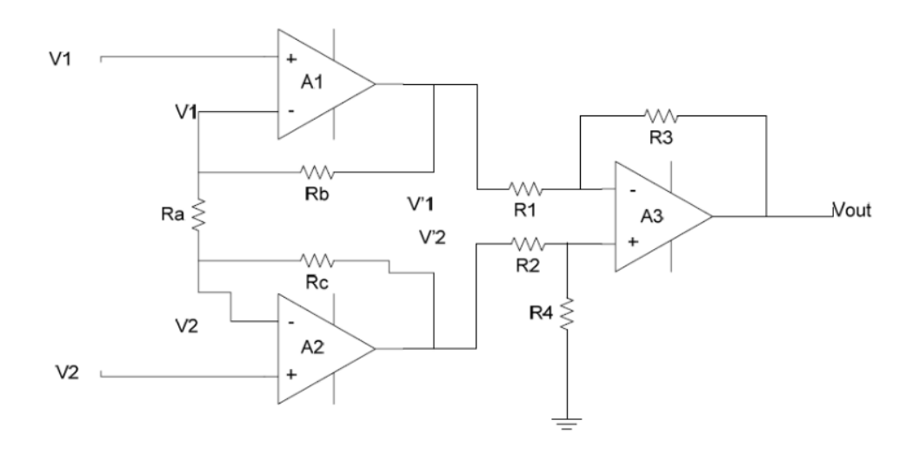 |

#### **2 & 3. 3 Op-Amp Instrumentation Amplifier Derivation & Sizing:**
For a symmetrical 3 Op-Amp topology ($R_b = R_c$, $R_1 = R_2$, $R_3 = R_4$):
$$V_{\text{out}} = \frac{R_3}{R_1} \left( 1 + \frac{2 R_b}{R_a} \right) (V_2 - V_1)$$

Setting differential gain $A_d = 3$ with inputs $V_1 = 100\text{ mV}$ (1 kHz) and $V_2 = 50\text{ mV}$ (1 kHz):
- Select $R_1 = R_2 = R_3 = R_4 = 10\text{ k}\Omega$ (Stage 2 Gain $= 1$).
- Stage 1 condition: $1 + \frac{2 R_b}{R_a} = 3 \implies \mathbf{R_a = R_b = R_c = 10\text{ k}\Omega}$.

#### **4 & 5. Proteus Simulation & Common-Mode Noise Rejection (CMRR):**
- **Clean Signal Test:** Input differential voltage $\Delta V = 50\text{ mV} - 100\text{ mV} = -50\text{ mV}$. Output voltage $V_{\text{out}} = 3 \times (-50\text{ mV}) = \mathbf{-150\text{ mV}}$ (180° phase shifted 1 kHz sine wave).
- **50 Hz Common-Mode Noise Injection:** Injecting a large $50\text{ Hz}, 200\text{ mV}$ noise source in series with both inputs distorts inputs up to $300\text{ mV}$.
- **Simulation Result:** The output $V_{\text{out}}$ remains a completely clean $150\text{ mV}$ 1 kHz sine wave with zero 50 Hz hum, demonstrating superior **CMRR**.

| Figure 4.2: Instrumentation Amp Clean Signal Test | Figure 4.3: 50Hz Common-Mode Noise Rejection (CMRR) |
| :---: | :---: |
| 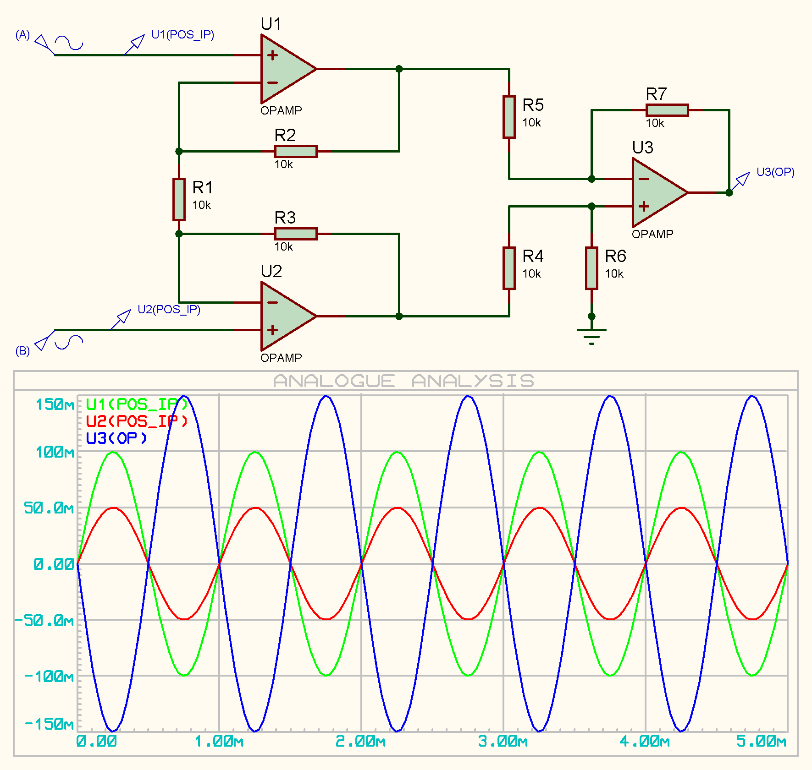 | 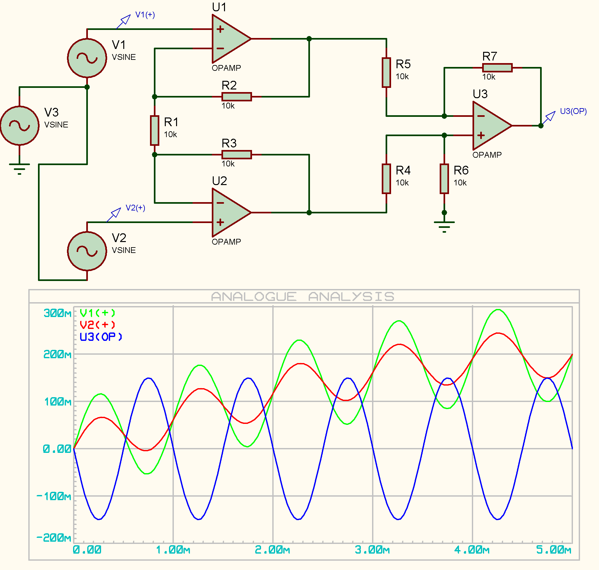 |

#### **6 & 7. AD620 Pressure Sensor Integration & 8-Bit ADC Calculation:**
- **Role of Wheatstone Bridge:** Converts minute strain gauge resistance variations ($\Delta R$) into measurable differential voltage while cancelling power supply drift and ambient temperature noise.
- **AD620 Gain Resistor Calculation ($G = 100$):**
  $$R_g = \frac{49.9\text{ k}\Omega}{G - 1} = \frac{49.9\text{ k}\Omega}{100 - 1} = \frac{49.9}{99} \approx \mathbf{504\,\Omega}$$
- **Balanced State ($R_1 = 3.0\text{ k}\Omega$):** Bridge in balance $\implies V_{\text{out}} = V_{\text{ref}} = \mathbf{2.00\text{ V}}$.
- **Pressure Applied State ($R_1 = 3.3\text{ k}\Omega$):** Unbalanced bridge saturates single-supply AD620 to positive rail limit $\implies V_{\text{out}} = \mathbf{3.84\text{ V}}$.
- **8-Bit Digital ADC Output ($V_{\text{ref,ADC}} = 5\text{ V}$):**
  $$D_{\text{out}} = \text{round}\left( \frac{3.84}{5} \times (2^8 - 1) \right) = \text{round}(0.768 \times 255) = \text{round}(195.84) = \mathbf{196}$$
  $$\text{Binary Representation} = \mathbf{11000100_2}$$

| Figure 4.4: AD620 Pressure System (Equilibrium $R_1=3\text{k}\Omega, V_{\text{out}}=2.0\text{V}$) | Figure 4.5: AD620 Pressure Applied ($R_1=3.3\text{k}\Omega, V_{\text{out}}=3.84\text{V}$) |
| :---: | :---: |
| 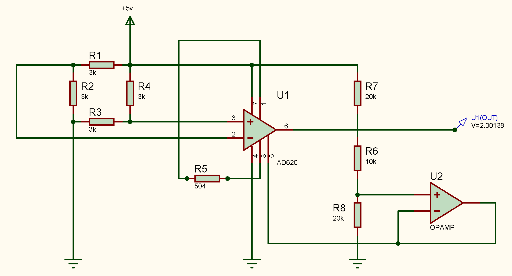 | 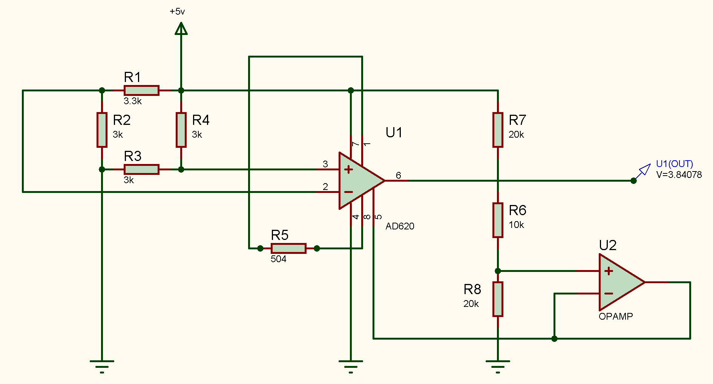 |

---

## 💻 How to Run Simulations

### 1. Simulink Filtering (Question 1)
```matlab
cd HW2/Codes
open_system('q1.slx');
sim('q1.slx');
```

### 2. Proteus Circuit Simulations (Questions 2 - 4)
1. Open **Proteus 8 Professional**.
2. Load any target `.pdsprj` file from `HW2/Proteus/`:
   - `q2.pdsprj`: NTC Thermistor ADC Comparators
   - `q3-2.pdsprj` / `q3-5.pdsprj`: Sawtooth & Triangular Wave Generators
   - `q4-1.pdsprj` / `q4-3.pdsprj`: ECG Conditioning & Instrumentation Amp CMRR
3. Press **Play** (Execute Simulation) to observe virtual oscilloscopes and voltmeters.

---

<div align="center">

**[Go back to Main Repository README](../README.md)**

</div>
