# ⚙️ HW3: Embedded Systems, Timers, EXTI Interrupts & Sensor LCD Interfacing

> **Course:** Instrumentation Engineering (Spring 2026 / 1405)  
> **Instructor:** Dr. Nayeri  
> **Student:** Amirali Dehghani (ID: 810102443)  
> **Microcontroller:** STM32F103 Series (ARM Cortex-M3)  
> **Tools:** STM32CubeIDE, STM32 HAL Library, Proteus 8 Professional, LaTeX  
> **Files Included:** C Source Code (`main.c`), STM32 Config (`.ioc`), Executables (`.hex`), Proteus Files (`.pdsprj`), Demonstration Videos (`.mp4`), Images (`img/`), and Solved Lab Report (`.pdf`).

---

## 📖 Overview

Homework 3 transitions into embedded microcontrollers (STM32F103) for industrial data acquisition, timing control, actuator driving, and visual display interfacing:
1. **Elevator Floor Indicator (7-Segment & EXTI Interrupts):** GPIO configuration for Common Cathode 7-Segment display, continuous 0–9 sequential floor cycling, and **External Interrupts (EXTI)** for emergency floor holds (`Floor 1` and `Floor 9`).
2. **DC Motor Speed & Direction Control (PWM TIM2 + L298 Driver + ADC):** Timer configuration for $1\text{ kHz}$ PWM generation, mathematical Prescaler & Auto-Reload calculations, 12-bit ADC potentiometer speed scaling, L298 H-Bridge driver interfacing, and EXTI direction toggling.
3. **15-Second Precision Countdown System (TIM2 Interrupts + 16x2 LCD + Alarm):** Hardware timer interrupt callback ($500\text{ ms}$ tick), synchronous $1\text{ Hz}$ LED blinking & Buzzer beeping, continuous alarm on expiration ($0\text{ s}$), real-time 16x2 LCD display, and instant `LogicState` reset.
4. **Automatic Industrial Sensor Identification System (12-Bit ADC + Alphanumeric LCD):** Multi-sensor simulation via potentiometer sampling with a 12-bit ADC ($0.8\text{ mV}$ resolution over $3.3\text{ V}$ range), automatic identification of **LM35 Temperature**, **HIH-4000 Humidity**, **MPX4115 Pressure**, and **MQ-135 Gas** sensors, and formatted LCD readout.

---

## 📂 Directory Structure

```text
HW3/
├── Q1/
│   ├── main.c                           # Source code for 7-Segment Elevator & EXTI emergency hold
│   ├── Q1.pdsprj                        # Proteus schematic (STM32 + 7-Segment + Buttons)
│   ├── HW3-1.hex                        # Compiled binary firmware
│   └── HW3-1.ioc                        # STM32CubeMX pinout & clock configuration
├── Q2/
│   ├── main.c                           # Source code for PWM DC motor speed & direction control
│   ├── Q2.pdsprj                        # Proteus schematic (STM32 + L298 Driver + DC Motor + Pot)
│   ├── Q2.hex                           # Compiled binary firmware
│   └── Q2.ioc                           # STM32CubeMX configuration (TIM2 PWM + ADC1 + EXTI)
├── Q3/
│   ├── main.c                           # Source code for 15s Timer Interrupt countdown system
│   ├── Q3.pdsprj                        # Proteus schematic (STM32 + 16x2 LCD + Buzzer + LED)
│   ├── Q3.hex                           # Compiled binary firmware
│   └── Q3.ioc                           # STM32CubeMX configuration (TIM2 Interrupt + GPIO)
├── Q4/
│   ├── main.c                           # Source code for Auto Sensor Classifier & Physical Unit LCD
│   ├── q4.pdsprj                        # Proteus schematic (STM32 + Active Pot + 16x2 LCD)
│   ├── Q4.hex                           # Compiled binary firmware
│   └── Q4.ioc                           # STM32CubeMX configuration (ADC1 12-Bit + GPIO LCD)
├── LCD Files/
│   ├── lcd.c                            # HD44780 LCD HAL driver implementation
│   └── lcd.h                            # HD44780 LCD library header
├── Video/
│   ├── Q1.mp4                           # Video demonstration for Question 1
│   ├── Q2.mp4                           # Video demonstration for Question 2
│   ├── Q3.mp4                           # Video demonstration for Question 3
│   └── Q4.mp4                           # Video demonstration for Question 4
├── img/
│   ├── q1-1.png - q1-5-9.png            # Pinouts, schematics & 7-Segment floor counting frames (0-9)
│   ├── q2-1.png - q2-4-2.png            # TIM2 PWM pinouts, L298 connections & motor rotation plots
│   ├── q3-1.png - q3-3.png              # Countdown LCD schematic, active state & zero-alarm hold
│   └── q4-1.png - q4-6.png              # ADC pinout & LCD readings for LM35, HIH4000, MPX4115, MQ135
├── Inst_HW3.pdf                         # Original Assignment Question Paper
└── Inst-HW3-810102443.pdf               # Complete Solved Lab Report (PDF)
```

---

## 💻 C Source Code & HAL Implementation Analysis

---

### 🔹 Question 1: Elevator Floor Indicator (`Q1/main.c`)

#### **Code Architecture & Register Manipulation:**
- **7-Segment Hex Look-up Table:**
  ```c
  uint8_t segCode[10] = {0x3F, 0x06, 0x5B, 0x4F, 0x66, 0x6D, 0x7D, 0x07, 0x7F, 0x6F};
  ```
  Pre-computed Common Cathode hex codes mapping digits `0` through `9` to GPIOA pins `PA0..PA6`.

- **Atomic ODR Register Update:**
  To update segment outputs without altering high GPIOA pins, atomic bitmasking is performed on the Output Data Register:
  ```c
  GPIOA->ODR = (GPIOA->ODR & 0xFF80) | segCode[currentNumber];
  ```

- **State Machine & EXTI Interrupt Callbacks:**
  ```c
  volatile uint8_t systemState = 0; // State 0: Init (Floor 0), State 1: Running, State 2: Emergency 1, State 3: Emergency 9

  void HAL_GPIO_EXTI_Callback(uint16_t GPIO_Pin) {
      if (GPIO_Pin == GPIO_PIN_1) {
          systemState = 2; // Immediate hold on Floor 1
      } else if (GPIO_Pin == GPIO_PIN_2) {
          systemState = 3; // Immediate hold on Floor 9
      }
  }
  ```
  The asynchronous EXTI callbacks interrupt the $1000\text{ ms}$ `HAL_Delay` loop immediately, guaranteeing zero-latency emergency stopping.

| Figure 1.1: STM32CubeIDE Pinout Configuration | Figure 1.2: Proteus Circuit Schematic |
| :---: | :---: |
| 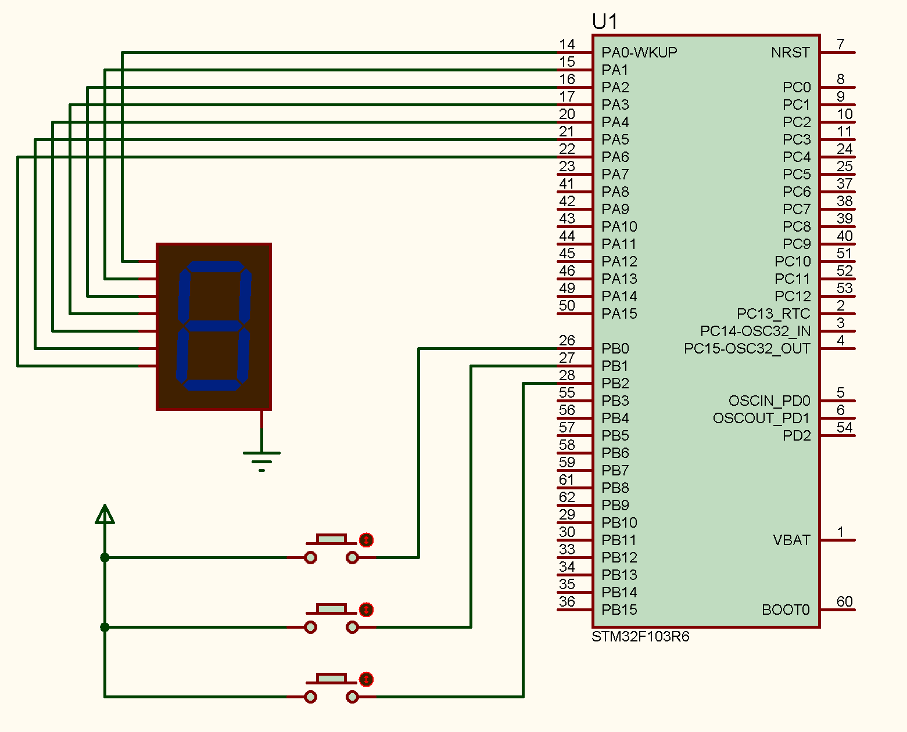 | 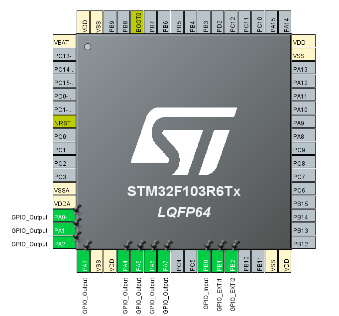 |

| Figure 1.3: Floor 0 (Initial) | Figure 1.4: Floor 5 (Cycling) | Figure 1.5: Emergency Hold Floor 1 (`EXTI1`) | Figure 1.6: Emergency Hold Floor 9 (`EXTI2`) |
| :---: | :---: | :---: | :---: |
| 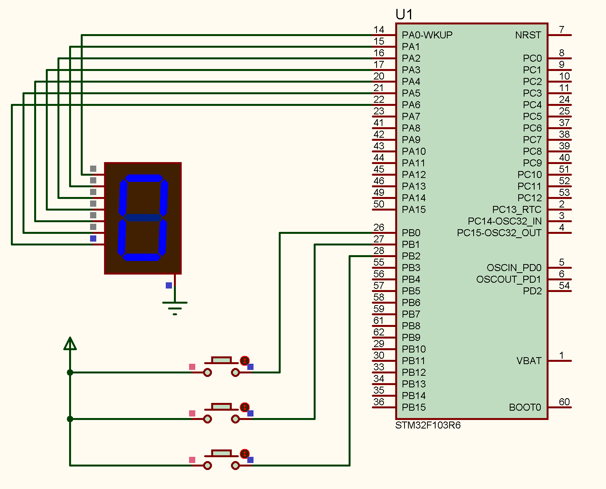 |  | 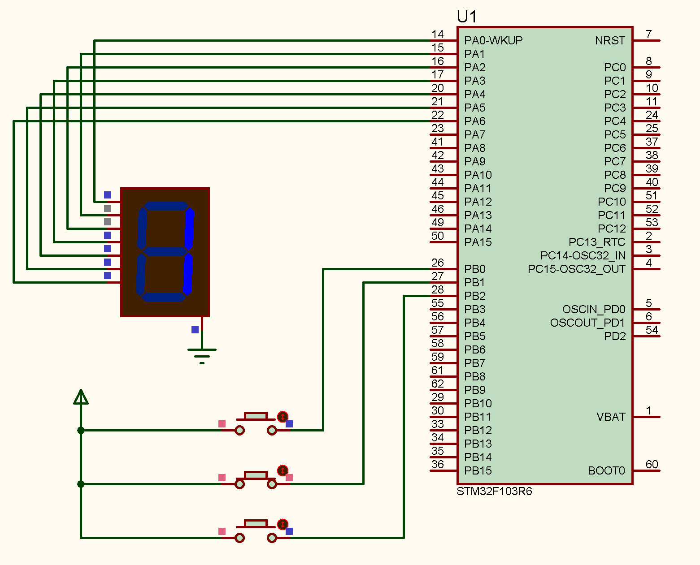 | 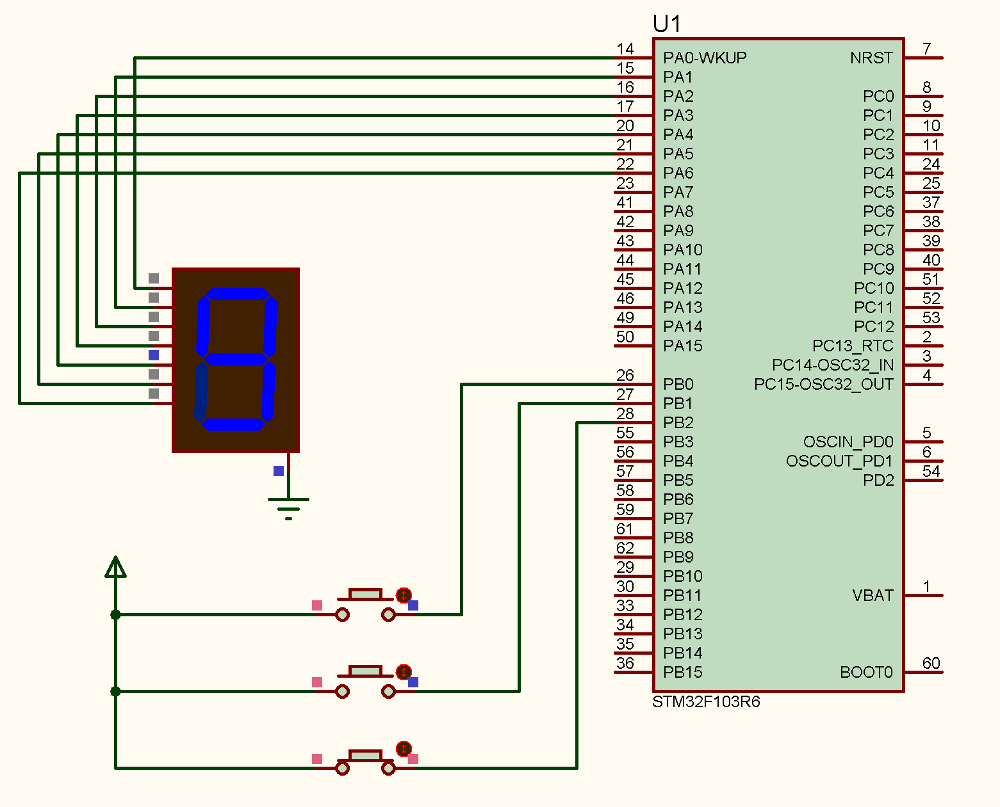 |

---

### 🔹 Question 2: DC Motor Speed & Direction Control (`Q2/main.c`)

#### **Theoretical Prescaler & PWM Frequency Math:**
Target PWM frequency: $f_{\text{PWM}} = 1\text{ kHz}$ on a $f_{\text{TIM}} = 36\text{ MHz}$ timer clock:
$$f_{\text{PWM}} = \frac{f_{\text{TIM}}}{(\text{PSC} + 1) \times (\text{ARR} + 1)} = \frac{36 \times 10^6}{(35 + 1) \times (999 + 1)} = \frac{36 \times 10^6}{36000} = \mathbf{1000\text{ Hz}}$$

#### **C Implementation Highlights:**
- **Timer & ADC Initialization:**
  ```c
  HAL_TIM_PWM_Start(&htim2, TIM_CHANNEL_1);
  ```

- **ADC Sampling & Dynamic PWM Scaling Loop:**
  ```c
  HAL_ADC_Start(&hadc1);
  if (HAL_ADC_PollForConversion(&hadc1, 10) == HAL_OK) {
      adcValue = HAL_ADC_GetValue(&hadc1);
  }
  HAL_ADC_Stop(&hadc1);

  // Mappings: 12-bit ADC (0..4095) -> PWM Duty Cycle ARR range (0..1000)
  pwmValue = (adcValue * 1000) / 4095;
  __HAL_TIM_SET_COMPARE(&htim2, TIM_CHANNEL_1, pwmValue);
  ```

- **H-Bridge Direction Control & EXTI Inversion:**
  ```c
  volatile uint8_t motorDirection = 0;

  void HAL_GPIO_EXTI_Callback(uint16_t GPIO_Pin) {
      if (GPIO_Pin == GPIO_PIN_0) {
          motorDirection = !motorDirection; // Toggle direction on button press
      }
  }
  ```
  The main loop evaluates `motorDirection` and sets L298 driver input pins `PA2` (`IN1`) and `PA3` (`IN2`) accordingly.

| Figure 2.1: TIM2 PWM & ADC Pinout Config | Figure 2.2: L298 Motor Driver Proteus Schematic |
| :---: | :---: |
| 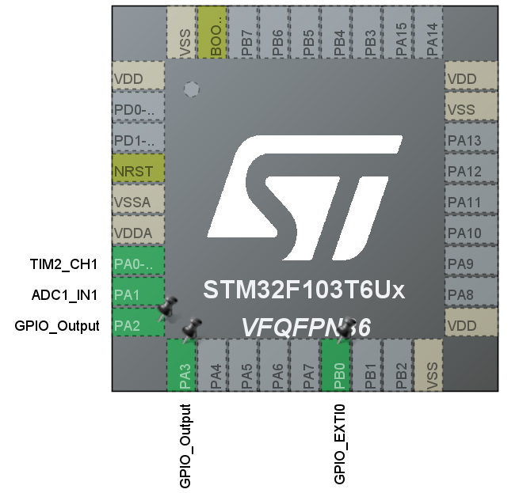 | 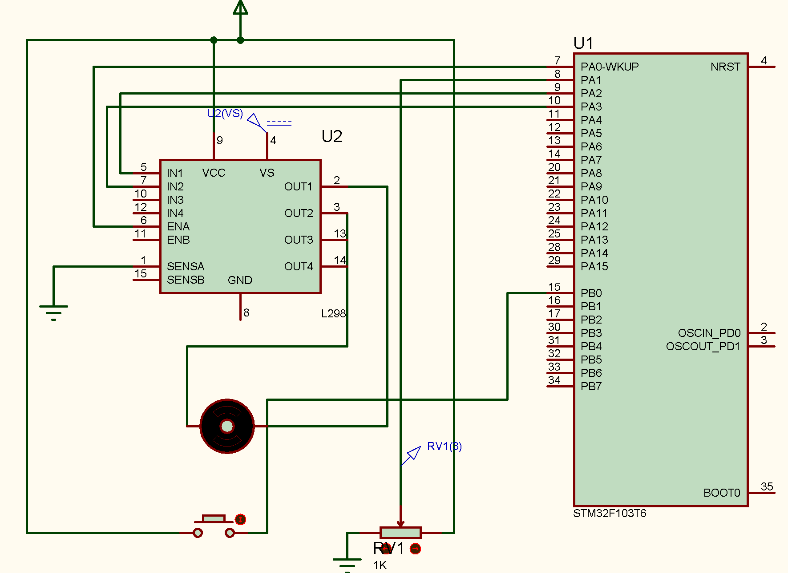 |

| Figure 2.3: Clockwise Rotation & Speed Adjustment | Figure 2.4: Counter-Clockwise Inversion (`EXTI`) |
| :---: | :---: |
|  |  |

---

### 🔹 Question 3: 15-Second Precision Countdown System (`Q3/main.c`)

#### **Timer Interrupt Callbacks & Sub-Second Ticking:**
TIM3 is configured with Prescaler $\text{PSC} = 35999$ and Period $\text{ARR} = 499$, generating a hardware interrupt callback every **$500\text{ ms}$** ($2\text{ Hz}$ tick).

- **Synchronous Alarm & Clock Management in `HAL_TIM_PeriodElapsedCallback`:**
  ```c
  void HAL_TIM_PeriodElapsedCallback(TIM_HandleTypeDef *htim) {
      if (htim->Instance == TIM3) {
          if (isRunning == 1) {
              if (countdown > 0) {
                  timerTick++;
                  if (timerTick % 2 == 1) { // 500ms ON state
                      HAL_GPIO_WritePin(GPIOA, GPIO_PIN_1, GPIO_PIN_SET);  // LED ON
                      HAL_GPIO_WritePin(GPIOA, GPIO_PIN_2, GPIO_PIN_SET);  // Buzzer ON
                  } else {                  // 500ms OFF state (Full 1s elapsed)
                      HAL_GPIO_WritePin(GPIOA, GPIO_PIN_1, GPIO_PIN_RESET); // LED OFF
                      HAL_GPIO_WritePin(GPIOA, GPIO_PIN_2, GPIO_PIN_RESET); // Buzzer OFF
                      countdown--;
                  }
              } else { // Expiration (0s): Latch Alarm Continuously
                  HAL_GPIO_WritePin(GPIOA, GPIO_PIN_1, GPIO_PIN_SET);
                  HAL_GPIO_WritePin(GPIOA, GPIO_PIN_2, GPIO_PIN_SET);
              }
          }
      }
  }
  ```

- **LCD Rendering & Hardware LogicState Reset in `main()`:**
  ```c
  if (HAL_GPIO_ReadPin(GPIOA, GPIO_PIN_0) == GPIO_PIN_SET) {
      if (isRunning == 0 && countdown == 15) isRunning = 1;
  } else {
      isRunning = 0; countdown = 15; // Reset countdown to 15s
      HAL_GPIO_WritePin(GPIOA, GPIO_PIN_1, GPIO_PIN_RESET);
      HAL_GPIO_WritePin(GPIOA, GPIO_PIN_2, GPIO_PIN_RESET);
  }

  if (countdown != last_countdown) {
      sprintf(lcdBuffer, "Time: %02d   ", countdown);
      Lcd_cursor(&lcd, 0, 0);
      Lcd_string(&lcd, lcdBuffer);
      last_countdown = countdown;
  }
  ```

| Figure 3.1: Countdown System Proteus Schematic |
| :---: |
| 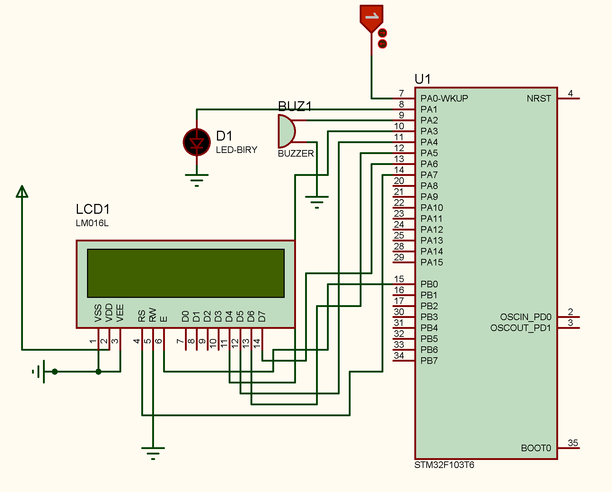 |

| Figure 3.2: Countdown Active (T-minus 8s, Blinking/Beeping) | Figure 3.3: Expiration Alarm Hold (0s, Continuous Alarm) |
| :---: | :---: |
| 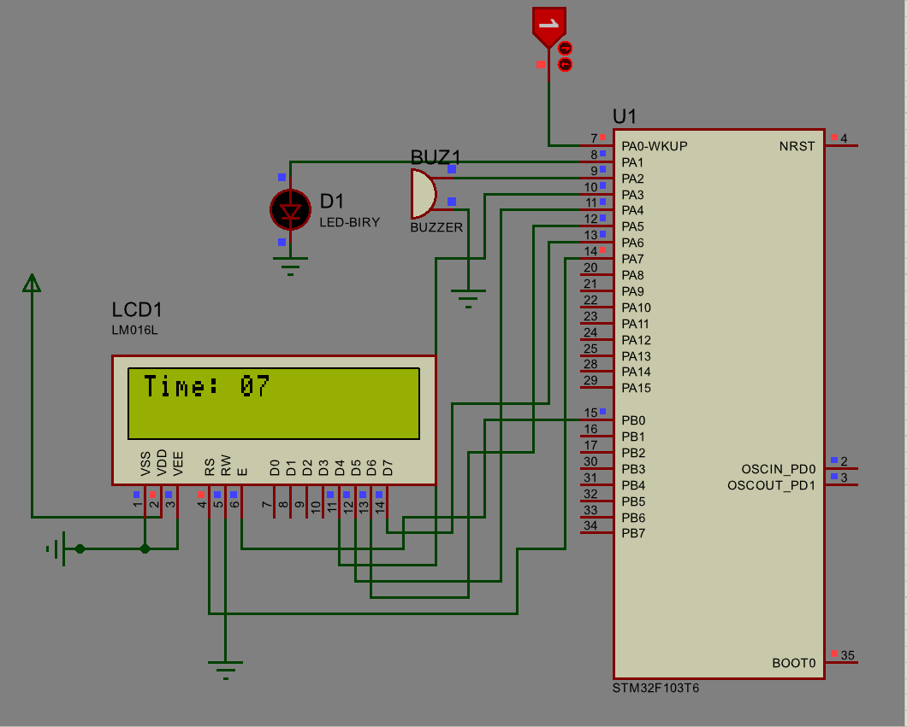 | 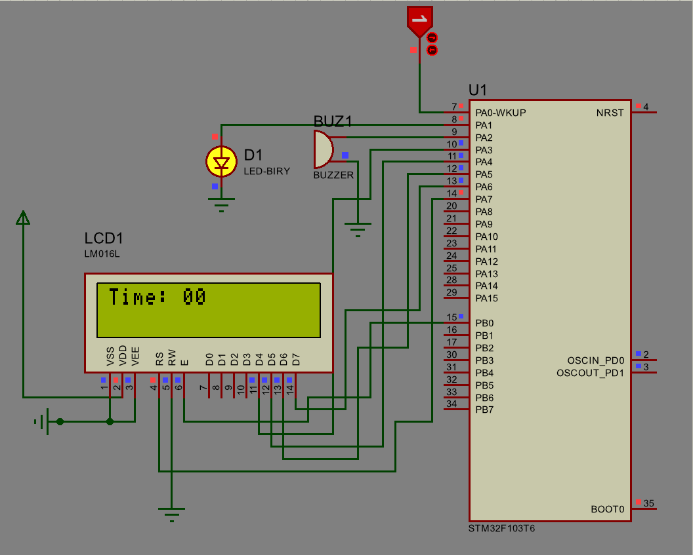 |

---

### 🔹 Question 4: Automatic Multi-Sensor Classifier (`Q4/main.c`)

#### **ADC Sampling & Real-Time Sensor Classification Code:**
- **Quantization Voltage Formula:**
  $$\text{sensorVoltage} = \frac{\text{adcValue} \times 3.3\text{ V}}{4095.0}$$

- **Conditional Multi-Sensor Classification & Formatting:**
  ```c
  HAL_ADC_Start(&hadc1);
  if (HAL_ADC_PollForConversion(&hadc1, 10) == HAL_OK) {
      adcValue = HAL_ADC_GetValue(&hadc1);
      sensorVoltage = (adcValue * 3.3f) / 4095.0f;
  }
  HAL_ADC_Stop(&hadc1);

  if (sensorVoltage >= 0.0f && sensorVoltage < 1.0f) {
      sprintf(sensorName, "Temp: LM35");
      physicalValue = 100.0f * sensorVoltage;
      sprintf(unit, "C");
  } else if (sensorVoltage >= 1.0f && sensorVoltage < 2.0f) {
      sprintf(sensorName, "Hum: HIH-4000");
      physicalValue = 33.3f * sensorVoltage;
      sprintf(unit, "%%");
  } else if (sensorVoltage >= 2.0f && sensorVoltage < 3.0f) {
      sprintf(sensorName, "Pres: MPX4115");
      physicalValue = 100.0f * sensorVoltage;
      sprintf(unit, "hPa");
  } else if (sensorVoltage >= 3.0f && sensorVoltage <= 3.3f) {
      sprintf(sensorName, "Air: MQ-135");
      physicalValue = 100.0f * (sensorVoltage / 3.3f);
      sprintf(unit, "%%");
  }

  sprintf(line1, "%-16s", sensorName);
  sprintf(line2, "Val: %.2f %s   ", physicalValue, unit);
  Lcd_cursor(&lcd, 0, 0); Lcd_string(&lcd, line1);
  Lcd_cursor(&lcd, 1, 0); Lcd_string(&lcd, line2);
  ```

| Voltage Window ($V$) | Classified Sensor | Physical Formula | LCD Line 1 / Line 2 Output |
| :---: | :---: | :---: | :---: |
| **$0.00 - 0.99\text{ V}$** | **LM35 Temperature** | $\text{Temp} = 100 \times V$ | `Temp: LM35` / `Val: 50.00 C` |
| **$1.00 - 1.99\text{ V}$** | **HIH-4000 Humidity** | $\text{Humidity} = 33.3 \times V$ | `Hum: HIH-4000` / `Val: 49.95 %` |
| **$2.00 - 2.99\text{ V}$** | **MPX4115 Pressure** | $\text{Pressure} = 100 \times V$ | `Pres: MPX4115` / `Val: 250.00 hPa` |
| **$3.00 - 3.30\text{ V}$** | **MQ-135 Air Quality** | $\text{Air Quality} = \frac{V}{3.3} \times 100$ | `Air: MQ-135` / `Val: 100.00 %` |

| Figure 4.1: STM32 ADC & LCD Pinout Config | Figure 4.2: Proteus Circuit Diagram |
| :---: | :---: |
| 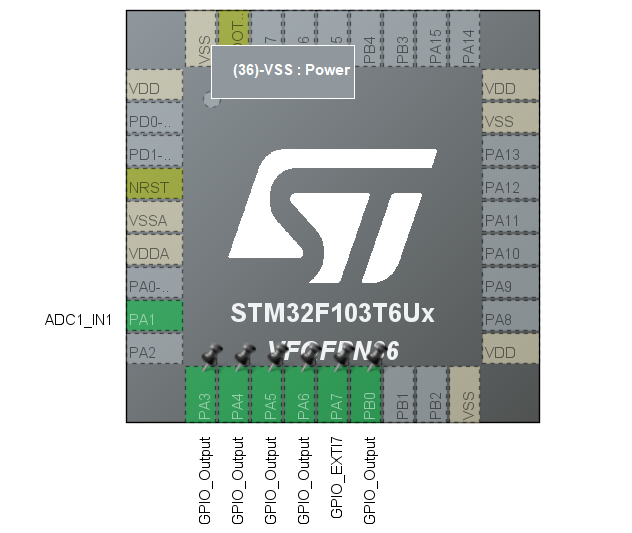 | 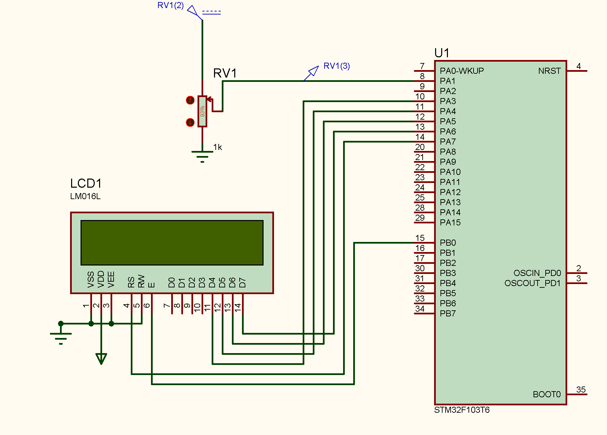 |

| Figure 4.3: LM35 Temp ($0.50\text{ V} \to 50.00^\circ\text{C}$) | Figure 4.4: HIH4000 Humidity ($1.50\text{ V} \to 49.95\%$) |
| :---: | :---: |
| 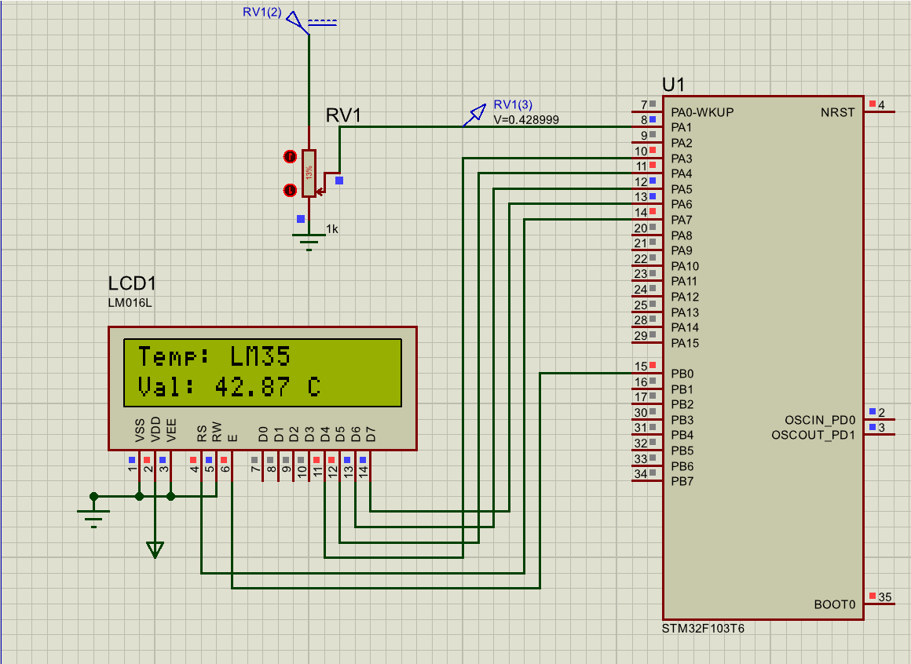 |  |

| Figure 4.5: MPX4115 Pressure ($2.50\text{ V} \to 250.00\text{ hPa}$) | Figure 4.6: MQ-135 Air Quality ($3.30\text{ V} \to 100.00\%$) |
| :---: | :---: |
| 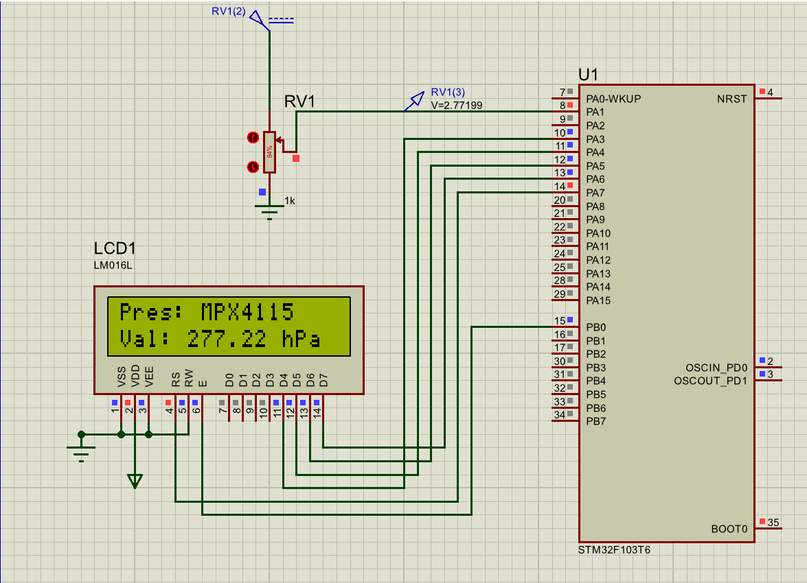 |  |

---

## 💻 How to Build & Simulate

### 1. Building Firmware in STM32CubeIDE
1. Open **STM32CubeIDE**.
2. File $\to$ Open Projects from File System $\to$ Select target folder (`HW3/Q1`, `HW3/Q2`, `HW3/Q3`, or `HW3/Q4`).
3. Build Project (`Ctrl + B`). The output `.hex` binary will generate automatically in `Debug/`.

### 2. Running Proteus Simulation
1. Launch **Proteus 8 Professional**.
2. Open target `.pdsprj` file from `HW3/Q1/`, `HW3/Q2/`, `HW3/Q3/`, or `HW3/Q4/`.
3. Double-click the STM32 microcontroller component and ensure **Program File** points to the corresponding `.hex` file.
4. Press **Play** to start real-time simulation. Demonstration MP4 videos are also available in `HW3/Video/`.

---

<div align="center">

**[Go back to Main Repository README](../README.md)**

</div>
