# ⚙️ HW4: Temperature Transducers, Industrial I2C Sensors & Precision Weighing Scale System

> **Course:** Instrumentation Engineering (Spring 2026 / 1405)  
> **Instructor:** Dr. Nayeri  
> **Student:** Amirali Dehghani (ID: 810102443)  
> **Microcontroller:** STM32F103 Series (ARM Cortex-M3 / BluePill)  
> **Tools:** STM32CubeIDE, MATLAB (`cftool`), Proteus 8 Professional, LaTeX  
> **Files Included:** C Source Code (`main.c`), STM32 Config (`.ioc`), Executables (`.hex`), Proteus Files (`.pdsprj`), Demonstration Videos (`.mp4`), Datasets (`.csv`), Images (`img/`), and Solved Lab Report (`.pdf`).

---

## 📖 Overview

Homework 4 explores precision analog signal conditioning, temperature transducer characterization, digital bus protocols, and strain-gauge loadcell instrumentation:
1. **Multi-Sensor Temperature Characterization (RTD, Thermocouple, Thermistor Datasets):** System identification using MATLAB `cftool`, 4-wire PT100 RTD current loop conditioning, Type K thermocouple Seebeck voltage amplification ($A_v=100$), NTC thermistor exponential modeling ($\beta = 4804\text{ K}$), and real-time STM32 ADC conversion.
2. **Industrial Temperature Sensing & LM75 I2C Digital Thermometer:** Comparative analysis of contact vs. non-contact digital sensors in high-temperature noisy industrial environments ($300^\circ\text{C}-1200^\circ\text{C}$, 50m distance, RS-485 protocol), and BluePill I2C driver implementation for the LM75 9-bit digital thermometer (`0.5^\circ\text{C}$ resolution).
3. **High-Precision Digital Weighing Scale System (0-2 kg Loadcell + Instrumentation Amp + Filters + Tare):** Design of a 3-Op-Amp Instrumentation Amplifier ($A_v = 500$), Wheatstone bridge loadcell linear modeling ($V = 2.5 \cdot m$), 2nd-order damped mechanical vibration simulation, active 1st-order Low-Pass Filter ($f_c = 0.5\text{ Hz}$), zero-latency **Tare (Zero-Calibration)** via EXTI interrupts, and 95% settling time response optimization ($t_{95\%} \approx 0.954\text{ s}$).

---

## 📂 Directory Structure

```text
HW4/
├── Q1/                                  # Multi-Sensor Temperature Conditioning
│   ├── RTD/                             # PT100 4-wire RTD 1mA current source subproject
│   ├── Thermocouple/                    # Type K Seebeck voltage amplifier (Gain=100) subproject
│   ├── Thermistor/                      # NTC Thermistor voltage divider subproject
│   ├── curveFit.m                       # MATLAB system identification script
│   └── Fits.sfit                        # MATLAB Curve Fitting session workspace
├── Q2/                                  # LM75 Digital I2C Thermometer
│   ├── main.c                           # STM32 I2C HAL memory read driver source code
│   ├── Q2.pdsprj                        # Proteus schematic (BluePill + LM75 + LCD)
│   ├── Instr-HW4-Q2.hex                 # Firmware binary
│   └── Instr-HW4-Q2.ioc                 # STM32CubeMX I2C1 pinout configuration
├── Q3/                                  # Digital Weighing Scale System
│   ├── main.c                           # Loadcell ADC scaling & EXTI Tare callback source code
│   ├── Q3-1.pdsprj - Q3-3.pdsprj        # Proteus schematics (Inst Amp + Damped Osc + LPF + Scale)
│   ├── Instr-HW4-Q3.hex                 # Firmware binary
│   └── Instr-HW4-Q3.ioc                 # STM32CubeMX configuration
├── Datasets/                            # Experimental Sensor CSV Data
│   ├── Data_1.csv                       # RTD PT100 Resistance-Temperature dataset
│   ├── Data_2.csv                       # NTC Thermistor Resistance-Temperature dataset
│   └── Data_3.csv                       # Thermocouple Millivolt-Temperature dataset
├── Videos/                              # Simulation Demonstration MP4 Files
│   ├── Q1_1.mp4, Q1_2.mp4, Q1_3.mp4     # Video demos for RTD, Thermocouple & Thermistor
│   ├── Q2.mp4                           # Video demo for LM75 I2C Thermometer
│   └── Q3.mp4                           # Video demo for Digital Weighing Scale with Tare
├── img/                                 # Curve fits, schematics & oscilloscope plots (32 files)
├── Inst_HW4.pdf                         # Original Assignment Question Paper
└── Instr-HW4-810102443.pdf              # Complete Solved Lab Report (PDF)
```

---

## ✍️ Detailed Solutions & Hardware Implementations

---

### 🔹 Question 1: Multi-Sensor Temperature Characterization & Signal Conditioning

#### **1. Dataset Identification via MATLAB (`cftool`):**

| Sensor Dataset | Physics & Output Quantity | Derived Mathematical Characteristic Curve | Classified Transducer Type | Key Parameters |
| :---: | :---: | :---: | :---: | :---: |
| **Dataset 1** | Resistance ($\Omega$) | $R(T) = 0.3557 \cdot T + 99.68 \quad [\Omega]$ | **PT100 RTD** (Platinum) | $R_{\text{ref}} = 99.68\,\Omega \approx 100\,\Omega$, $\alpha_1 = \mathbf{0.003568\text{ }^\circ\text{C}^{-1}}$ |
| **Dataset 2** | Resistance ($\Omega$) | $R(T) = 30500 \cdot e^{-0.05899 \cdot T} \quad [\Omega]$ | **NTC Thermistor** | $R_0 = 30500\,\Omega$ at $0^\circ\text{C}$, $\beta = \mathbf{4804\text{ K}}$ |
| **Dataset 3** | Voltage ($\text{mV}$) | $V(T) = 0.041 \cdot T + 0.02007 \quad [\text{mV}]$ | **Type K Thermocouple** | Sensitivity $\alpha = \mathbf{41\,\mu\text{V/}}^\circ\text{C}$, Cold Junction $T_0 \approx 0^\circ\text{C}$ |

| Figure 1.1: Dataset 1 Linear Fit (PT100 RTD) | Figure 1.2: Dataset 2 Exponential Fit (NTC Thermistor) | Figure 1.3: Dataset 3 Linear Fit (Type K Thermocouple) |
| :---: | :---: | :---: |
| 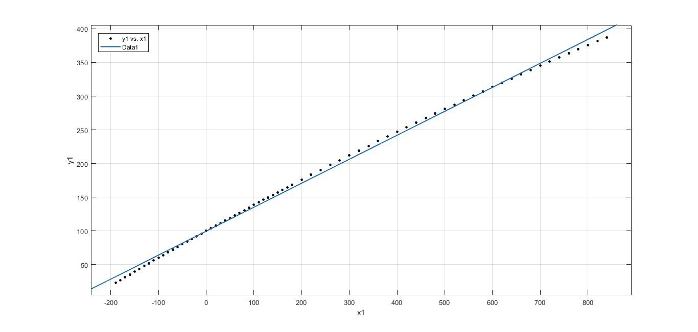 | 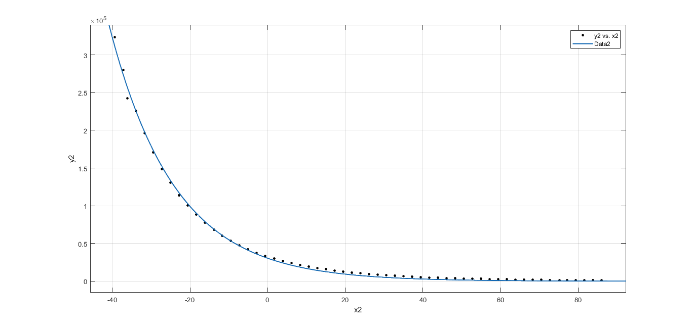 | 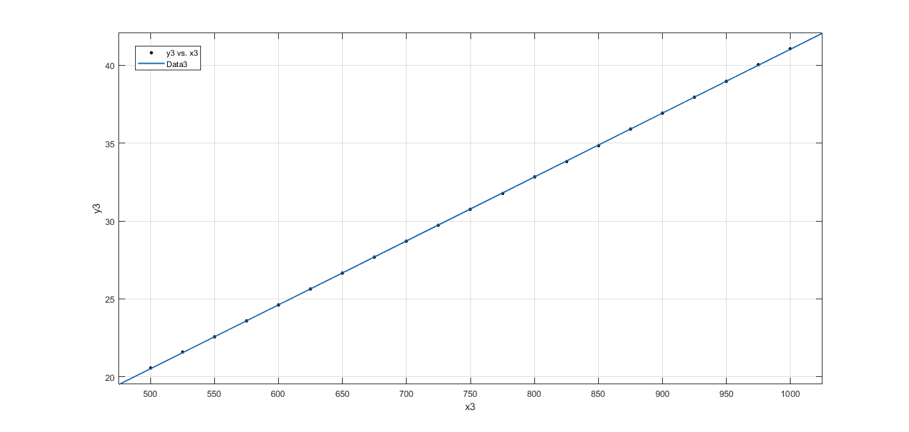 |

---

#### **2. PT100 RTD Signal Conditioning Circuit:**
- **Excitation:** Constant current source $I = 1\text{ mA}$ connected across 4-wire PT100 RTD.
- **Differential Amplifier:** Voltage drop across RTD is amplified by a differential amplifier with **Gain $= 10$**.
- **STM32 Processing Formula:**
  $$V_{\text{amp}} = \text{ADC} \times \frac{5.0}{4095} \implies R_{\text{RTD}} = V_{\text{amp}} \times 100 \implies T = \frac{R_{\text{RTD}} - 99.68}{0.3557} \quad [^\circ\text{C}]$$

| Figure 1.4: 4-Wire PT100 RTD Conditioning Schematic | Figure 1.5: LCD Output at $20^\circ\text{C}$ | Figure 1.6: LCD Output at $30^\circ\text{C}$ |
| :---: | :---: | :---: |
| 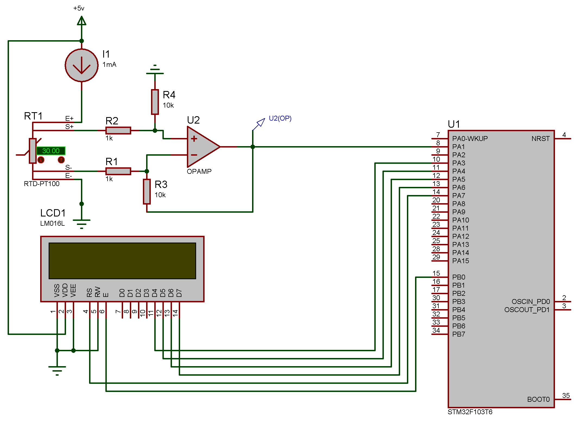 | 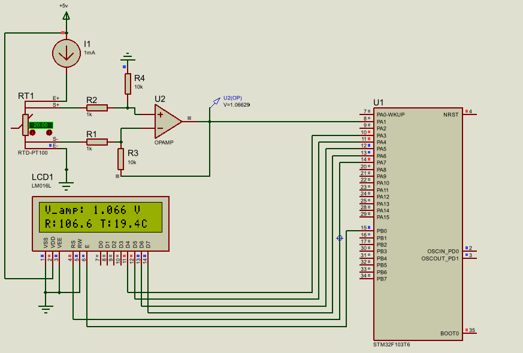 |  |

---

#### **3. Type K Thermocouple Seebeck Voltage Amplifier:**
- **Signal Conditioning:** Small thermoelectric Seebeck output ($41\,\mu\text{V/}^\circ\text{C}$) is amplified using a non-inverting operational amplifier with **Gain $= 100$** ($41\text{ mV}$ full-scale $\to 4.1\text{ V}$).
- **STM32 Processing Formula:**
  $$V_{\text{tc}} = 10 \cdot V_{\text{amp}} \quad [\text{mV}] \implies T = \frac{V_{\text{tc}} - 0.02007}{0.041} \quad [^\circ\text{C}]$$

| Figure 1.7: Thermocouple Amplifier Schematic | Figure 1.8: LCD Output at $25\text{ mV}$ ($609.3^\circ\text{C}$) | Figure 1.9: LCD Output at $41\text{ mV}$ ($999.5^\circ\text{C}$) |
| :---: | :---: | :---: |
| 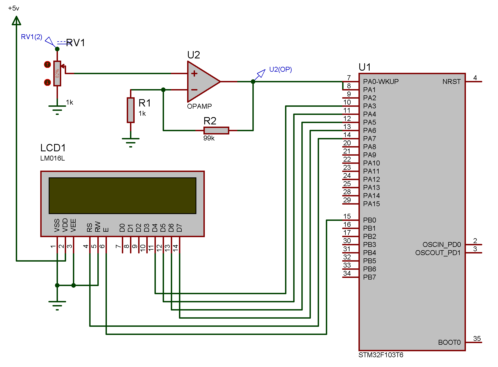 | 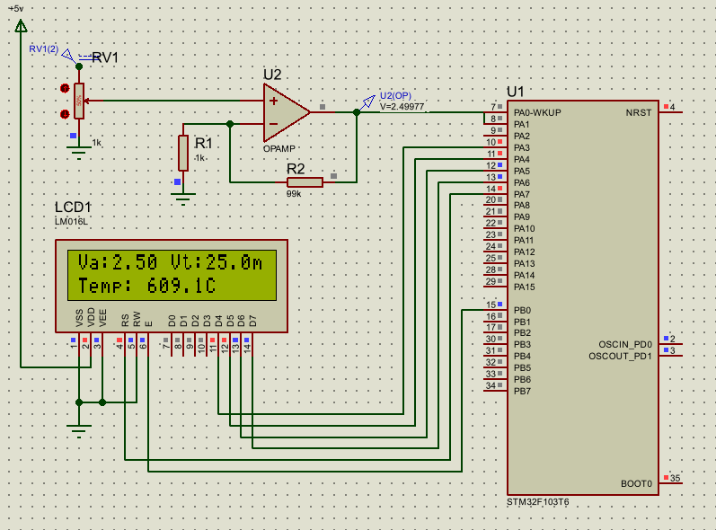 | 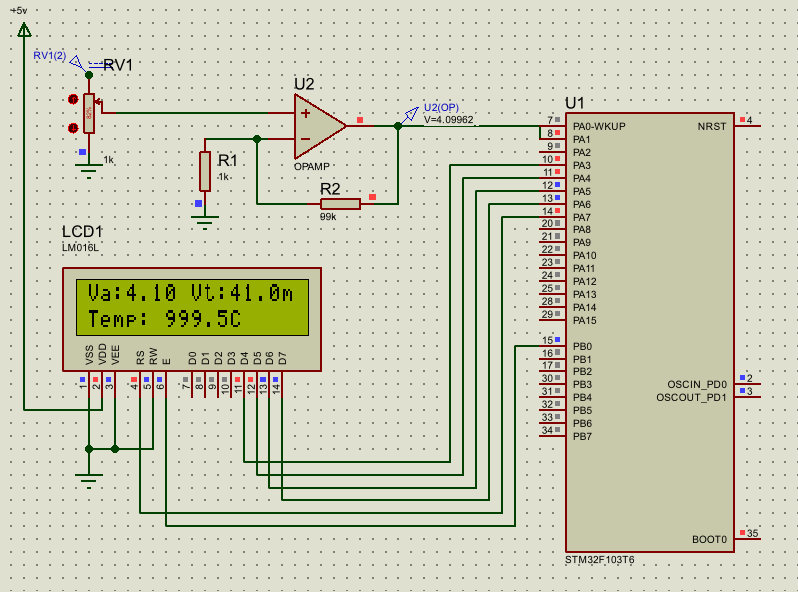 |

---

#### **4. NTC Thermistor Voltage Divider Circuit:**
- **Voltage Divider:** NTC thermistor connected in series with a fixed $10\text{ k}\Omega$ resistor to $5\text{ V}$ rail.
- **STM32 Processing Formula:**
  $$R_{\text{NTC}} = 10000 \times \left( \frac{5.0}{V_{\text{out}}} - 1 \right) \implies T = \frac{\ln(R_{\text{NTC}} / 30500)}{-0.05899} \quad [^\circ\text{C}]$$

| Figure 1.10: Thermistor Divider Schematic | Figure 1.11: LCD Output at $25^\circ\text{C}$ ($25.1^\circ\text{C}$) | Figure 1.12: LCD Output at $35^\circ\text{C}$ ($29.9^\circ\text{C}$) |
| :---: | :---: | :---: |
| 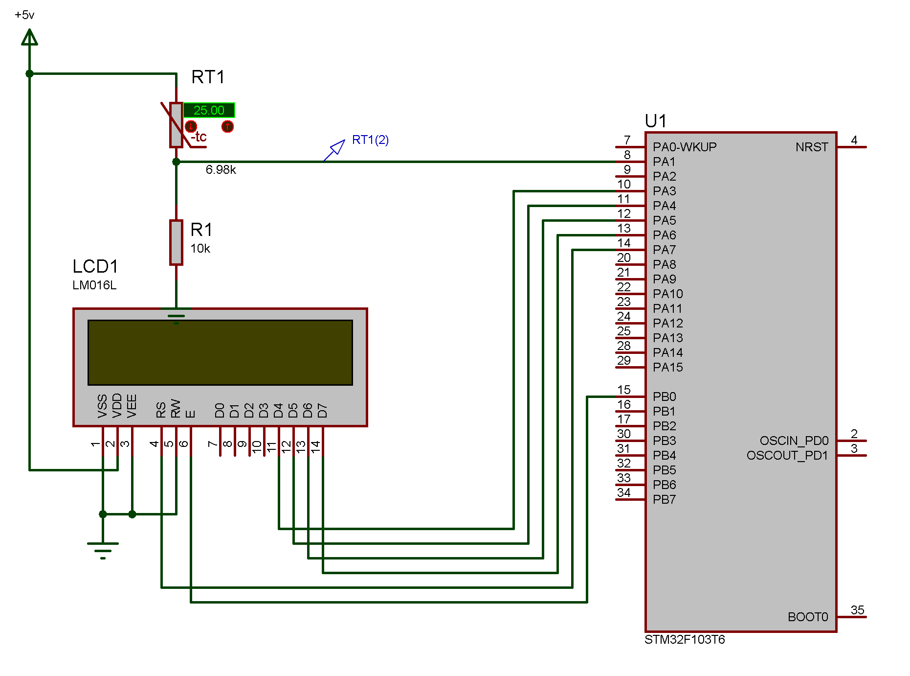 | 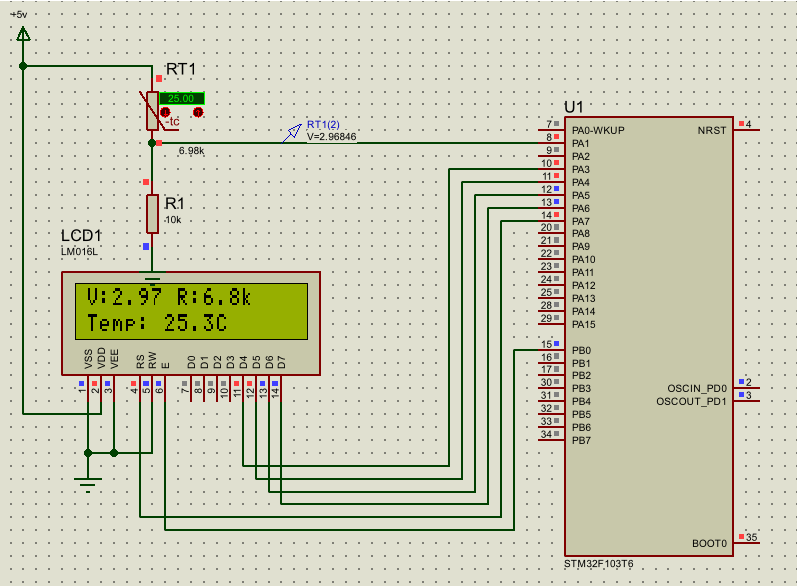 | 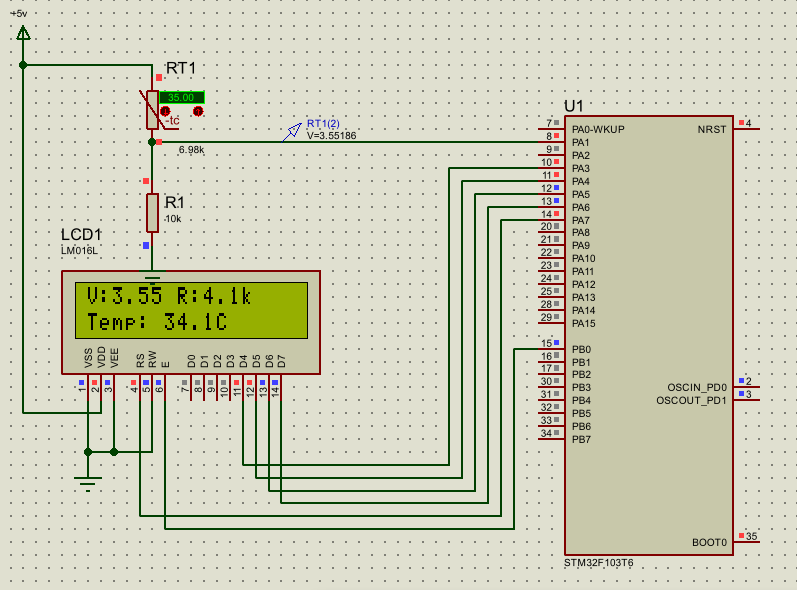 |

---

### 🔹 Question 2: Industrial Sensor Selection & LM75 I2C Digital Thermometer

#### **1. Industrial Environment Trade-Off Analysis ($300^\circ\text{C}-1200^\circ\text{C}$ Furnace, 50m Distance, EMI Noise):**
- **Sensor Type Selection:** A **contactless digital pyrometer** is mandatory. Direct probe contact at $1200^\circ\text{C}$ causes rapid physical destruction, probe oxidation, and thermal degradation.
- **Signal Transmission Integrity:** Digital signals eliminate analog voltage attenuation and electromagnetic noise pick-up over long 50m wire runs.
- **Optimal Protocol:** **RS-485 (Differential Serial Bus)**. Standard PCB protocols like I2C or SPI fail over distances $>1\text{ m}$. RS-485 differential signaling rejects severe industrial common-mode electromagnetic noise over distances up to $1200\text{ m}$.

---

#### **2. LM75 Digital I2C Thermometer Interfacing (STM32 BluePill):**
- **I2C Address:** 8-bit read address `0x91` (Hardware address pins `A0..A2` grounded).
- **I2C Memory Read API:**
  ```c
  HAL_I2C_Mem_Read(&hi2c1, LM75_ADDR_8BIT, TEMP_REGISTER, I2C_MEMADD_SIZE_8BIT, temp_data, 2, 100);
  ```
- **9-Bit Temperature Extraction Logic:**
  - 16-bit word synthesized from 2 received bytes: `uint16_t temp_raw = (temp_data[0] << 8) | temp_data[1];`
  - 9-bit MSB extracted by right-shifting 7 bits: `int16_t temp_val = (int16_t)temp_raw >> 7;`
  - Physical Temperature: $T = \text{temp\_val} \times 0.5^\circ\text{C}$.
  - Error Handling: Display `"Sensor Error"` if I2C polling fails or timeouts.

| Figure 2.1: LM75 I2C BluePill Schematic | Figure 2.2: LCD Output at $22^\circ\text{C}$ | Figure 2.3: LCD Output at $42^\circ\text{C}$ |
| :---: | :---: | :---: |
| 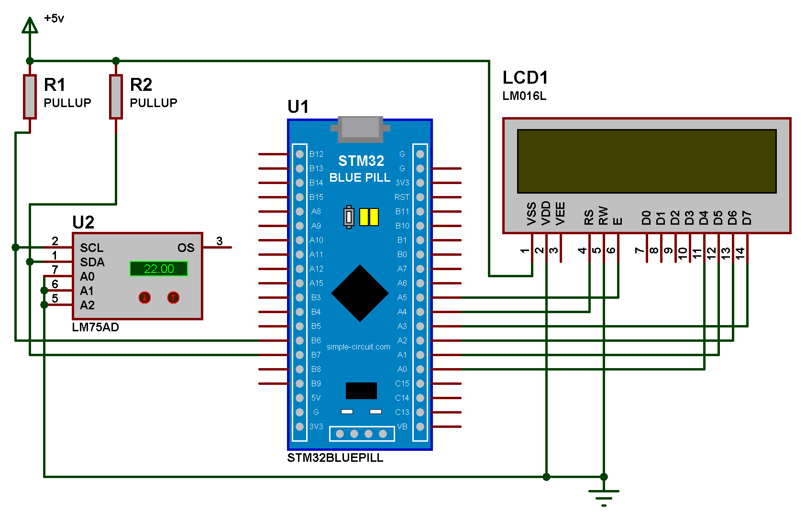 | 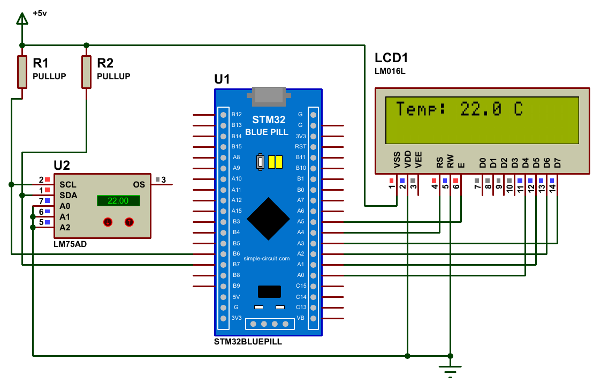 |  |

---

### 🔹 Question 3: High-Precision Digital Weighing Scale System (0-2 kg Loadcell)

#### **1. 3-Op-Amp Instrumentation Amplifier Design:**
Target mass range $0 - 2\text{ kg}$, Loadcell full-scale differential output $\Delta V_{\text{in}} = 10\text{ mV}$, target ADC range $0 - 5\text{ V}$.

$$\text{Total Required Gain } A_v = \frac{\Delta V_{\text{out}}}{\Delta V_{\text{in}}} = \frac{5\text{ V}}{10\text{ mV}} = \mathbf{500}$$

- **Direct Buffer Stage ($A_1 = 50$):**
  $$A_1 = 1 + \frac{2 R_1}{R_g} = 50 \implies \text{Select } R_g = 1\text{ k}\Omega \implies R_1 = 24.5\text{ k}\Omega$$
- **Differential Stage ($A_2 = 10$):**
  $$A_2 = \frac{R_3}{R_2} = 10 \implies \text{Select } R_2 = 10\text{ k}\Omega \implies R_3 = 100\text{ k}\Omega$$
- **Theoretical Transfer Function:** $V_{\text{out}} = 2.5 \cdot m \quad [\text{V}]$ (Sensitivity $2.5\text{ V/kg}$).

| Figure 3.1: Instrumentation Amplifier & Loadcell | Figure 3.2: Circuit Output at $1\text{ kg}$ ($50\% \to 2.5\text{ V}$) | Figure 3.3: Circuit Output at $2\text{ kg}$ ($100\% \to 5.0\text{ V}$) |
| :---: | :---: | :---: |
| 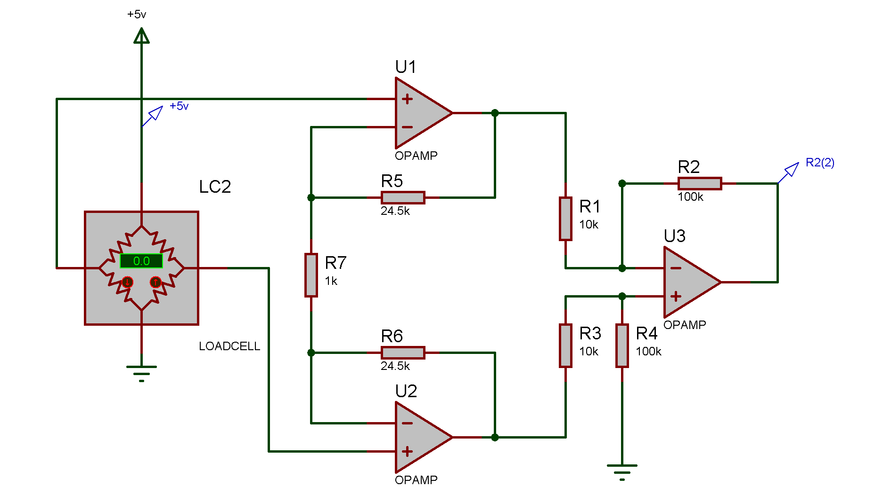 |  |  |

---

#### **2. Loadcell Characteristic Linearity & Mechanical Vibration Simulation:**
- **Measured Transfer Function:** $V_{\text{out}} = 2.4999 \cdot m$ ($100\%$ linear correlation!).
- **Damped Mechanical Ringing Simulation:** A 2nd-order Low-Pass filter connected after the Instrumentation Amplifier simulates spring-mass elasticity when a weight is dropped onto the scale platter.
- **Active 1st-Order Low-Pass Filter ($f_c = 0.5\text{ Hz}$):**
  $$f_c = \frac{1}{2 \pi R C} = 0.5\text{ Hz} \implies \text{Select } C = 10\,\mu\text{F} \implies R = \frac{1}{2 \pi (0.5) (10 \times 10^{-6})} = \mathbf{31.83\text{ k}\Omega}$$

| Figure 3.4: Loadcell Linear Characteristic Plot | Figure 3.5: Damped Vibration Circuit Schematic | Figure 3.6: Oscilloscope Ringing & LPF Filtered Signals |
| :---: | :---: | :---: |
| 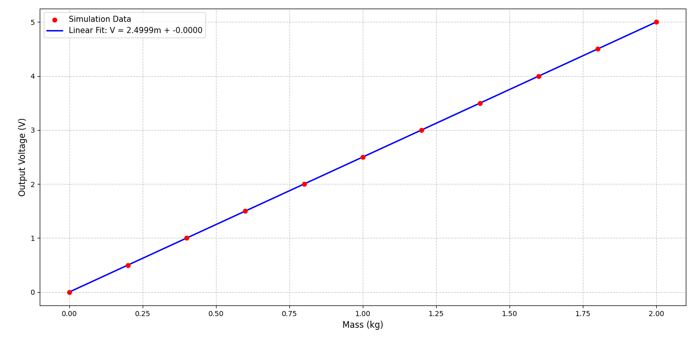 | 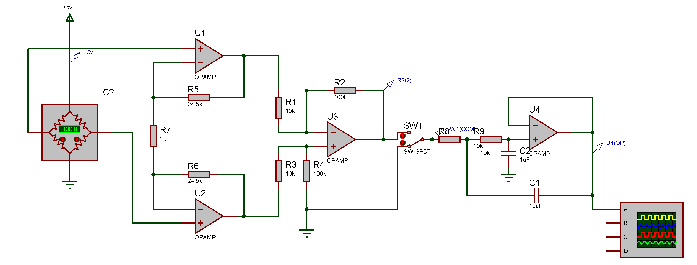 | 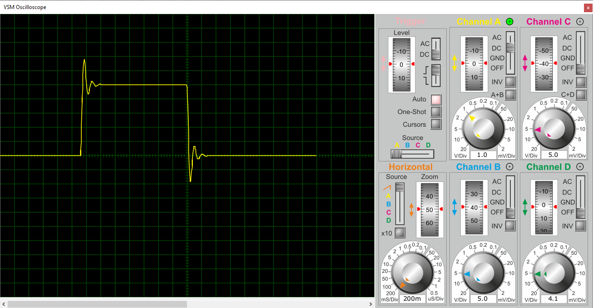 |

---

#### **3. Firmware Tare (Zero-Calibration) & Dynamic Step Response:**
- **Tare Functionality:** EXTI push button executes `HAL_GPIO_EXTI_Callback` to capture current gross weight as `tareOffset`. Net Weight $= \text{Gross} - \text{Tare}$.
- **95% Settling Time Calculation:**
  $$\tau = \frac{1}{2 \pi f_c} = \frac{1}{2 \pi (0.5)} = \frac{1}{\pi} \approx 0.318\text{ s} \implies t_{95\%} \approx 3 \tau = 3 \times 0.318 = \mathbf{0.954\text{ seconds}}$$
- **Response Speed Optimization Methods:**
  1. Use higher-order active analog filters (2nd or 3rd order) with a higher cutoff frequency for sharp attenuation without slowing settling time.
  2. Implement hybrid digital filtering algorithms (e.g., Moving Average or Kalman filtering) inside STM32 firmware.

| Figure 3.7: Full Digital Scale System Schematic | Figure 3.8: LCD Display Before Tare ($1.00\text{ kg}$) | Figure 3.9: LCD Display After Tare Zero-Calibration ($0.00\text{ kg}$) |
| :---: | :---: | :---: |
| 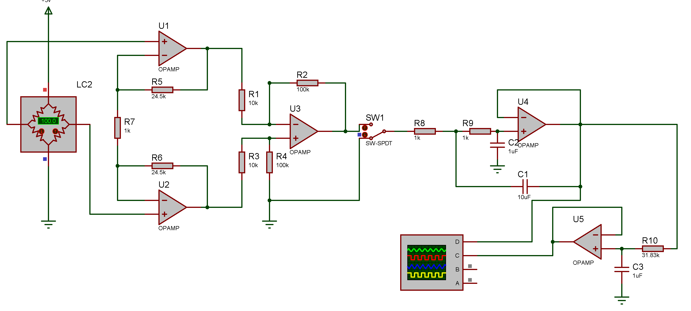 | 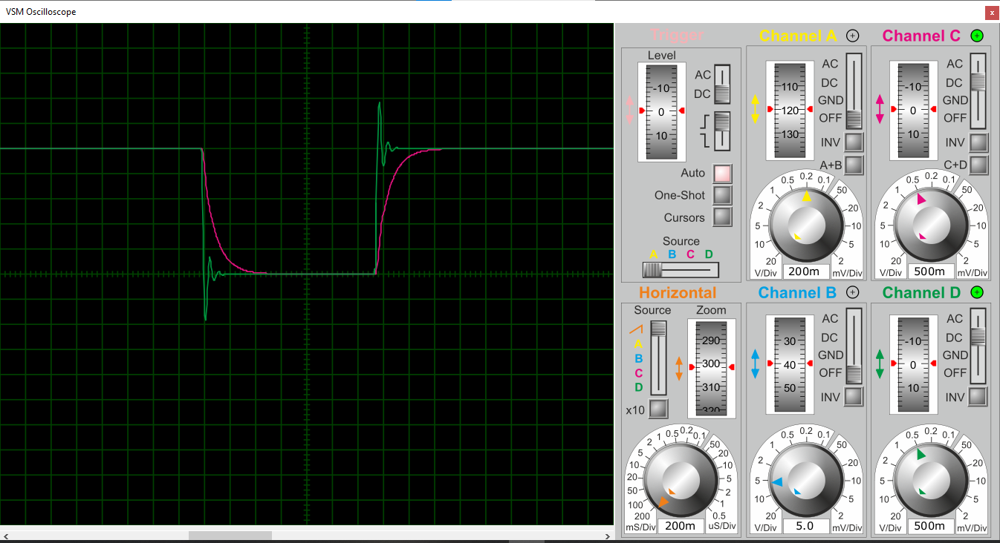 | 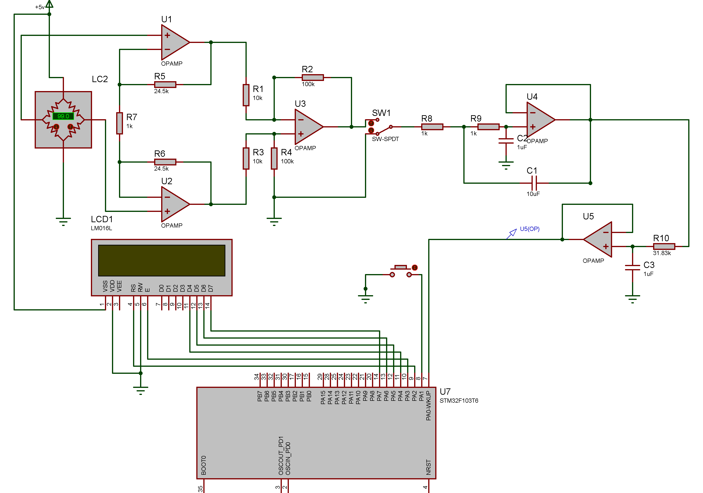 |

| Figure 3.10: Dynamic Oscilloscope Step Response ($1\text{ kg}$ Sudden Impact) |
| :---: |
| 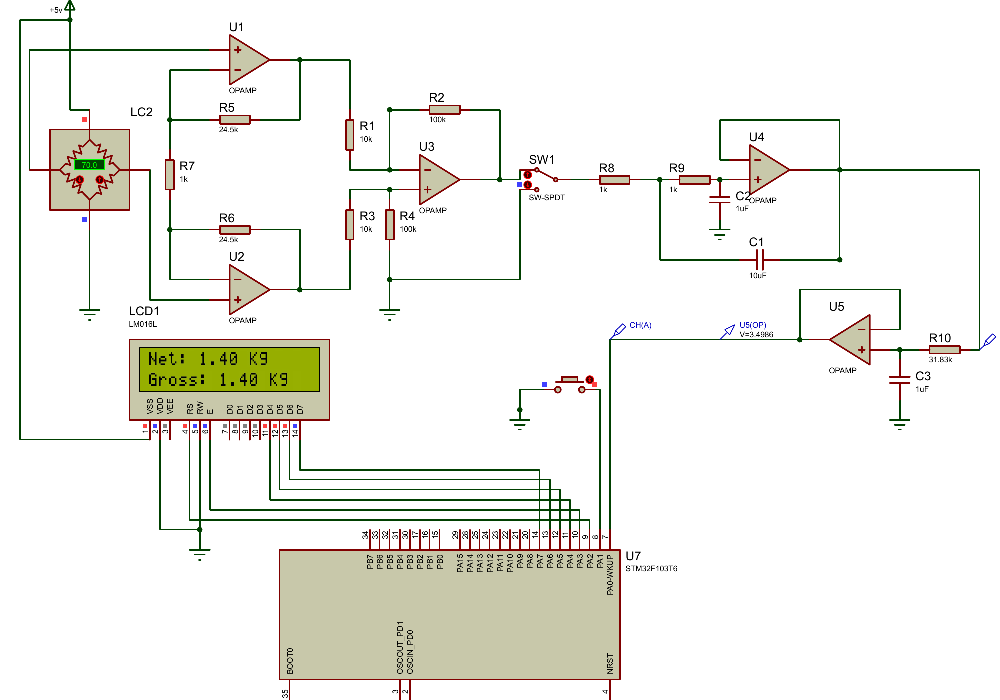 |

---

## 💻 How to Build & Simulate

### 1. Building Firmware in STM32CubeIDE
1. Open **STM32CubeIDE**.
2. File $\to$ Open Projects from File System $\to$ Select target folder (`HW4/Q1/RTD`, `HW4/Q1/Thermocouple`, `HW4/Q1/Thermistor`, `HW4/Q2`, or `HW4/Q3`).
3. Build Project (`Ctrl + B`). The output `.hex` binary will generate automatically in `Debug/`.

### 2. Running Proteus Simulation
1. Launch **Proteus 8 Professional**.
2. Open target `.pdsprj` file from `HW4/Q1/`, `HW4/Q2/`, or `HW4/Q3/`.
3. Double-click the STM32 microcontroller component and ensure **Program File** points to the corresponding `.hex` file.
4. Press **Play** to start real-time simulation. Demonstration MP4 videos are also available in `HW4/Videos/`.

---

<div align="center">

**[Go back to Main Repository README](../README.md)**

</div>
