# ⚙️ HW5: Actuators, Motors, Ultrasonic/IR Sensors & Rotary Encoder Decoding

> **Course:** Instrumentation Engineering (Spring 2026 / 1405)  
> **Instructor:** Dr. Nayeri  
> **Student:** Amirali Dehghani (ID: 810102443)  
> **Microcontroller:** STM32F103 Series (ARM Cortex-M3)  
> **Tools:** STM32CubeIDE, STM32 HAL Library, Proteus 8 Professional, LaTeX  
> **Files Included:** C Source Code (`q1-*.c` to `q4-*.c`), STM32 Config (`.ioc`), Executables (`.hex`), Proteus Files (`.pdsprj`), Demonstration Videos (`.mp4`), Images (`img/`), and Solved Lab Report (`.pdf`).

---

## 📖 Overview

Homework 5 focuses on advanced electromechanical actuation, sensor interfacing, and motion measurement using the STM32F103 microcontroller:
1. **DC Motor Speed & Direction Control (L293D H-Bridge Driver):** Theoretical analysis of motor drivers, PWM duty cycle modulation ($0 - 100\%$), H-Bridge directional switching (`CW` / `CCW`), and real-time LCD state updates.
2. **Solar Tracker Panel Control (Stepper Motor 1.8° + ULN2003A Driver):** Open-loop precise angular stepping, manual push-button positioning, automatic continuous solar tracking ($1.8^\circ / 2\text{ s}$ up to $180^\circ$), rapid high-speed reset rewinding, and theoretical comparison between **Full-Step** and **Half-Step** excitation modes.
3. **Distance & Proximity Interfacing (Ultrasonic & Infrared Sensors):** Time-of-Flight (ToF) distance calculation using ultrasonic pulse timing ($d = \frac{t \cdot 0.034}{2}\text{ cm}$) and active reflection obstacle detection using IR proximity sensors.
4. **Angle Measurement, Optocounter Speed & Incremental Encoder Decoding:** High-precision potentiometer angle sensing ($0.0659^\circ$ resolution), optocounter frequency-to-RPM conversion ($N = 23$ slots), and 1-channel vs 2-channel quadrature incremental encoder decoding (**1x**, **2x**, and **4x** decoding modes down to $0.342^\circ$ resolution).

---

## 📂 Directory Structure

```text
HW5/
├── Q1/                                  # DC Motor Control with L293D
│   ├── q1-1.c, q1-2.c, q1-3.c           # C Source codes for Init, Speed & Direction control
│   ├── Q1.pdsprj                        # Proteus schematic (STM32 + L293D + DC Motor + LCD)
│   ├── q1-1.hex, q1-2.hex, q1-3.hex     # Compiled binaries
│   ├── Q1.ioc                           # STM32CubeMX configuration
│   └── Q1.mp4                           # Video demonstration
├── Q2/                                  # Solar Tracker Stepper Motor Control
│   ├── q2-1.c, q2-2.c, q2-3.c           # Manual stepping, Auto tracking & Reset C codes
│   ├── Q2.pdsprj                        # Proteus schematic (STM32 + ULN2003A + Stepper + LCD)
│   ├── q2-1.hex, q2-2.hex, q2-3.hex     # Compiled binaries
│   ├── Q2.ioc                           # STM32CubeMX configuration
│   └── Q2.mp4                           # Video demonstration
├── Q3/                                  # Ultrasonic & IR Proximity Sensors
│   ├── q3-1.c, q3-2.c                   # ToF Ultrasonic & IR Obstacle Detection source code
│   ├── Q3-1.pdsprj, Q3-2.pdsprj         # Proteus schematics
│   ├── q3-1.hex, q3-2.hex               # Compiled binaries
│   ├── Q3-1.mp4, Q3-2.mp4               # Video demonstrations
│   ├── UltrasonicSensor.HEX             # Sensor model library firmware
│   └── InfraredSensorsTEP.HEX           # IR model library firmware
├── Q4/                                  # Angle, Optocounter & Incremental Encoder
│   ├── q4-1.c                           # Potentiometer 12-bit ADC angle measurement
│   ├── q4-2.c                           # Optocounter RPM measurement (N=23 slots)
│   ├── q4-3-1.c, q4-3-2.c, q4-3-3.c     # Rotary Encoder 1x, 2x, and 4x Quadrature decoding
│   ├── Q4-1.pdsprj - Q4-3.pdsprj        # Proteus schematics
│   ├── Q4-1.mp4 - Q4-3.mp4              # Video demonstrations
│   └── *.hex, *.ioc                     # Firmware binaries & CubeMX pinouts
├── LCD Files/
│   ├── lcd.c                            # HD44780 LCD HAL driver implementation
│   └── lcd.h                            # HD44780 LCD library header
├── img/                                 # Extracted schematics, plots & LCD screenshots (41 files)
├── Description.pdf                      # Original Assignment Question Paper
└── Report.pdf                           # Complete Solved Lab Report (PDF)
```

---

## ✍️ Detailed Solutions & Embedded Hardware Implementations

---

### 🔹 Question 1: DC Motor Speed & Direction Control (L293D H-Bridge Driver)

#### **1. Theoretical Justification for Motor Drivers:**
Direct connection of a DC motor to microcontroller GPIO pins is strictly prohibited due to three critical hardware constraints:
- **Current Drive Limitation:** Microcontroller GPIO pins provide a maximum of $10 - 20\text{ mA}$, whereas a small DC motor draws hundreds of milliamperes to several amperes during startup and load conditions. Attempting direct draw will permanently destroy the microcontroller.
- **Voltage Domain Mismatch:** Microcontrollers operate at logic levels ($3.3\text{ V}$ or $5\text{ V}$), while industrial DC motors operate at $12\text{ V}, 24\text{ V}$, or higher.
- **Inductive Back-EMF Voltage Spikes:** Inductive motor windings generate massive reverse voltage spikes ($V = -L \frac{di}{dt}$) during switching off or direction reversal. The L293D driver incorporates internal **freewheeling flyback diodes** that clamp these high-voltage transients safely to power rails.

#### **2. STM32 Firmware & Hardware Setup:**
- **PWM Speed Modulation:** TIM2 Channel 1 on `PA0` generates a PWM signal connected to L293D `EN1,2`.
- **Direction Control:** Pins `PA1` (`IN1`) and `PA2` (`IN2`) set direction logic (`1,0` for `CW`, `0,1` for `CCW`).
- **User Interface:** Push buttons on `PB0` (Duty Cycle $+10\%$), `PB1` (Duty Cycle $-10\%$), and `PB2` (Direction Toggle).
- **LCD Output:** HD44780 LCD displays real-time `Duty: XX%` and `Dir: CW` / `CCW`.

| Figure 1.1: Proteus Circuit Schematic | Figure 1.2: Initial State ($0\%$ Duty, Motor Stopped) |
| :---: | :---: |
| 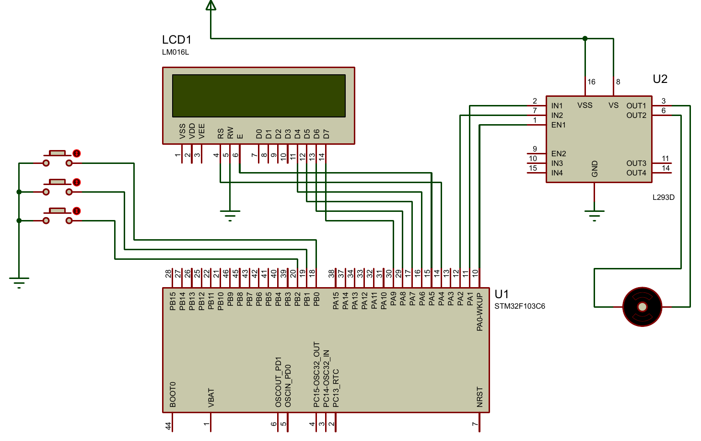 |  |

| Figure 1.3: Speed Adjusted to 30% Duty | Figure 1.4: Speed Adjusted to 70% Duty | Figure 1.5: Clockwise (`CW`) Direction | Figure 1.6: Counter-Clockwise (`CCW`) Direction |
| :---: | :---: | :---: | :---: |
|  |  |  | 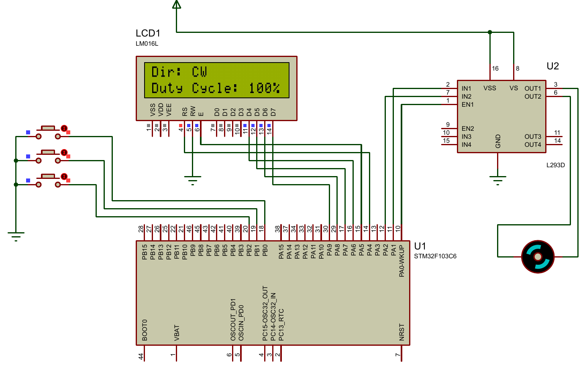 |

---

### 🔹 Question 2: Solar Tracker Panel Angle Control (Stepper Motor 1.8° + ULN2003A Driver)

#### **1. Advantages of Stepper Motors for Solar Trackers:**
- **Precise Open-Loop Positioning:** Stepper motors move in discrete, fixed angular increments ($1.8^\circ$ per step), allowing the microcontroller to calculate exact solar panel position by counting step pulses without requiring expensive feedback encoders.
- **High Holding Torque:** When stopped, energizing motor windings produces high **Holding Torque**, holding heavy solar panels firmly against external wind loads without mechanical brakes.

#### **2. Hardware & Firmware Architecture:**
- **Driver:** ULN2003A Darlington Transistor Array driving 4 motor phase coils from GPIO pins `PA0..PA3`.
- **Manual Mode:** Pressing `PB0` steps $1.8^\circ$ Clockwise; `PB1` steps $1.8^\circ$ Counter-Clockwise. Display shows panel angle from $0^\circ$ to $180^\circ$.
- **Auto Tracking Mode:** SPDT Toggle switch on `PB2` triggers automatic tracking: every **$2\text{ seconds}$**, the panel steps $1.8^\circ$ CW until reaching $180^\circ$ (West), then automatically halts.
- **High-Speed Reset Button:** Push button on `PB3` operates **only when the panel reaches $180^\circ$**, triggering a rapid rewind back to $0^\circ$ (East) with a reduced $10\text{ ms}$ delay per step.

| Figure 2.1: Stepper Motor & ULN2003A Schematic | Figure 2.2: Manual Angle Control ($12.6^\circ$ & $122.4^\circ$) |
| :---: | :---: |
| 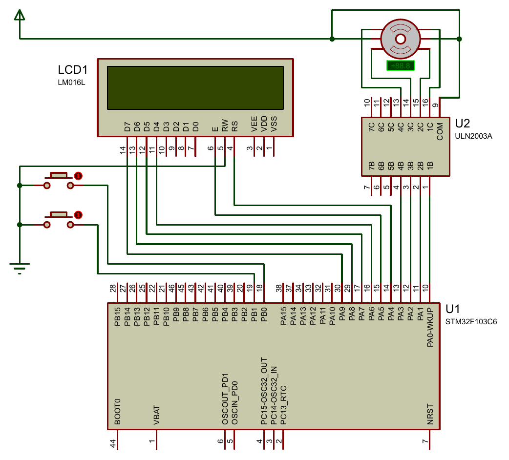 | 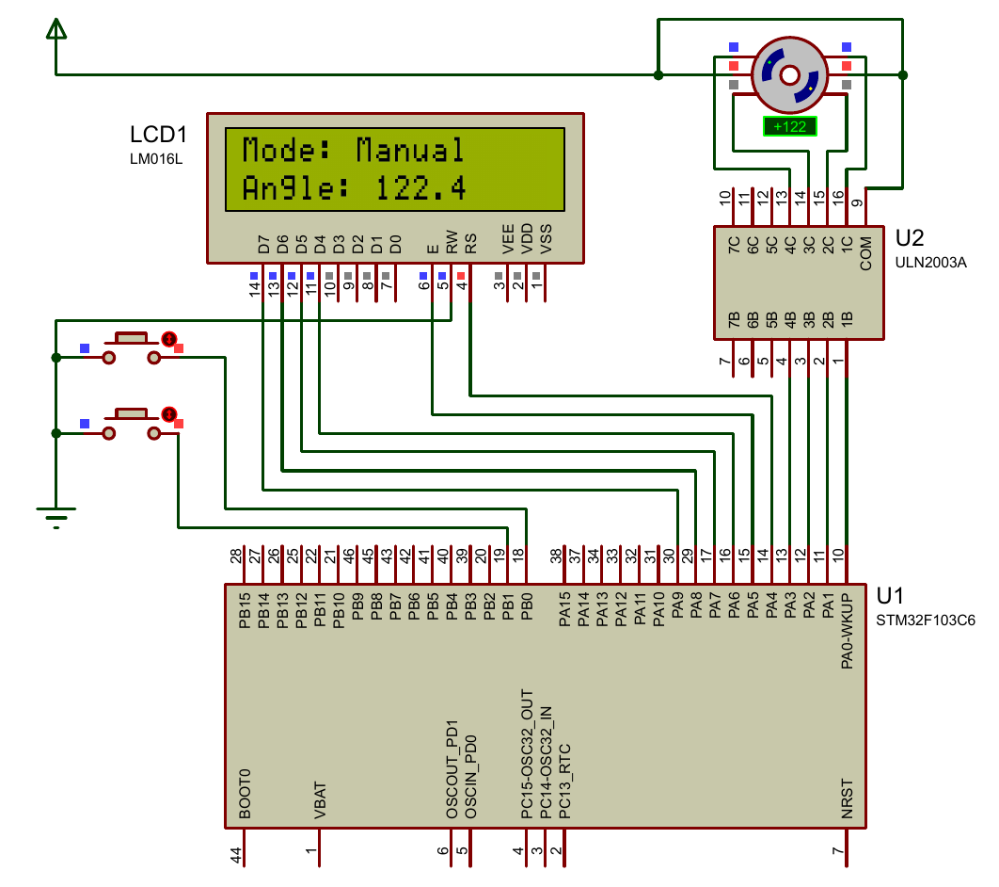 |

| Figure 2.3: Automatic Solar Tracking in Progress | Figure 2.4: High-Speed Reset Rewinding to $0^\circ$ |
| :---: | :---: |
| 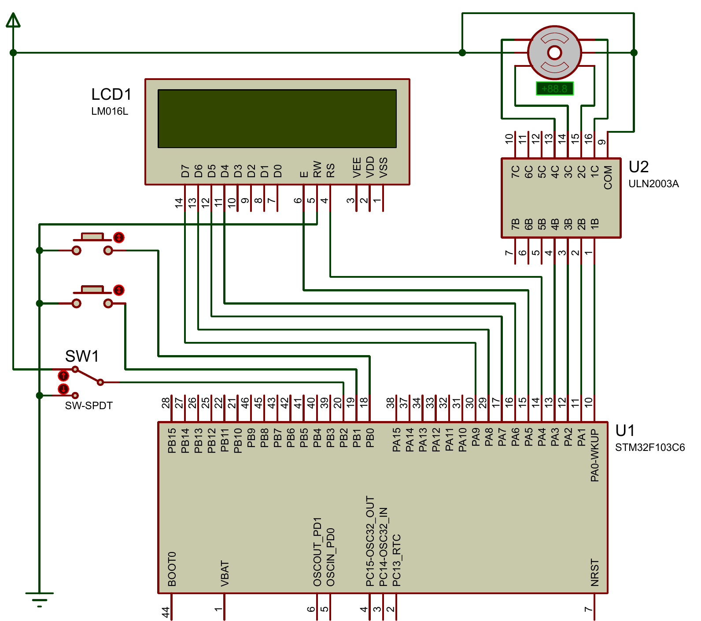 | 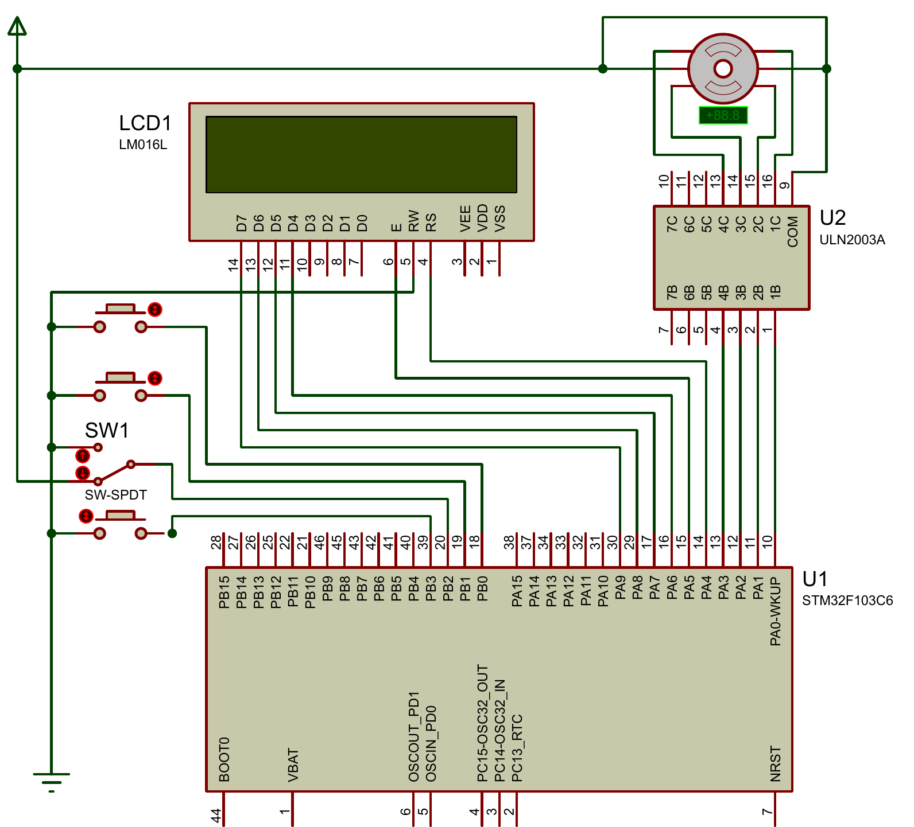 |

#### **3. Full-Step vs. Half-Step Excitation Modes:**
- **Half-Step Mode:** Halves the step angle to $0.9^\circ$, doubling angular resolution ($400$ steps per full revolution instead of $200$), providing smoother panel movement and reduced mechanical vibration.
- **Feasibility of $2^\circ$ or $10^\circ$ Stepping in Full-Step Mode:** Impossible with a physical $1.8^\circ$ stepper motor in Full-Step mode because $2^\circ$ and $10^\circ$ are not integer multiples of $1.8^\circ$ ($2 / 1.8 = 1.111$).

---

### 🔹 Question 3: Distance & Proximity Interfacing (Ultrasonic & IR Sensors)

#### **Part (a): Ultrasonic ToF Distance Measurement:**
- **Operating Principle:** Microcontroller emits a $10\,\mu\text{s}$ HIGH pulse on Trigger pin (`PA0`). The sensor transmits a $40\text{ kHz}$ ultrasonic sound wave burst and pulls Echo pin (`PA1`) HIGH until the reflected wave returns.
- **Distance Calculation Formula:**
  $$d = \frac{t_{\text{echo}} \times v_{\text{sound}}}{2} = \frac{t_{\mu\text{s}} \times 0.034\text{ cm/\mu s}}{2} \quad [\text{cm}]$$
- **Proteus Simulation:** Potentiometer varies simulated object distance; real-time values ($21\text{ cm}$, $85\text{ cm}$) update cleanly on the 16x2 LCD.

| Figure 3.1: Ultrasonic Sensor Proteus Schematic | Figure 3.2: Distance Reading $21\text{ cm}$ | Figure 3.3: Distance Reading $85\text{ cm}$ |
| :---: | :---: | :---: |
| 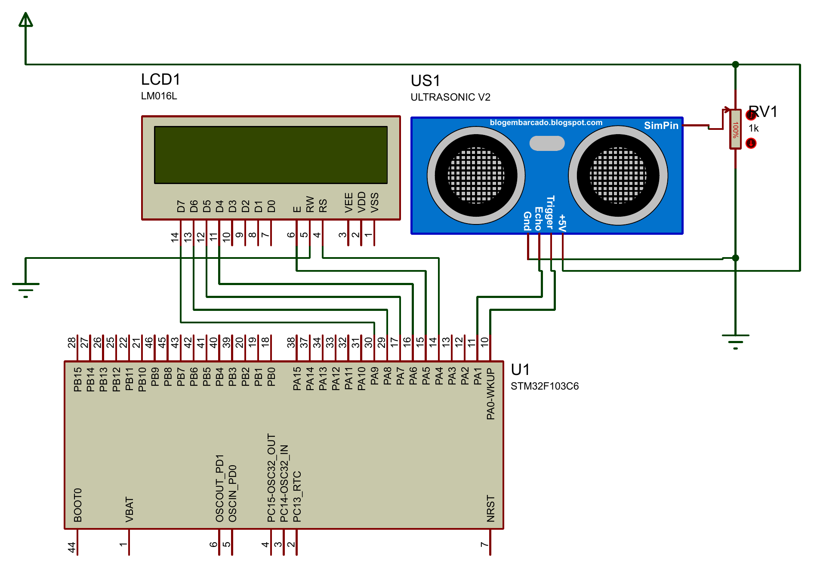 |  | 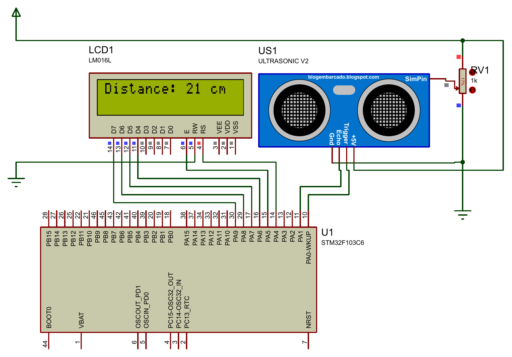 |

#### **Part (b): Infrared (IR) Proximity Barrier Sensor:**
- **Operating Principle:** An IR LED continuously radiates infrared light. When an obstacle reflects light into the receiving photodiode, internal comparator output drops to active LOW (`0`).
- **Detection Logic:** Input pin `PA0` continuously polls status; LCD displays `Object Detected` (pin = `0`) or `No Object` (pin = `1`).

| Figure 3.4: IR Proximity Sensor Circuit | Figure 3.5: Object Detection Output (`Object Detected`) |
| :---: | :---: |
| 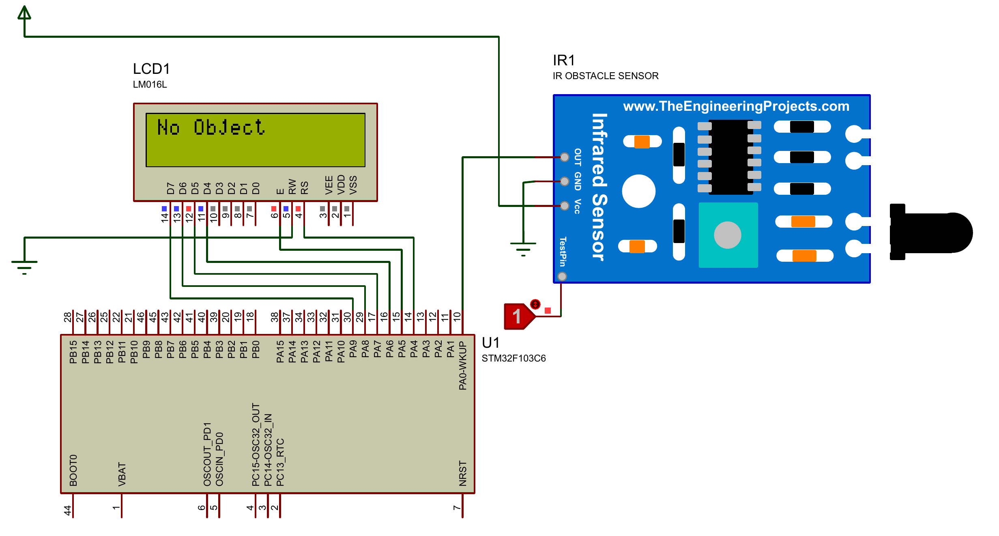 | 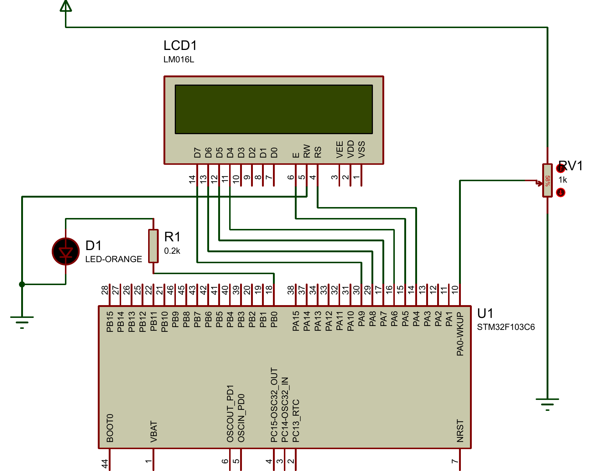 |

---

### 🔹 Question 4: Angle Measurement, Optocounter Speed & Incremental Encoder Decoding

#### **Part 1: Potentiometer Angle Measurement (12-Bit ADC):**
- **Quantization & Mapping:** Potentiometer shaft rotates from $0^\circ$ to $270^\circ$ mapped across 12-bit ADC values ($0 - 4095$ on `PA0`):
  $$\text{Angle} = \frac{\text{ADC\_Value} \times 270^\circ}{4095}$$
- **System Angular Resolution:**
  $$\Delta \theta = \frac{270^\circ}{4095} \approx \mathbf{0.0659^\circ}$$
- **Over-Angle Alarm:** If $\text{Angle} > 180^\circ$, warning LED on `PB0` turns ON.

| Figure 4.1: Angle Measurement Schematic | Figure 4.2: Angle Output ($113^\circ$ Normal / $213^\circ$ Alarm ON) |
| :---: | :---: |
| 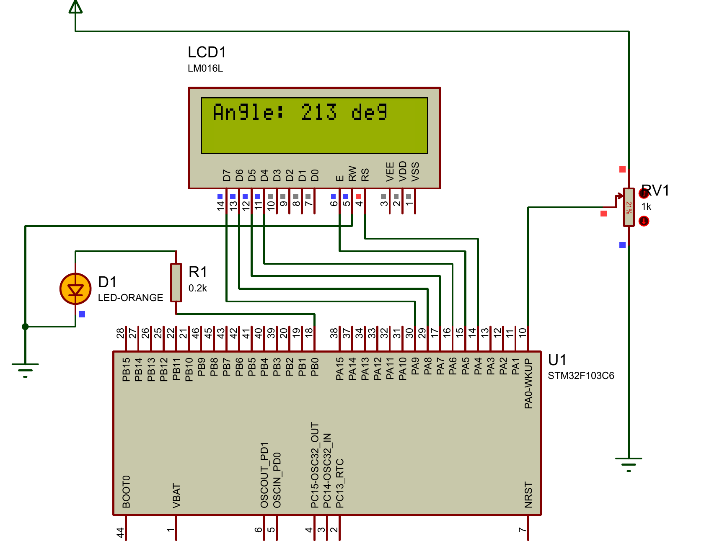 | 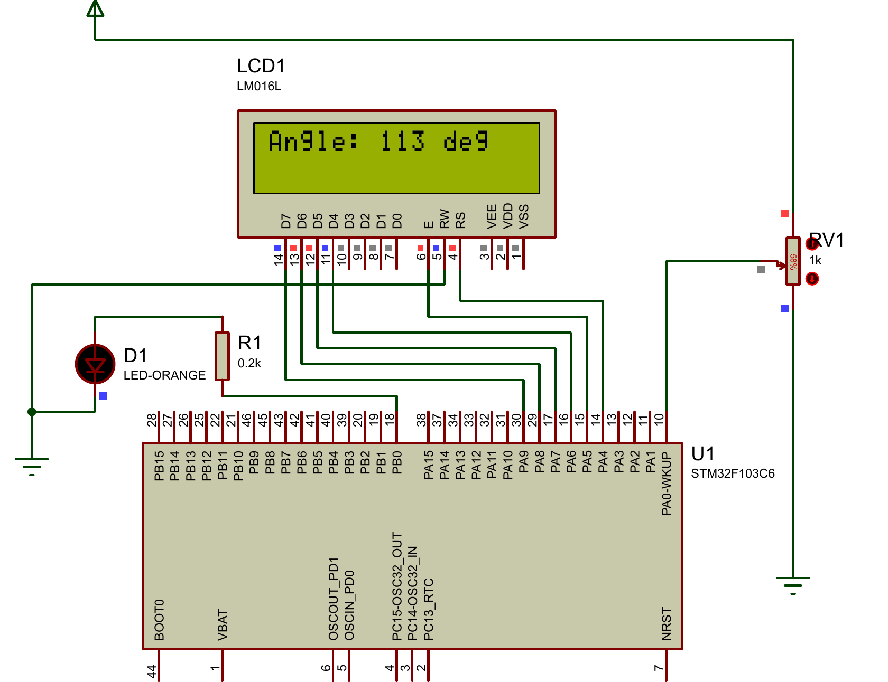 |

#### **Part 2: Optocounter Angular Speed Measurement (RPM):**
- **Disk Slot Calculation:**
  $$N = 20 + \text{mod}(\text{StudentID}, 10) = 20 + \text{mod}(810102443, 10) = \mathbf{23\text{ slots}}$$
- **Frequency-to-RPM Formula:** Pulses counted in $1\text{ second}$ interval timer ($f\text{ Hz}$):
  $$\text{RPM} = \frac{f \times 60}{N} = \frac{f \times 60}{23}$$
- **Minimum Speed Resolution:** At $f = 1\text{ Hz} \implies \text{RPM}_{\min} = \frac{1 \times 60}{23} = \mathbf{2.608\text{ RPM}}$.
- **Over-Speed Alarm:** If $\text{RPM} > 500$, warning LED on `PB0` blinks.

| Input Frequency ($f$) | Theoretical Speed | Simulated Speed | Alarm LED State (`PB0`) | LCD Simulation Display |
| :---: | :---: | :---: | :---: | :---: |
| **$50\text{ Hz}$** | $130.4\text{ RPM}$ | $130\text{ RPM}$ | **OFF** | 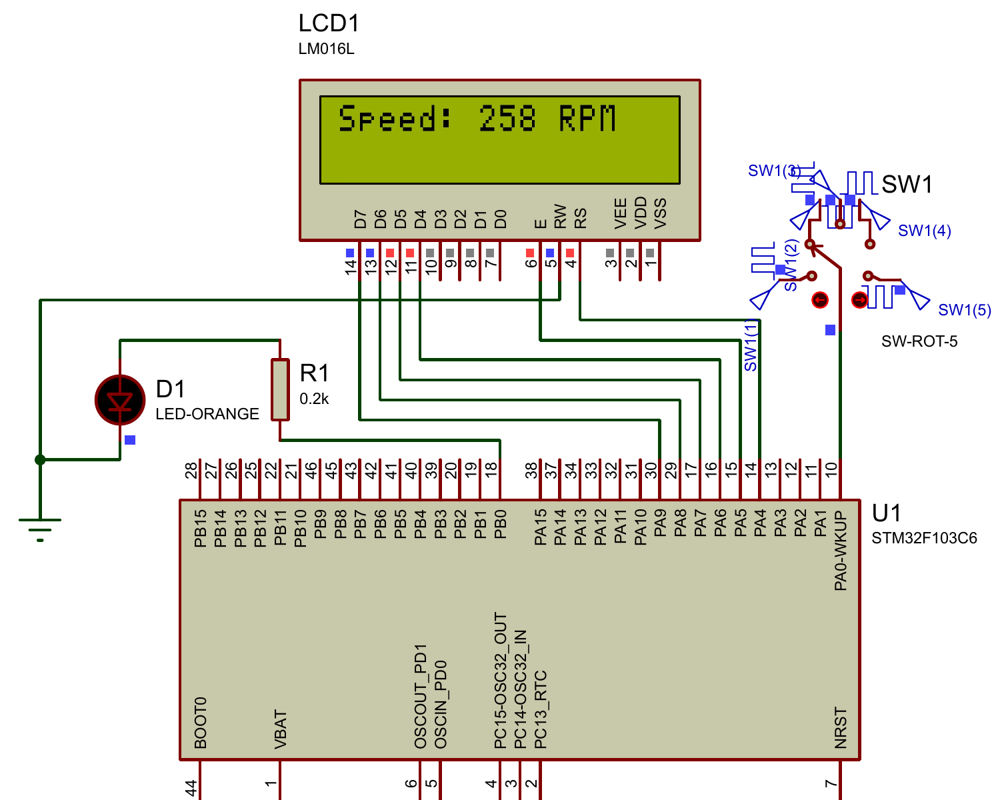 |
| **$100\text{ Hz}$** | $260.8\text{ RPM}$ | $258\text{ RPM}$ | **OFF** | 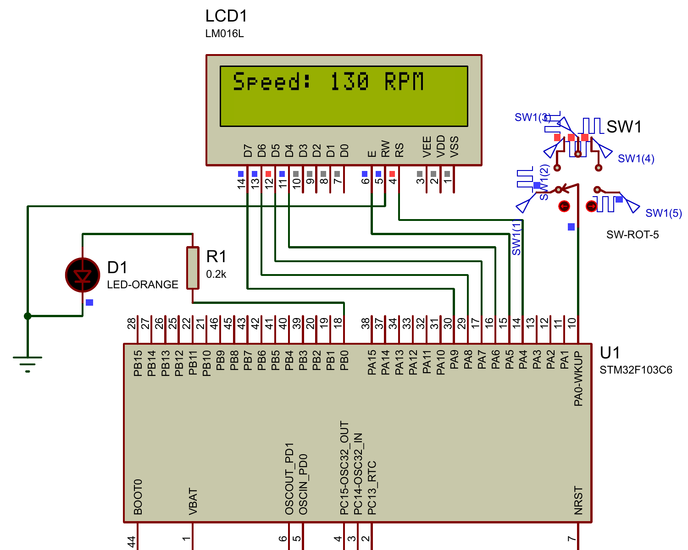 |
| **$150\text{ Hz}$** | $391.3\text{ RPM}$ | $388\text{ RPM}$ | **OFF** | 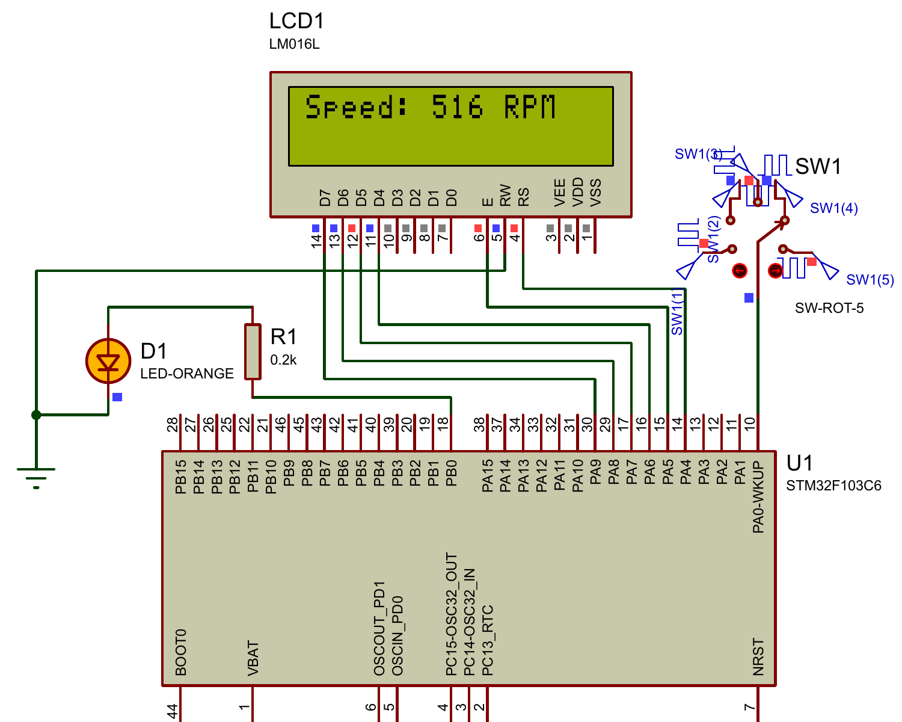 |
| **$200\text{ Hz}$** | $521.7\text{ RPM}$ | $516\text{ RPM}$ | **ON (Blinking Alarm)** | 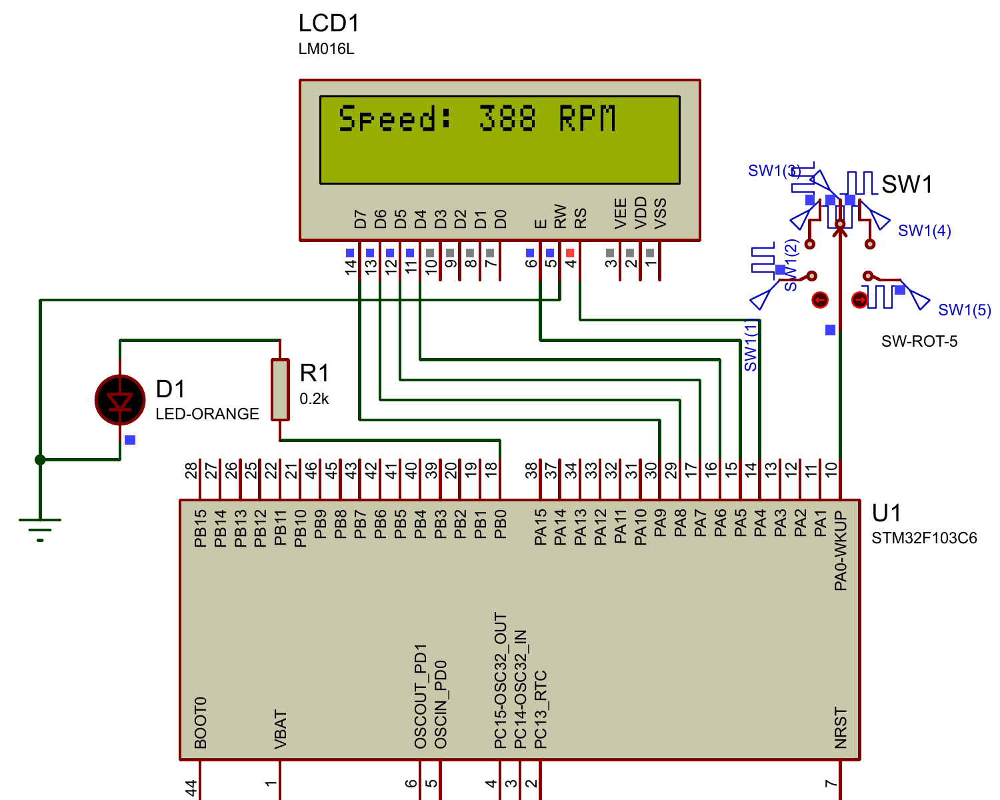 |
| **$250\text{ Hz}$** | $652.1\text{ RPM}$ | $646\text{ RPM}$ | **ON (Blinking Alarm)** | 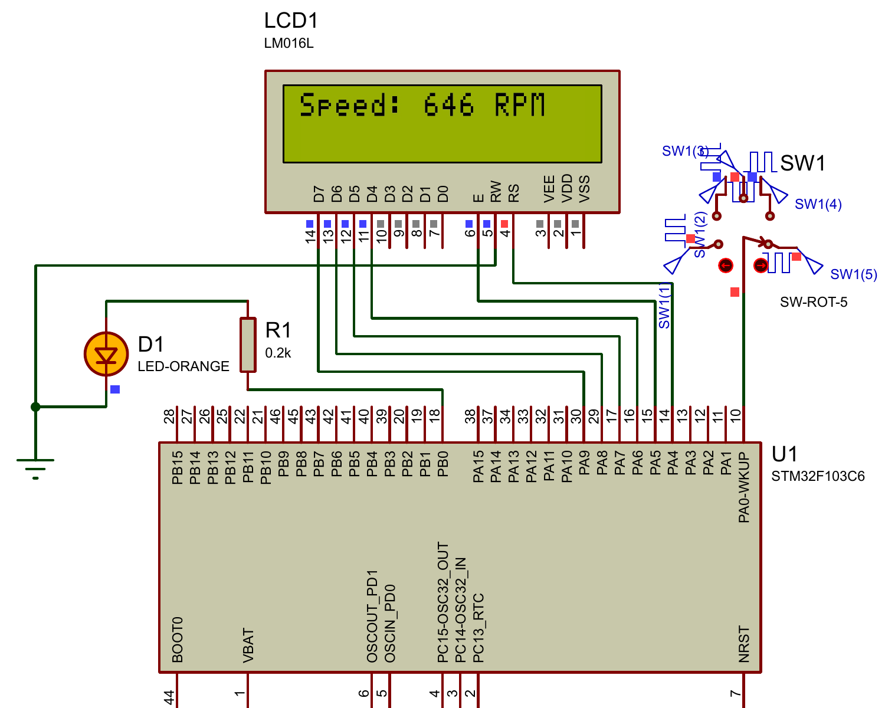 |

| Figure 4.3: Optocounter Pulse Speed Measurement Circuit |
| :---: |
| 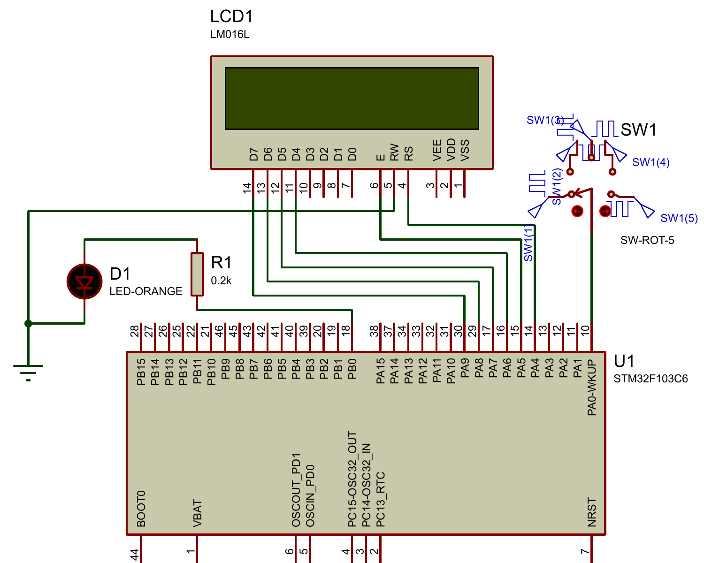 |

#### **Part 3: Incremental Rotary Encoder Quadrature Decoding:**
- **Pulses Per Revolution (PPR):**
  $$\text{PPR} = 220 + \text{mod}(\text{StudentID}, 100) = 220 + 43 = \mathbf{263\text{ PPR}}$$
- **Comparative Decoding Modes Analysis:**

| Decoding Mode | Triggering Edges | Counts / Rev | Angular Resolution ($\Delta \theta$) | Accuracy & Precision Level |
| :---: | :---: | :---: | :---: | :---: |
| **1x Mode** | Channel A (Rising Edge Only) | $263$ | $\frac{360^\circ}{263} = \mathbf{1.369^\circ}$ | Standard Resolution |
| **2x Mode** | Channel A (Rising & Falling Edges) | $526$ | $\frac{360^\circ}{526} = \mathbf{0.684^\circ}$ | $2\times$ Precision Resolution |
| **4x Mode (Quadrature)** | Channels A & B (All Rising & Falling Edges) | $1052$ | $\frac{360^\circ}{1052} = \mathbf{0.342^\circ}$ | **Maximum $4\times$ Precision** |

| Figure 4.4: Incremental Encoder Setup & Pin Configuration | Figure 4.5: Speed & Shaft Angle Real-Time LCD Display |
| :---: | :---: |
| 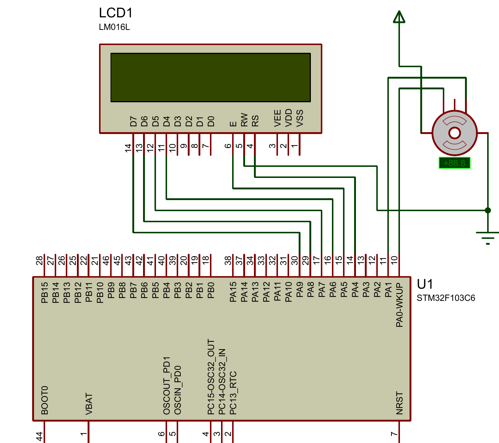 | 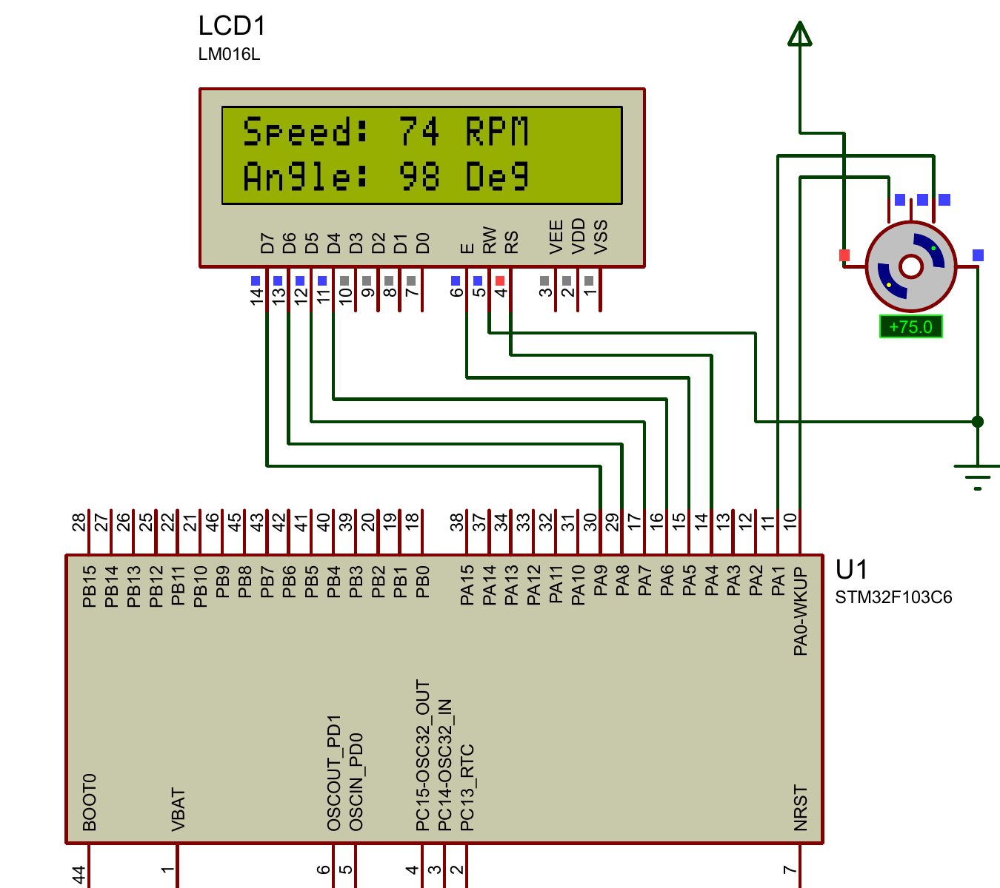 |

---

## 💻 How to Build & Simulate

### 1. Building Firmware in STM32CubeIDE
1. Open **STM32CubeIDE**.
2. File $\to$ Open Projects from File System $\to$ Select target folder (`HW5/Q1`, `HW5/Q2`, `HW5/Q3`, or `HW5/Q4`).
3. Build Project (`Ctrl + B`). The output `.hex` binary will generate automatically in `Debug/`.

### 2. Running Proteus Simulation
1. Launch **Proteus 8 Professional**.
2. Open target `.pdsprj` file from `HW5/Q1/`, `HW5/Q2/`, `HW5/Q3/`, or `HW5/Q4/`.
3. Double-click the STM32 microcontroller component and ensure **Program File** points to the corresponding `.hex` file.
4. Press **Play** to start real-time simulation. Demonstration MP4 videos are also available in `HW5/Q1/Q1.mp4`, `HW5/Q2/Q2.mp4`, `HW5/Q3/Q3-1.mp4`, etc.

---

<div align="center">

**[Go back to Main Repository README](../README.md)**

</div>
