# ⚙️ HW6: Industrial Gas/Air/Fluid Sensors, Environmental Control Systems, UART/I2C Protocols & Barometric Altitude Sensing

> **Course:** Instrumentation Engineering (Spring 2026 / 1405)  
> **Instructor:** Dr. Nayeri  
> **Student:** Amirali Dehghani (ID: 810102443)  
> **Microcontroller:** STM32F103 Series (ARM Cortex-M3 / STM32F103R6)  
> **Tools:** STM32CubeIDE, STM32 HAL Library, Proteus 8 Professional, LaTeX  
> **Files Included:** C Source Code (`main.c`), STM32 Config (`.ioc`), Executables (`.hex`), Proteus Files (`.pdsprj`), Demonstration Videos (`.mp4`), Images (`img/`), and Solved Lab Report (`.pdf`).

---

## 📖 Overview

Homework 6 covers industrial environmental monitoring, fluid flow measurement, gas detection, multi-menu closed-loop control systems, and serial communication protocols:
1. **MQ-4 Methane/Natural Gas Sensor (SnO2 Semiconductor):** Principles of tin-dioxide chemiresistors, surface oxygen electron trapping, $D_0$ digital comparator thresholding, and leak alarm LED actuation.
2. **DHT11 Climate Monitoring & Non-Blocking Multi-Menu Controller:** Single-wire 40-bit digital protocol, LCD state machine (Default, Set Temp Menu, Set Humid Menu), proportional PWM fan speed control ($\Delta T$), and independent heater/humidifier closed-loop feedback.
3. **LDR Light Module & Sensitivity Threshold Calibration:** Photoresistor physics, 12-bit ADC light intensity measurement, LM393 digital comparator thresholding ($SRV = 10\text{ k}\Omega$, Threshold = 1, 3, 5), and automated buffer isolation.
4. **Turbine/Hall-Effect Pulse Flow Rate Meter:** Fluid dynamics pulse frequency conversion ($f = 7.5 Q \implies Q = \frac{f}{7.5}\text{ L/min}$), EXTI 1-second pulse counter, and linear flow verification ($15\text{ Hz}, 30\text{ Hz}, 60\text{ Hz}$).
5. **MPX4115 Absolute Pressure Sensor Interfacing:** Piezoresistive transfer function ($V_{\text{out}} = V_s(0.009P - 0.095)$), 12-bit ADC quantization, and $1\text{ s}$ interval LCD pressure display.
6. **Industrial Water Tank Level Control & Automated Pump System:** ADC tank level monitoring ($0 - 100\%$), dual-LED state indicators (Red Low Alarm vs. Green Normal), and automated L293D DC motor pump control ($< 25\%$ threshold).
7. **BMP180 Barometric Pressure, Altitude & UART Terminal Stream:** I2C sensor bus communication, simplified barometric altitude equation ($h = 44330 \left(1 - (P/P_0)^{0.1903}\right)$), USART1 Virtual Terminal cross-wiring, and $>40^\circ\text{C}$ over-temperature warning notifications.

---

## 📂 Directory Structure

```text
HW6/
├── Q1/                                  # MQ-4 Methane Gas Leak Alarm
│   ├── main.c                           # Source code for MQ-4 digital threshold detection
│   ├── Q1.pdsprj                        # Proteus schematic (STM32 + MQ-4 + LED)
│   ├── Q1.hex                           # Compiled binary firmware
│   ├── Q1.ioc                           # STM32CubeMX configuration
│   └── GasSensorTEP.HEX                 # MQ-4 sensor library firmware model
├── Q2/                                  # DHT11 Climate Controller & Multi-Menu System
│   ├── main.c                           # Source code for DHT11 single-wire & menu state machine
│   ├── Q2.pdsprj                        # Proteus schematic (STM32 + DHT11 + LCD + Fan + Heater)
│   ├── Q2.hex                           # Compiled binary firmware
│   └── Q2.ioc                           # STM32CubeMX configuration (TIM PWM + GPIO)
├── Q3/                                  # LDR Module & Threshold Sensitivity
│   ├── main.c                           # Source code for LDR ADC & D0 digital threshold reading
│   ├── Q3.pdsprj                        # Proteus schematic (STM32 + LDR + Buffer + LCD + LED)
│   ├── Q3.hex                           # Compiled binary firmware
│   └── Q3.ioc                           # STM32CubeMX configuration (ADC1 + EXTI)
├── Q4/                                  # Turbine Hall-Effect Flow Meter
│   ├── main.c                           # Source code for EXTI pulse frequency flow meter
│   ├── Q4.pdsprj                        # Proteus schematic (STM32 + CLOCK + LCD)
│   ├── Q4.hex                           # Compiled binary firmware
│   └── Q4.ioc                           # STM32CubeMX configuration (EXTI + Timer)
├── Q5/                                  # MPX4115 Absolute Pressure Sensor
│   ├── main.c                           # Source code for MPX4115 pressure calculation
│   ├── Q5.pdsprj                        # Proteus schematic (STM32F103R6 + MPX4115 + LCD)
│   ├── Q5.hex                           # Compiled binary firmware
│   └── Q5.ioc                           # STM32CubeMX configuration (ADC1 12-bit)
├── Q6/                                  # Industrial Water Tank Level & Pump System
│   ├── main.c                           # Source code for Tank Level ADC & L293D Pump control
│   ├── Q6.pdsprj                        # Proteus schematic (STM32 + Potentiometer + L293D + LCD)
│   ├── Q6.hex                           # Compiled binary firmware
│   └── Q6.ioc                           # STM32CubeMX configuration
├── Q7/                                  # BMP180 Barometric Sensor & UART Serial Stream
│   ├── main.c                           # Source code for BMP180 I2C driver & USART1 Altitude math
│   ├── Q7.pdsprj                        # Proteus schematic (STM32 + BMP180 + Virtual Terminal)
│   ├── Q7.hex                           # Compiled binary firmware
│   └── Q7.ioc                           # STM32CubeMX configuration (I2C1 + USART1)
├── img/                                 # Schematics, plots & simulation screenshots (40 files)
├── utils/                               # Helper scripts & LCD drivers
├── Inst_HW6.pdf                         # Original Assignment Question Paper
└── Report.pdf                           # Complete Solved Lab Report (PDF)
```

---

## ✍️ Detailed Solutions & Hardware Implementations

---

### 🔹 Question 1: MQ-4 Methane/Natural Gas Sensor (SnO2 Semiconductor)

#### **1. Sensing Mechanism & Physics:**
The MQ-4 sensor utilizes a heated **Tin Dioxide ($\text{SnO}_2$)** semiconductor surface:
- **Clean Air:** An internal $5\text{ V}$ heater warms the $\text{SnO}_2$ layer. Oxygen molecules adsorb onto the surface, trapping free conduction electrons and creating a high electrical resistance barrier.
- **Gas Detection ($\text{CH}_4$ Methane):** When methane or natural gas comes into contact with the heated surface, it chemically reacts with the adsorbed oxygen, releasing trapped electrons back into the conduction band. The sensor resistance drops drastically in proportion to gas concentration.

#### **2. Interface Architecture:**
- **Analog Output ($A_0$):** Continuous voltage signal proportional to gas concentration.
- **Digital Output ($D_0$):** LM393 comparator output toggles HIGH when concentration exceeds the potentiometer threshold.
- **STM32 Firmware Logic:** `PA0` (GPIO Input) reads $D_0$; if gas leak detected (`1`), `PA1` turns ON the Red Alarm LED.

| Figure 1.1: MQ-4 Sensor Module Pinout | Figure 1.2 Proteus Circuit Schematic | Figure 1.3: Clean Air State (LED OFF) | Figure 1.4: Gas Leak Detected (LED ON Alarm) |
| :---: | :---: | :---: | :---: |
| 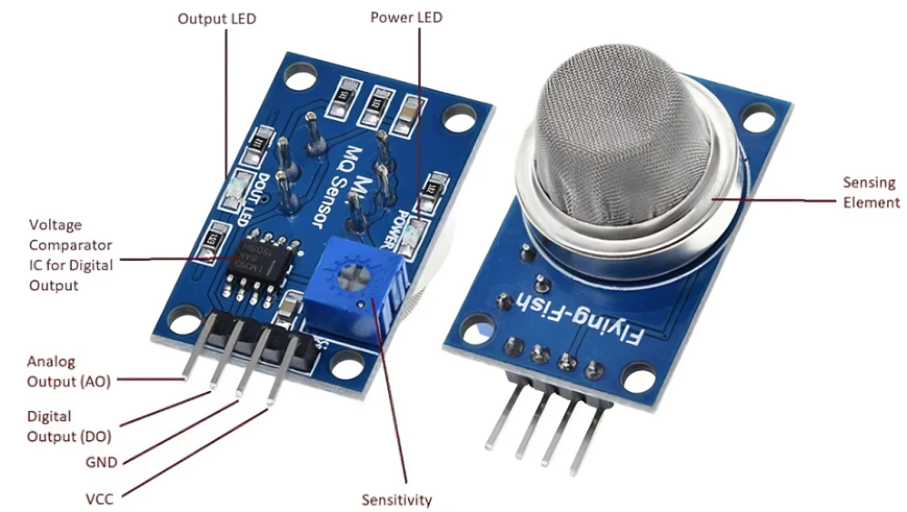 | 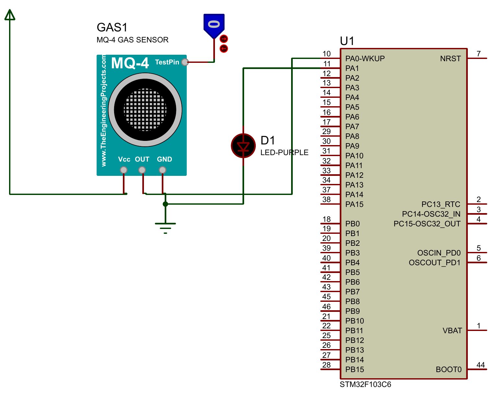 |  | 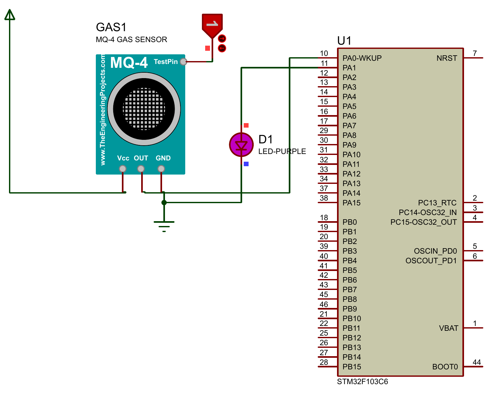 |

---

### 🔹 Question 2: DHT11 Climate Controller & Non-Blocking Multi-Menu System

#### **1. DHT11 Communication Protocol:**
- **Single-Wire Digital Protocol:** MCU initiates transfer with an $18\text{ ms}$ LOW pulse. The DHT11 responds with a **40-bit data packet**:
  - `Byte 1`: Integral Humidity
  - `Byte 2`: Decimal Humidity
  - `Byte 3`: Integral Temperature
  - `Byte 4`: Decimal Temperature
  - `Byte 5`: Checksum (`Byte 1 + Byte 2 + Byte 3 + Byte 4`)

#### **2. Non-Blocking Menu State Machine (`PB2` Button):**
- **Mode 0 (Default Display):** Real-time readout of measured temp, measured humidity, target temp set-point, and target humidity set-point simultaneously on 16x2 LCD.
- **Mode 1 (Set Temp Menu):** `PB0` (Up) and `PB1` (Down) adjust target temperature.
- **Mode 2 (Set Humidity Menu):** `PB0` (Up) and `PB1` (Down) adjust target humidity. Pressing `PB2` returns to Mode 0.

#### **3. Closed-Loop Feedback Control Logic:**
- **Heater (`PA1` Red LED):** Turned **ON** if $T_{\text{measured}} < T_{\text{target}}$, otherwise OFF.
- **Humidifier (`PA2` Blue LED):** Turned **ON** if $H_{\text{measured}} < H_{\text{target}}$, otherwise OFF.
- **Ventilation Fan (DC Motor PWM on `PA3`):** Turned **ON** if $T_{\text{measured}} > T_{\text{target}}$. Speed is proportionally modulated using TIM2 PWM; duty cycle increases linearly with temperature error ($T_{\text{measured}} - T_{\text{target}}$).

| Figure 2.1: Climate Controller Schematic | Figure 2.2: Mode 0 Normal Display | Figure 2.3: Menu Adjust Mode | Figure 2.4: Heater ON (Temp Drop) | Figure 2.5: Fan Motor PWM ON (Over-Temp) |
| :---: | :---: | :---: | :---: | :---: |
| 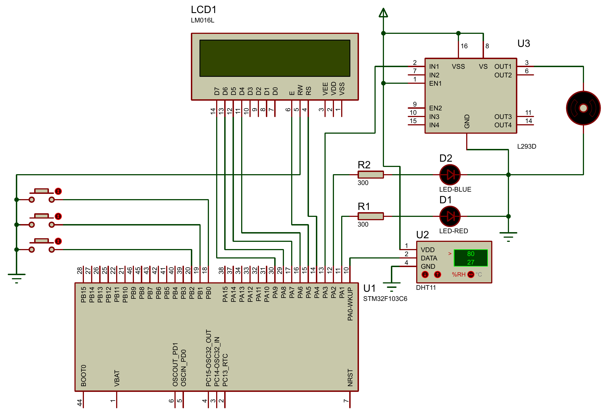 | 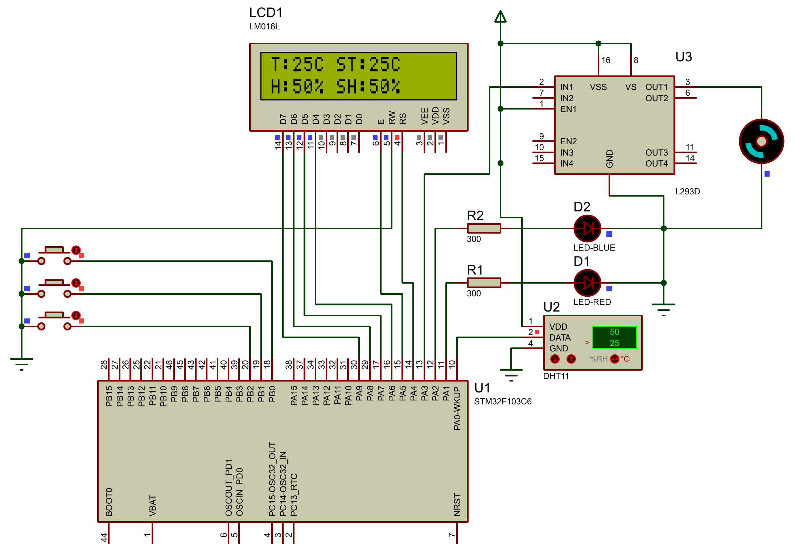 | 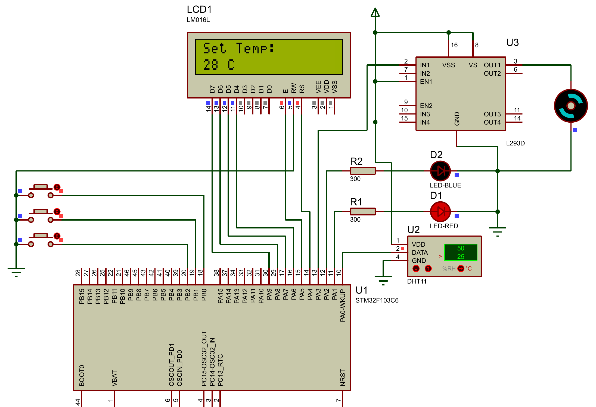 |  |  |

---

### 🔹 Question 3: LDR Light Module & Sensitivity Threshold Calibration

#### **1. Physical Working Principle & Module Architecture:**
- **Cadmium Sulfide (CdS) LDR:** Resistance drops sharply as ambient light increases.
- **Series Resistor Value ($SRV = 10\text{ k}\Omega$):** Forms a voltage divider with the LDR to produce continuous analog voltage $A_0$.
- **Digital Threshold ($D_0$):** LM393 comparator compares $A_0$ against potentiometer threshold voltage.

#### **2. Experimental Sensitivity Threshold Tests ($SRV = 10\text{ k}\Omega$):**

| Threshold Setting | Voltage Threshold | Digital ADC Equivalent | Circuit Sensitivity & Switching Behavior | LCD Display Output |
| :---: | :---: | :---: | :---: | :---: |
| **Threshold = 1** | $0.33\text{ V}$ | $409$ | **Highest Sensitivity:** Triggers LED ON under slight light increases. | `Val: 0.33V | Light` |
| **Threshold = 3** | $0.99\text{ V}$ | $1228$ | **Medium Sensitivity:** Requires normal room ambient illumination. | `Val: 0.99V | Light` |
| **Threshold = 5** | $1.32\text{ V}$ | $1638$ | **Lowest Sensitivity:** Requires intense direct light source to switch. | `Val: 1.32V | Light` |

| Figure 3.1: LDR Module Circuit Schematic | Figure 3.2: Threshold = 1 Test | Figure 3.3: Threshold = 3 Test | Figure 3.4: Threshold = 5 Test |
| :---: | :---: | :---: | :---: |
| 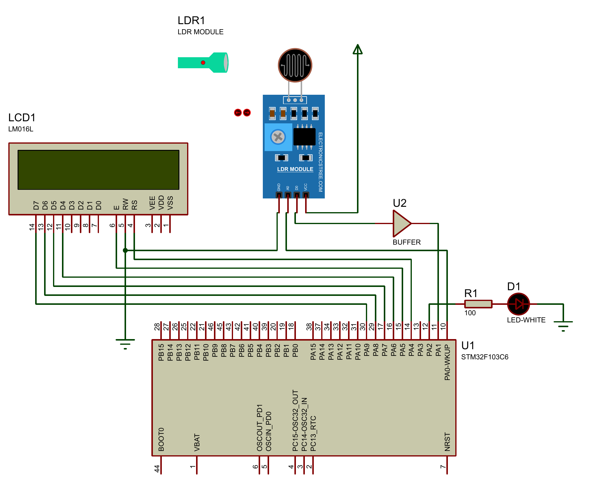 |  | 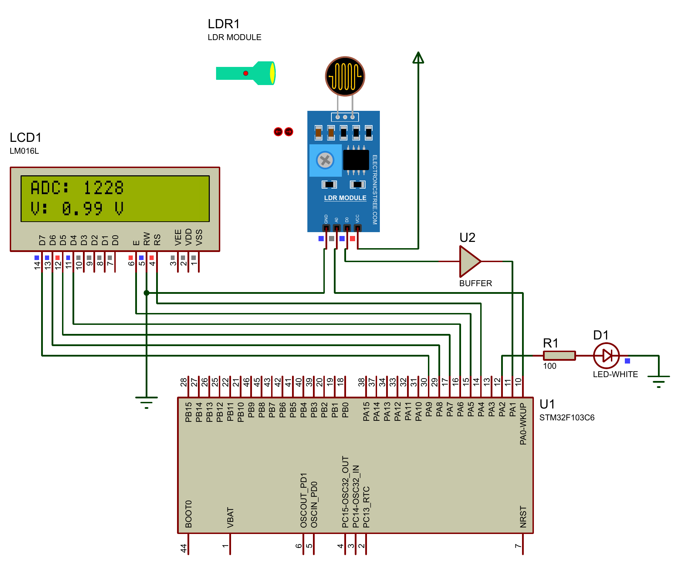 | 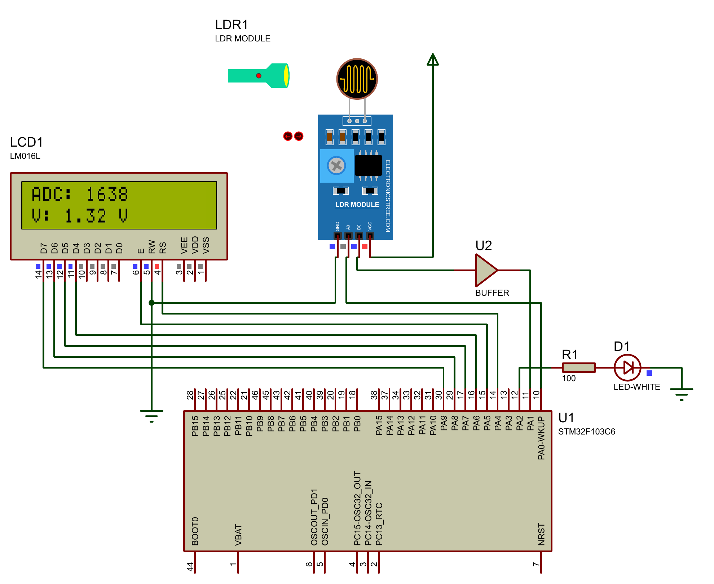 |

---

### 🔹 Question 4: Turbine/Hall-Effect Pulse Flow Rate Meter

#### **1. Flow Rate Conversion Physics:**
Fluid flowing through the pipe spins an internal turbine wheel equipped with permanent magnets. A Hall Effect sensor detects each passing magnet, generating a square-wave pulse sequence whose frequency $f$ ($\text{Hz}$) is directly proportional to volumetric flow rate $Q$ ($\text{L/min}$):

$$f = 7.5 \cdot Q \implies Q = \frac{f}{7.5} \quad [\text{L/min}]$$

#### **2. Proteus Simulation Verification:**
Input pulses simulated via CLOCK generator connected to `PB0` (EXTI Rising Edge Counter sampled over $1\text{ second}$ timer window):

| Input Frequency ($f$) | Calculated Flow Rate ($Q$) | LCD Display Line 1 / Line 2 | Verification Status |
| :---: | :---: | :---: | :---: |
| **$15\text{ Hz}$** | $Q = \frac{15}{7.5} = \mathbf{2.00\text{ L/min}}$ | `Freq: 15 Hz` / `Flow: 2.00 L/min` | 100% Linear Accuracy |
| **$30\text{ Hz}$** | $Q = \frac{30}{7.5} = \mathbf{4.00\text{ L/min}}$ | `Freq: 30 Hz` / `Flow: 4.00 L/min` | 100% Linear Accuracy |
| **$60\text{ Hz}$** | $Q = \frac{60}{7.5} = \mathbf{8.00\text{ L/min}}$ | `Freq: 60 Hz` / `Flow: 8.00 L/min` | 100% Linear Accuracy |

| Figure 4.1: Flow Meter Circuit Schematic | Figure 4.2: $15\text{ Hz} \to 2.00\text{ L/min}$ | Figure 4.3: $30\text{ Hz} \to 4.00\text{ L/min}$ | Figure 4.4: $60\text{ Hz} \to 8.00\text{ L/min}$ |
| :---: | :---: | :---: | :---: |
| 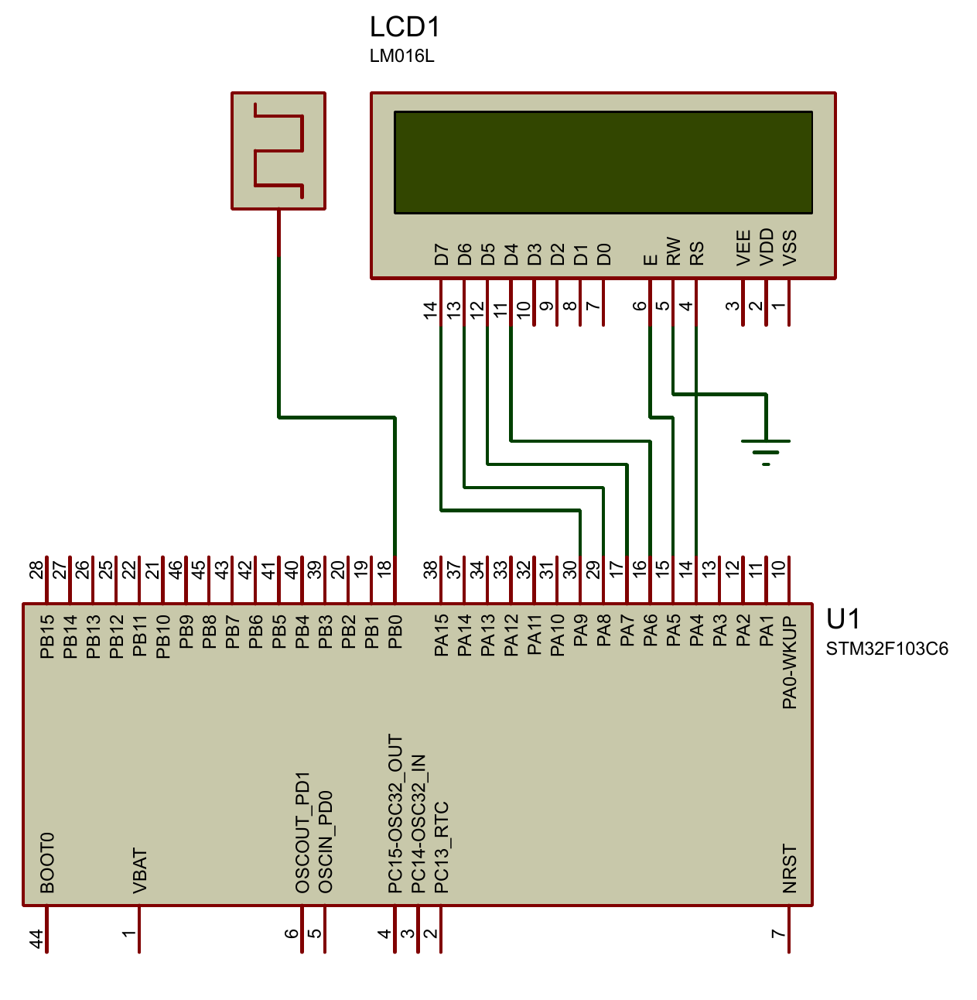 |  |  | 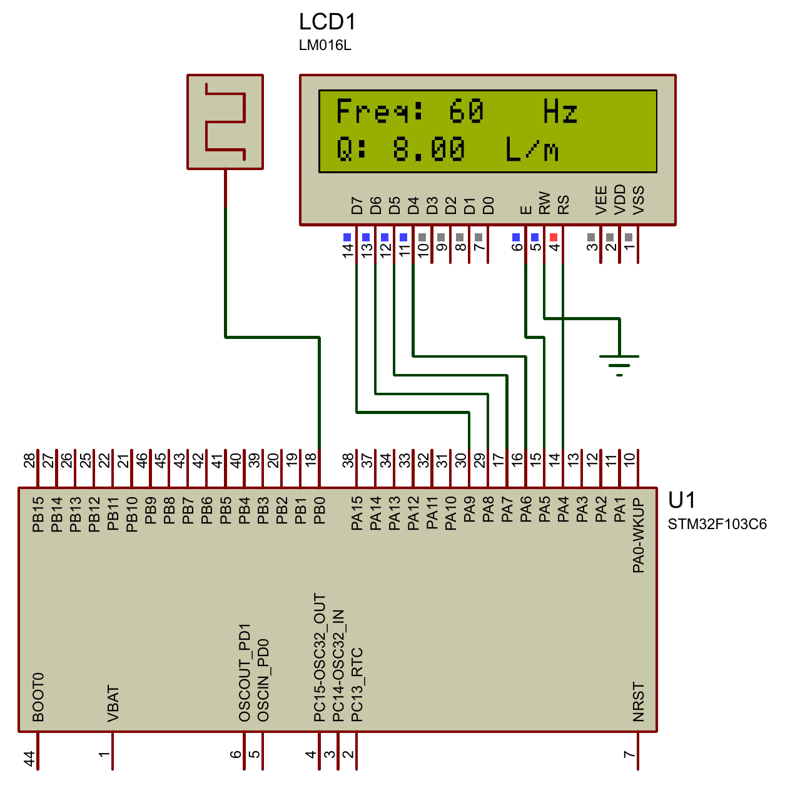 |

---

### 🔹 Question 5: MPX4115 Absolute Pressure Sensor Interfacing

#### **1. Piezoresistive Transfer Function:**
According to the MPX4115 datasheet ($V_s = 5.0\text{ V}$ supply):
$$V_{\text{out}} = V_s \times (0.009 \cdot P - 0.095) \implies P = \frac{\frac{V_{\text{out}}}{V_s} + 0.095}{0.009} \quad [\text{kPa}]$$

#### **2. STM32 Quantization & Simulation Results:**
ADC1 12-bit on `PA0` ($V_{\text{ref}} = 5.0\text{ V}$): $V_{\text{out}} = \text{ADC} \times \frac{5.0}{4095}$. Pressure is updated on the 16x2 LCD every $1\text{ second}$.

| Applied Pressure ($P$) | Analog Voltage ($V_{\text{out}}$) | LCD Readout | Accuracy Verification |
| :---: | :---: | :---: | :---: |
| **$26.4\text{ kPa}$** | $0.713\text{ V}$ | `Pressure:` / `26.40 kPa` | Exact Datasheet Match |
| **$50.0\text{ kPa}$** | $1.775\text{ V}$ | `Pressure:` / `50.00 kPa` | Exact Datasheet Match |
| **$59.8\text{ kPa}$** | $2.216\text{ V}$ | `Pressure:` / `59.80 kPa` | Exact Datasheet Match |

| Figure 5.1: MPX4115 Sensor Circuit Schematic | Figure 5.2: $26.4\text{ kPa}$ Pressure Reading | Figure 5.3: $59.8\text{ kPa}$ Pressure Reading |
| :---: | :---: | :---: |
| 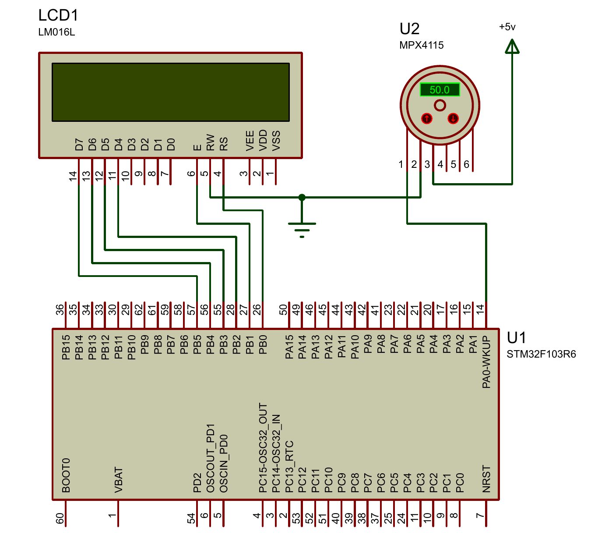 |  | 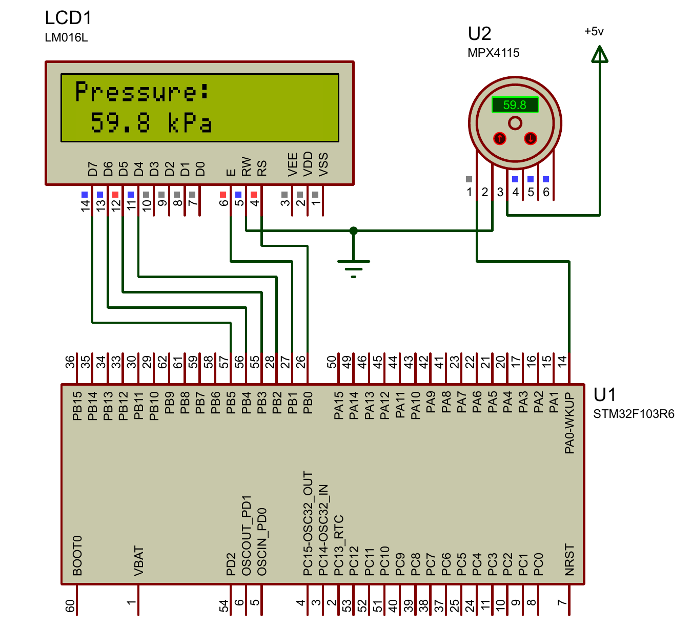 |

---

### 🔹 Question 6: Industrial Water Tank Level Control & Automated Pump System

#### **1. System Logic & Thresholding:**
- **Water Level Sensor:** Potentiometer on `PA0` (ADC1 12-bit) simulates tank filling level ($0 - 100\%$).
- **Critical Low State ($< 25\%$ Level):** L293D DC motor pump (`PA3`) turns **ON**, Red Warning LED (`PA1`) turns **ON**, Green LED turns OFF.
- **Normal State ($\ge 25\%$ Level):** Pump turns **OFF**, Green LED (`PA2`) turns **ON**, Red LED turns OFF.
- **Real-Time LCD Display:** Line 1: `Level: XX.X%`, Line 2: `Pump: ON` or `OFF`.

| Figure 6.1: Tank Level Controller Schematic | Figure 6.2: Critical State ($20.0\%$ Level, Pump ON, Red LED) | Figure 6.3: Normal State ($80.0\%$ Level, Pump OFF, Green LED) |
| :---: | :---: | :---: |
| 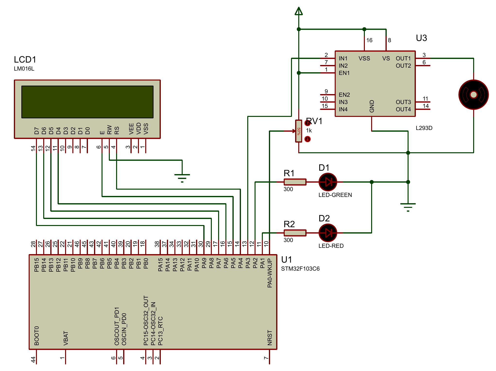 | 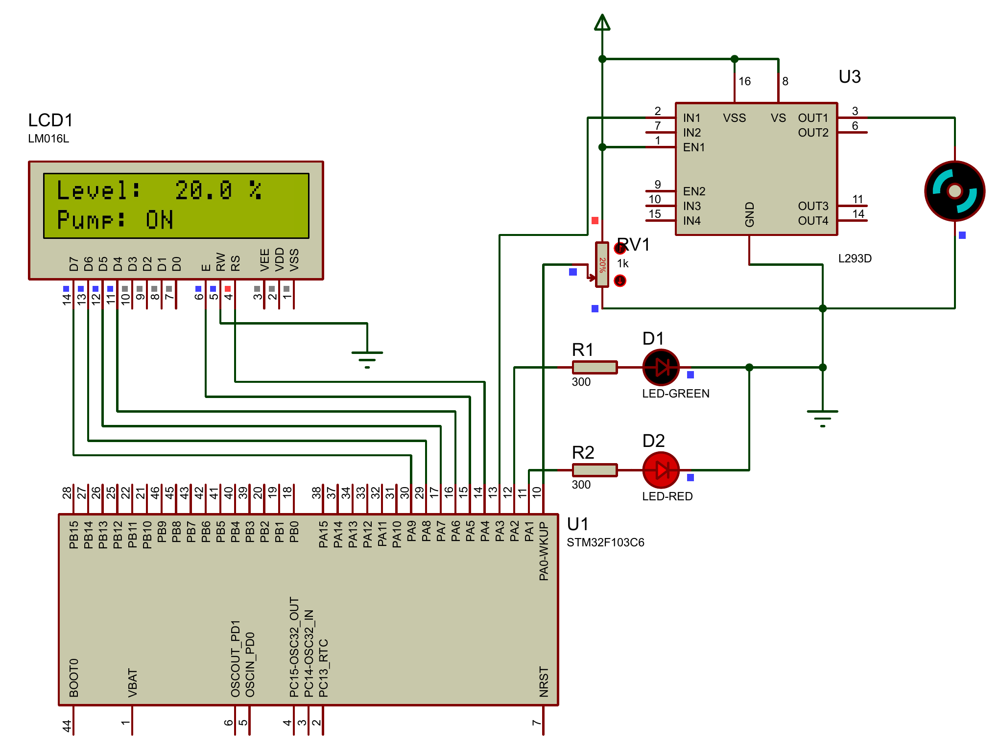 | 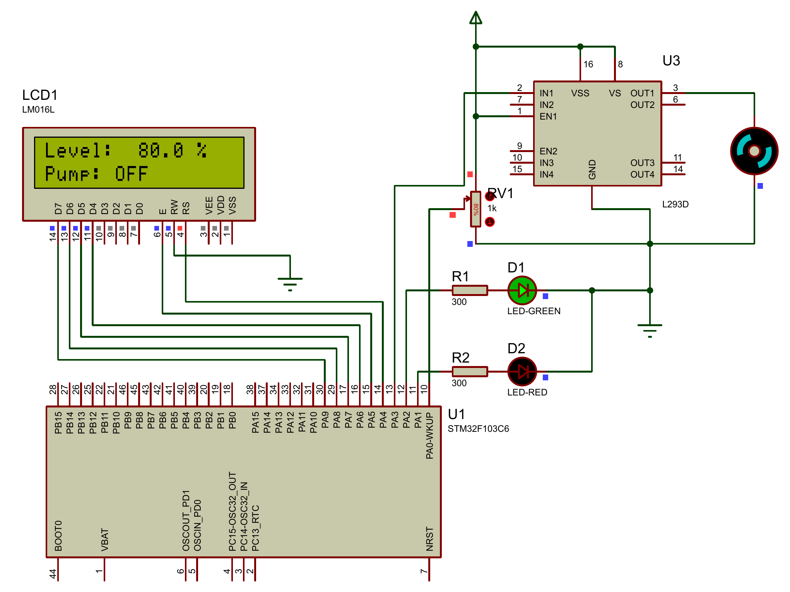 |

---

### 🔹 Question 7: BMP180 Barometric Pressure, Altitude & UART Serial Stream

#### **1. Barometric Altitude Equation:**
The BMP180 measures barometric pressure $P$ ($\text{hPa}$) via I2C bus (`PB6` SCL, `PB7` SDA). The estimated altitude above sea level $h$ ($\text{m}$) is calculated using the simplified barometric formula ($P_0 = 1013.25\text{ hPa}$):

$$h = 44330 \times \left(1 - \left(\frac{P}{P_0}\right)^{0.1903}\right) \quad [\text{m}]$$

#### **2. USART1 Virtual Terminal Interfacing:**
- **Cross-Wiring Setup:** Microcontroller `TX` (`PA9`) connects to Virtual Terminal `RXD`; Microcontroller `RX` (`PA10`) connects to Virtual Terminal `TXD`.
- **Serial Stream Format:** `Temp: XX.X C | Pressure: XX hPa | Estimated Altitude: XX m`.
- **Over-Temperature Notification:** If $T > 40^\circ\text{C}$, the firmware appends `WARNING!` to the serial output stream.

| Figure 7.1: BMP180 & USART Virtual Terminal Circuit | Figure 7.2: Sea-Level Normal Test ($25.0^\circ\text{C}, 1013\text{ hPa} \to 0\text{ m}$) | Figure 7.3: Altitude Test ($700\text{ hPa} \to 3011\text{ m}$) | Figure 7.4: Over-Temp Warning ($46.0^\circ\text{C} \to \text{WARNING!}$) |
| :---: | :---: | :---: | :---: |
| 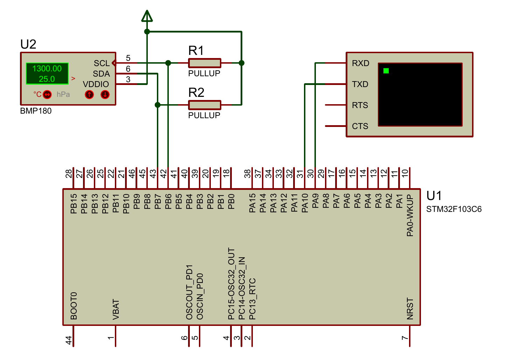 | 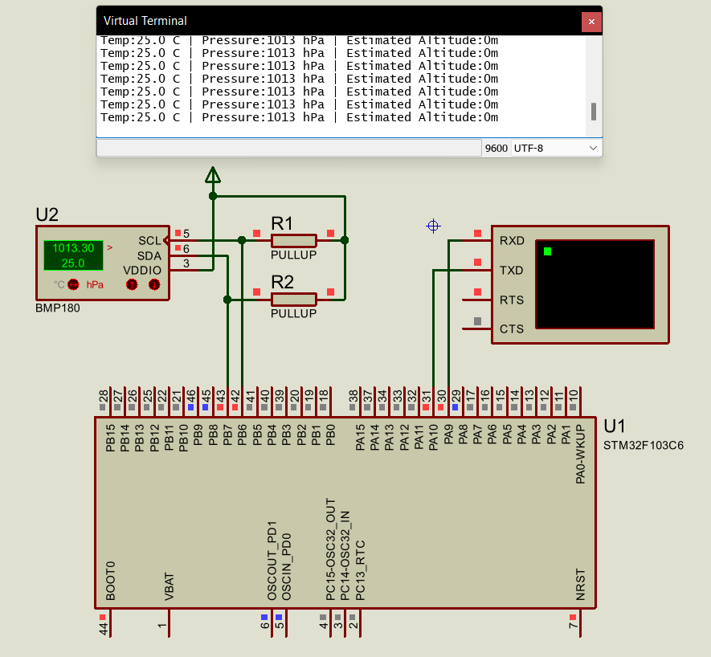 | 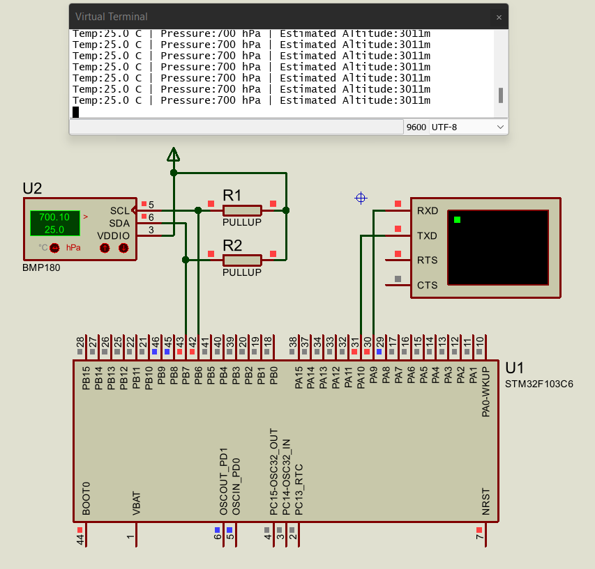 | 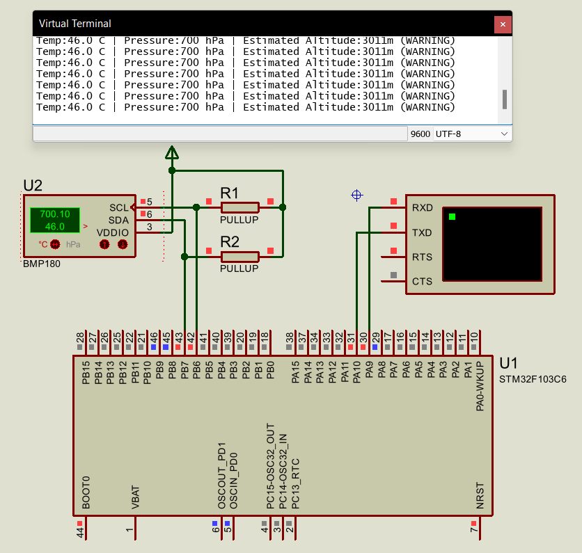 |

---

## 💻 How to Build & Simulate

### 1. Building Firmware in STM32CubeIDE
1. Open **STM32CubeIDE**.
2. File $\to$ Open Projects from File System $\to$ Select target folder (`HW6/Q1`, `HW6/Q2`, `HW6/Q3`, `HW6/Q4`, `HW6/Q5`, `HW6/Q6`, or `HW6/Q7`).
3. Build Project (`Ctrl + B`). The output `.hex` binary will generate automatically in `Debug/`.

### 2. Running Proteus Simulation
1. Launch **Proteus 8 Professional**.
2. Open target `.pdsprj` file from `HW6/Q1/`, `HW6/Q2/`, `HW6/Q3/`, `HW6/Q4/`, `HW6/Q5/`, `HW6/Q6/`, or `HW6/Q7/`.
3. Double-click the STM32 microcontroller component and ensure **Program File** points to the corresponding `.hex` file.
4. Press **Play** to start real-time simulation. Demonstration MP4 videos are also available in `HW6/Q1/Q1.mp4`, `HW6/Q2/Q2.mp4`, etc.

---

<div align="center">

**[Go back to Main Repository README](../README.md)**

</div>
